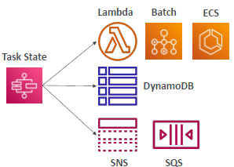
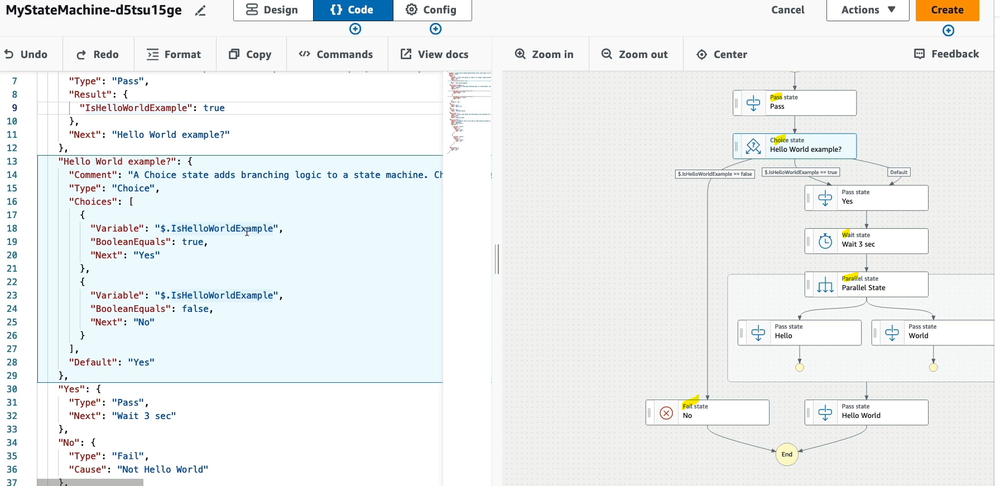
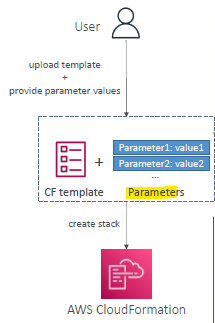

# Step Function (serverless)
## 1. State machine
- model **workflow** as state-machine
  - from workflow studio / console UI
  - create `ASL` (Amazon State lamguage), json.
- has **states** to do some work, like
  - 
  - 
- **type**: standard and express

### 1.1 standard
### 1.2 express
---
## 2. state
- **type**
  - `pass`
  - `choice`
  - `wait`
  - `parallel`
  - `fail`
  - `Activity`
  - `task`
    - execute lambda

---
## 3. config

---
## 4. logging

---
## 5. Error handing
- can handle in Application code
- can handle in state machine using **retry** and  **catch**

### Retry


### Catch
- **error/exception**
  - note: `CustomError` in screenshot : coming from Application/lambda code
```
• States.ALL        : matches any error name
• States.Timeout    : Task ran longer than TimeoutSeconds or no heartbeat received
• States.TaskFailed : execution failure
• States.Permissions: insufficient privileges to execute code
```
- 

- **resultpath** : input to next state
  - 

---
## 5. security

---
## 6. Type


