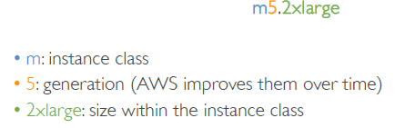
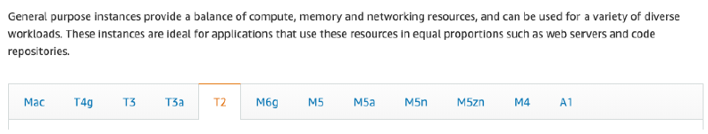
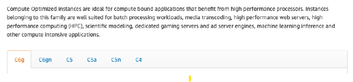
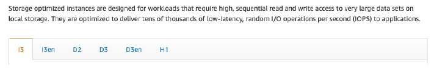
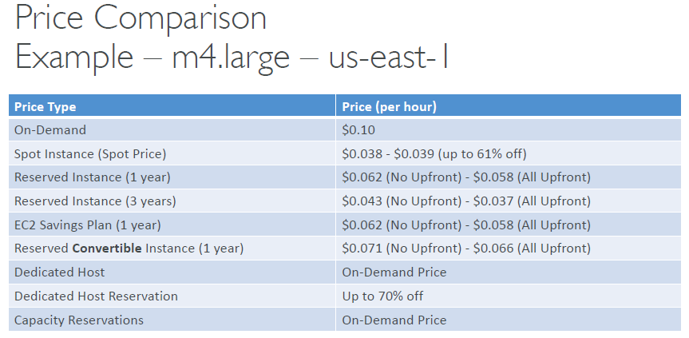
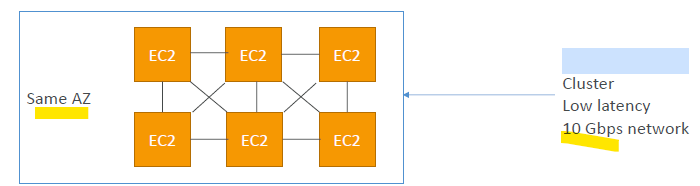

- EC2_01: https://chatgpt.com/c/7ddee1bf-7240-4789-913a-72dae8438d00
- EC2_02 : https://chatgpt.com/c/636011e3-1ce6-4268-8089-47ca3b12c9b9
--- 
# EC2 / ECC (elastic compute cloud)
## 1. Intro
- IaaS
- connect from terminal (instance must have public IP)
  - **SSH** (OS : linux,mac,W10+) 
    - generate SSH key-Pair
  - **Putty** ( OS: W7,8,9) 
  - **EC2 instance Connect** (Amazon Linux 2) - browser session.
```
- aws cli installed in ec2
- run any commnd, provided IAM permission added on ec2-role
- don't run "aws configure" 
```
- get Instance **metadata**
  - http://169.254.169.254/latest/meta-data/ 
  - instance ID,
  - public IP, private IP, elastic IP, etc
  - ...
  - Retrieve runtime information dynamically

- When the new **AMI** is copied from Region A into Region B,  :dart:
  - it automatically **creates a snapshot** in Region B because AMIs are based on the underlying snapshots
  - Region B will have :
    - 1 AMI 
    - 1 snapshot 
  
```yaml
t2.micro      1     1     EBS-Only          Low to Moderate
t2.xlarge     4     16    EBS-Only          Moderate
c5d.4xlarge   16    32    1 x 400 NVMe SSD  Up to 10 Gbps     
r5.16xlarge   64    512   EBS Only          20 Gbps           
m5.8xlarge    32    128   EBS Only          10 Gbps           
```
---
## 2. ec2: Instance type (family,gen,size) :yellow_circle:
- https://ec2instances.github.io/ 
- https://instances.vantage.sh/
- 

### **general purpose** : 
  - balanced, 
  - eg: t2.micro
  - 

### **compute optimized**, 
  - gaming server, media, batch, ML, HPC
  - 

### **memory optimized**
  - real-time system, large dataset processing, BI
  - 

### **storage optimized**
  - File System, RDBMS, data-ware house, cache server, OLTP etc
  - 

---
## 3. Purchase options :yellow_circle:

### 3.1 On-Demand  
- No long-term commitment
- no upfront payment
- **Flexible**
- use case: short workload
- pay by 
  - **second** (after the first minute) (Window and Linux) 
  - **hour** (other OS)

#### Capacity Reservations
- Reserve **On-Demand** instances capacity in a **specific AZ** for **any duration**

---  
### 3.2 Reserved 
- 1 & 3 years
- **fixed** : InstanceType, scope:**Region/AZ**, Tenancy, OS 
- up to 72% discount
- Payment Options – No Upfront (+), Partial Upfront (++), All Upfront (+++)
- use case: 
  - long workloads
  - steady-state usage applications

#### Convertible Reserved 
- upto 66%  discount
- **flexible** : Instance Type, scope:**Region/AZ**, Tenancy, OS
- use case: long workloads with flexible instances types

---  
### 3.3 Savings Plans 
- (1 & 3 years) 
- commitment to an amount of usage.
- Usage beyond EC2 Savings Plans is billed at the On-Demand price :point_left:
- **fixed** : instance family & AWS region
- **Flexible** : Instance Size, OS, Tenancy

---  
### 3.4 Spot Instances 
- upto 90% discount +  MOST cost-efficient
- can lose instances (less reliable), 
- `2 min` **grace period.**
- use case:
  - Not suitable for critical jobs or databases
  - workloads that are **resilient to failure** : Batch jobs, Data Analysis, Image processing, etc
- **type**: 
  - **one time** 
    - if interrupted then terminated.
  - **persistent**
    - has to terminate instance manually :point_left:
- **provision** : define launch pool
    ```
    launch pool :
        duration/expiry            <<<
        type: one-time/persistent 
        count
        instance Types 
        cpu (min.max)    
     
    -   define **our max spot price** , else od-price
    
            if max spot price  < current Spot price 
               then use it
            if max spot price  > current Spot price
                then stop/terminate instance
                with 2 min grace
    
    ```
  
- terminate:
  - 

---  
#### 3.4.1 Spot fleet 
- collection of Spot Instances (and optionally On-Demand Instances)
- on-time Instances only
- define **multiple launch pool**
  - thus request various instance types
- provides higher availability and fault tolerance
  - if spot instance is termninated, it will match with another spot instance
  - if none found then OD

- **strategies**: :books:
  - `lowestPrice`: 
    - from the pool with the lowest price 
    - (cost optimization, short workload)
  - `diversified`: 
    - distributed across all pools 
    - (great for availability, long workloads)
  - `capacityOptimized`: 
    - pool with the optimal capacity for the number of instances
  - `priceCapacityOptimized` (recommended): 
    - pools with highest capacity available, 
    - then selectthe pool with the lowest price (best choice for most workloads)

#### 3.4.1 Spot block
- Spot Blocks are priced at the same rate as Spot Instances
- but with the added benefit of no interruptions for the block duration (`1-6 hr`)

---  
### 3.6. Dedicated Instances
- underlying h/w not shared with **other account**.
- May share hardware with other instances in **same account**

---  
### 3.7 Dedicated Hosts
- most expensive $$
- book an entire physical **server/racks/building**. 
  - for companies that have strong regulatory or compliance needs
- control over **instance placement**
- pay by : 
  - physical cores
  - underlying network socket visibility.
- Purchasing Options
  - On-demand – pay per second for active Dedicated Host
  - Reserved - 1 or 3 years (No Upfront, Partial Upfront, All Upfront)

### summary

---
## 4. hibernate
- RAM state ( < `150 GB`), gets preserved in EBS root volume ( with/without **Encryption**).
- hence boot up fast. 
- supported family instances : C3, C4, C5, I3, M3, M4, R3, R4, T2, T3, …
  - `C**` 
  - `M**` 
  - `T**`
- max for `60 days`
- Also, **Root Volume** – must be EBS, encrypted. :point_left:

---
## 5. Placement group :yellow_circle:
- **cluster** 
  - **low-latency group** in a **single AZ**
  - close-proximity. 
  - hence high n/w throughput
  - usecase : HCP
  - 
  
- **spread**
  - spreads instances across underlying hardware in **mutli-AZ**
  - max : `7 instance/group/AZ`
  - 
  
- **partition**
  - partition-1 in AZ-1 
  - partition-2 in AZ-1
  - ...
  - partition-3 in AZ-2
  - ...
  - max /restriction
    - `100 instances/group`
    - `7 partitions/AZ`
  - use case: hadoop, kafka, casandra
  - 
  
---
## 6. provision instance :yellow_circle:
- **Tenancy**
  - host 
  - Dedicated 
  - default
- **OS / AMI** 
  - can create AMI on ec2-i. 
  - OS boot volume : `gp* / io*` :point_left:
- **memory/RAM** 
- **cpu architecture**
  - `ARM` 
  - `AMD`
- **user-data script** 
  - bootstrap script  - automate boot tasks
    - install update
    - install software
    - ...
  - run only once
  - run with **root user** permission.

- **Storage** 
  - [02_storage](../02_storage)
  - Network-attached (EBS & EFS) 
  - hardware (EC2 Instance Store)
  
- **Network** : 
  - [04_network](../04_network)
  - ENI [00_eni+sg.md](../04_network/00_eni%2Bsg.md)
  - sg: [00_eni+sg.md](../04_network/00_eni%2Bsg.md)
  
- **Elastic load Balancer, Auto Scaling group**  : [ELB and ASG](../04_network/01_ASG)


  