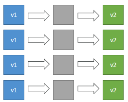
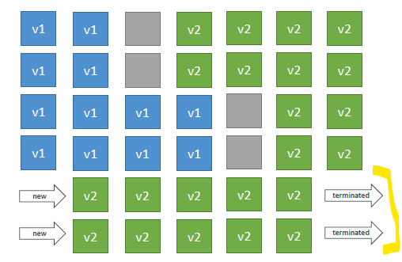
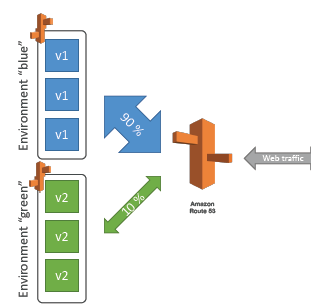
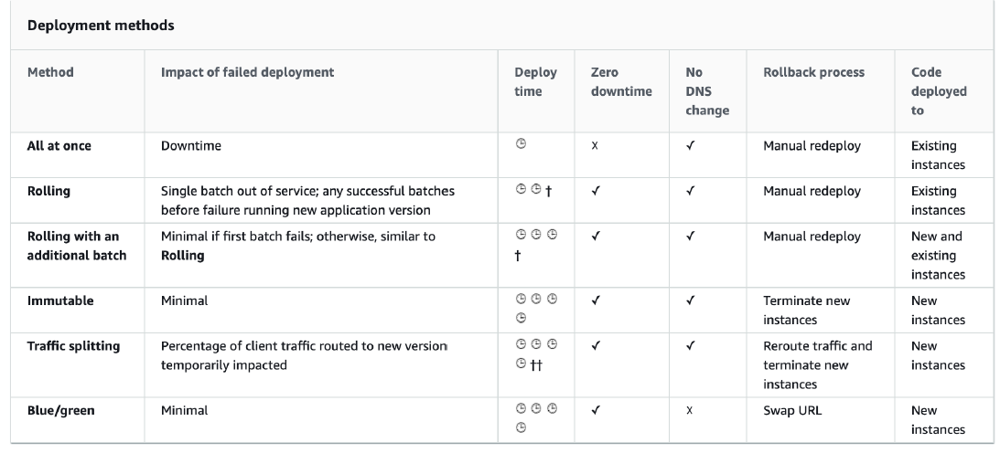
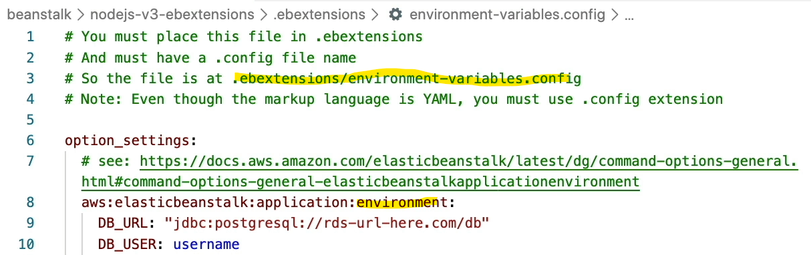
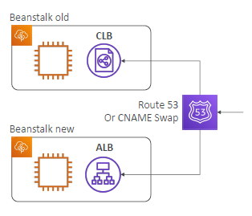
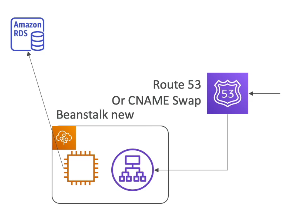

# A. Elastic Beanstalk : `deployments` :books:
- mode of deployments:
## 1. All at once
- **fastest**  deployment
- issue: has  **downtime**
- updates same instance :point_left:
  - ASG-1[ec1-i1:`v1`, ec1-i2:`v1` , ...]
  - ASG-1[]
  - ASG-1[ec1-i1:`v2`, ec1-i1:`v2` , ...]
- 

## 2 Rolling
> fixing: downtime
- **Long** deployment
- steps:
  - update same instances at a time (by bucket-size), 
  - once the bucket is healthy, move to next bucket...
- 
  - notice: v1 and v1 - **both version**s are running
- issue:
  - **rollback takes time**
  - **under capacity**

### Rolling (with additional batches)
> fixing: under capacity
- same like rolling, but application is running with **desired capacity**
  - becoz of additional batch.
  - also Small **additional cost** for a additional batch
- 

## 3 Immutable 
> fixing: rollback time
- steps:
  - spins up new instances in a new **temporary ASG**, 
  - deploys new version to these new instances,
  - then **swaps** all the instances
  - ASG-1[v1,v1,...]
  - ASG-temp[v2] --> check health, if ok then rest
  - ASG-temp[v2,v2,...]
  - swap: ASG-1[v1,v1,... v2,v2,...] >> [ v2,v2,... ]
- 
- **Quick rollback**

## 4. Traffic Splitting
> fixing : swapping of instance
- steps
  - ASG-1[v1,v1,...]
  - ASG-2[v2,v2,...]
  - point ALB to ASG-2 eventually after testing small traffic
- very quick **automated rollback**
- - 

## 99. Blue Green (not direct feature)
- steps:
  - manually create/**clone** a **new beanstalk stage `environment`** (green)
  - deploy new version into green using any of above types(4).
  - Traffic Splitting using `R53` (dns change)
    - send a small % of traffic to new deployment
  - switch over when ready
- 
- 

## summary


---
# B. Elastic Beanstalk : `CLI` :x:
- not in scope of DVA
- install and gives handy commands
```yaml
• eb create
• eb status
• eb health
• eb events
• eb logs
• eb open
• eb deploy
• eb config
• eb terminate
```


---
# C. Elastic Beanstalk : `Extension`
- project-root-dir/
  - **.ebextensions**/
    - yaml-json-content.**config**. `purpose`:
      - modify default config
      - add other resource (under the hood use Cloudformation)  :point_left:
        - RDS, 
        - DynamoDB, 
        - ElastiCache
        - ...

## example - set Environment var




---
# E. Elastic Beanstalk : `Migration` (manual)

## example: migrate CLB to ALB
> ELB type cannnot be change once env is created.
- migration step:
  - create new environment with ALB, manually
  - deploy code again 
  - DNS swapping to new environment
  - delete old env
- nothing fancy, but that's the only way.
- 

## Decouple RDS
- migration step:
  - create new environment
  - deploy code again 
  - DNS swapping to new environment
  - delete old env 
    - RDS wont be deleted, since delete protection enabled) :point_left:
- again same step, nothing fancy, 
- 
- 