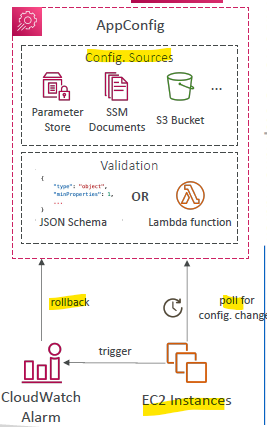
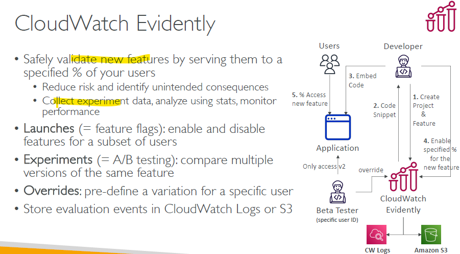

# AppConfig :books:

## Intro

- deploy **dynamic configurations** independently of any code deployments
  - EC2 instances, Lambda, ECS, EKS…
- don’t need to restart the application

-  **Validate configuration** changes before deployment using:
  - JSON Schema (syntactic check) or
  - Lambda Function – run code to perform validation
  - if failed then  **rollback**

---

# Cloudwatch Evidently :books:

