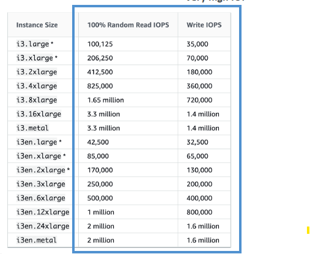
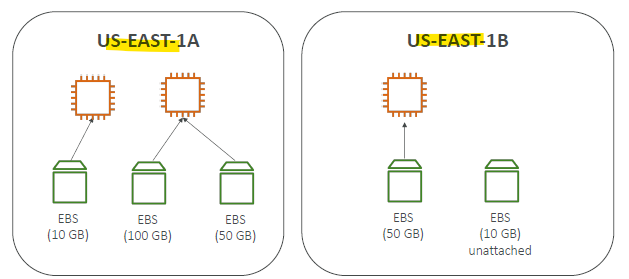
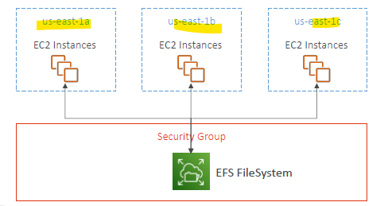

- https://chatgpt.com/c/677dbc0a-3414-800d-8960-b0d969c9ffda
  - ebs,efs,Fxs,snowball
---
# Storage
- check these 3 aspects:
  - `size` (capacity)
  - `iops` 
    - read iops
    - write iops
  - `throughput` (MB/s)

--- 
## A. EC2 instant-store (block-storage)
### Intro
- **better Read/write iops** :smile:
  - high-performance hardware disk
  - depends on ec2-i family type.
  - 
- risk of data loss if h/w fails 
- **manual backup**
- volume size is **fixed** 
  - determined by the EC2 instance type.
  - so dont have option to choose custom instant store :dart:
- fact : AMIs do not preserve instance store data :point_left:
- fixed to host machine
  - cannot be detached or reattached
- can be used as boot volume :point_left: not preferred
- AMI does NOT preserve instance store volumes. 
  - only EBS backed AMI :dart:
---
## B. EBS

### 1. Intro
- **AZ bounded** :point_left:
- Have **volumes**
- **network drive** (bit latency, same az) + **limited performance**
- can be attach/dettach to ec2-i
- persist data, even after their termination
- only be mounted to **one instance** at a time. multiple volumes can be attached. `1-2-M`
- **deleteOnTermination** 
  - root volume - `true`
    - if disable it on running app - how ? console or api/cli**
  - additional ebs volume - `false`
- use `e2label` **command** to change label name
  - scenario:
  ```text
    - ec2-1 root volume > snapshot-1 > created volume-2 > attached to ec2-2 as additional volume 
    - vol-1 is root vol for ec2-2
    - re-b0ot ec2-2, it will boot from volume-2, rather than vol-1
  ```
  
### 2. EBS: snapshot
- Snapshots are **incremental backups** :dart:
  - which means that only the blocks on the device that have changed after your most recent snapshot are saved.
- `point in time` snapshot.
  - no need to detach volumn while taking snapshot, but recommended.
- **cross az/region restore** :point_left:
  - 
- Build an AMI, will also create EBS snapshots :point_left:

- store snapshot to **archive tier**
  - 75% cheaper, save cost
  - but restore time 24-72 hrs 
  - 
  
- accidental delete 
  - setup **recycle bin** with retention policy (1 day to 1 year)
  - 

- **Fast Snapshot Restore** (FSR)  

### 3. Security
- encrypt at rest, both - **volume and snapshot** using KMS

### 4. Types :books:
- **General Purpose SSD**
  - **gp2**  
    - size defines iops --> `3 iops / GB`    
    - max -->  `16TB | 3K iops | 125 MB/s`
  - **gp3** 
    - max -->  `16TB | 16k iops | 1000 MB/s`
    - System boot volumes, Virtual desktops, Development and test environments
    - Balanced price/performance for a wide variety of workloads
    
- **Provisioned IOPS SSD**
  - **io1** 
    - max -->  `16TB | 64k iops | 1000 MB/s`
  - **io2** 
    - max -->  `64TB | 256k iops | 4000 MB/s`
    - supports multi attach :point_left:
      - max - 16 ec2-i
    - databases workloads

- **HDD**
  - dont use as boot volume :dart:
  - **HDD**  / Throughput Optimized HDD / `st1`
    - max -->  `? | 500 iops | max-500 MB/s`
    - Big Data, Data Warehouses, Log Processing
    -  
  
  - **cold HDD**  / `sc1`
    - max --> `? | 250 iops | max-250 MB/s`
    - data that is infrequently accessed

```
General Purpose SSD (gp3):
- IOPS: Up to 16,000 IOPS.
- Throughput: Up to 1,000 MB/s.
- Use Case: Balanced price/performance for a wide variety of workloads.

Provisioned IOPS SSD (io2/io2 Block Express):
- IOPS: Up to 64,000 IOPS (io2), up to 256,000 IOPS (io2 Block Express).
- Throughput: Up to 1,000 MB/s (io2), up to 4,000 MB/s (io2 Block Express).
- Use Case: Critical applications requiring high performance and reliability.

Throughput Optimized HDD (st1):
- IOPS: Up to 500 IOPS.
- Throughput: Up to 500 MB/s.
- Use Case: Big data, data warehouses, and log processing.

Cold HDD (sc1):
- IOPS: Up to 250 IOPS.
- Throughput: Up to 250 MB/s.
- Use Case: Infrequently accessed data with lower cost requirements.
```
---
## C. EFS (regional)
### Intro
- **distributed** across an unconstrained number of storage servers.
- grow elastically to **petabyte scale**.
- **high availability** Managed NFS (network file system)
- protocol    : **NFSv4**
- file system : **POXIS-complaint**
- **3x times expensive** than EBS(gp2), because:
  - no capacity planning
    - auto-Scale in Size(PB) 
    - auto/manual adjust performance.
  - supports 
    - multi-AZ (Regional)  :point_left:
    - single AZ
    - 
    - attach to multiple EC2 ( **Linux based AMI** only) :point_left:
  - high performance 
    - Read - `3 GB / s`
    - Write - `1 GB / s`

- **use case**
  - content management, web serving, data sharing, Wordpress, big data, media processing.
    
### storage class
- **lifecycle policy** to move between 
  - **standard** (with One-Zone option as well)
  - **Infrequent-Access** (with One-Zone option as well) 
  - **Archive** 50% low cost

### Target Mount :dart:
- 
- Allows EC2 instances in a VPC to access an EFS file system
  - not needed for **lambda**.
  - not needed for **on-prem**  ( if DX/VPN, is setup)
- configure:
  - Subnet ID
  - Security Groups
- EFS mount targets are:
  - created **per AZ**, not per subnet.
  - EFS is **not multi-VPC**, use VPC peering :point_left:
  - eg: 
  ```text
    - tm-1 create for az-1, and for VPC-1
    - VPC-1 has 3 subnets for az-1  
    - VPC-2 has 3 subnets for az-1
    - Next, VPC-1 --- peer --- VPC-2
    - update security group
    - then can mount EFS on ec2 intance of VPC-2
   ```

---
### EFS Throughput Modes
- **Bursting Throughput** ( default)
  - throughput scales with file system size

- **elastic Throughput**
  - throughput scale regardless of size
  - auto-scale with the best performance. (R/recommended)

- **provisioned Throughput**
  - manually configure throughput.
  - If your workloads require even higher and consistent throughput
  - allows you to specify the throughput you need, independent of the amount of data stored.

---
### EFS Performance Mode
- **general-purpose** ( default)
  - **low-latency** operations :)
  - lower throughput
  - and is not ideal for highly parallelized/concurrent big data processing tasks.
  
- **max I/O** 
  - Highly `parallelized` applications and **big data workloads** that require higher throughput.
  -  supports thousands of `concurrent` connections and higher I/O operations.
  -  **higher latencies**
  - higher throughput

### Summary :dart:
| **Category**          | **Option**              | **Description**                                                                                  | **Best For**                           |
|------------------------|-------------------------|--------------------------------------------------------------------------------------------------|-----------------------------------------|
| **Performance Modes**  | **General Purpose**     | Low latency, limited concurrency, fixed throughput per client.                                  | Latency-sensitive workloads.            |
|                        | **Max I/O**            | Higher latency, massive concurrency, elastic throughput scaling.                                | High-concurrency workloads.             |
| **Throughput Modes**   | **Bursting Throughput** | Default mode; scales with file system size.                                                     | Variable workloads with spiky demand.   |
|                        | **Provisioned**        | Fixed throughput, independent of file system size.                                              | Consistent high-throughput workloads.   |
|                        | **Elastic Throughput** | Automatically scales throughput to match workload needs (Enhanced Mode).                       | Unpredictable or spiky workloads.       |


---  
### Security
- choose VPC/subnet >  add security group.
- Encryption at rest using `KMS` + enable/disable automatic backup

### hands on
  ```
  - Create EFS `efs-1` + efs-sg-1
  - Ec2-i1 and i2 : launch instance > attach efs-1
  - choose mount location : /mnt/efs/fs1
  - aws automatically adds sg
      - ec2-i1-sg : inbound rule : Type:NFS, protocol:TCP, port:2049, source:efs-sg-1
      - similary outbound rule.
  - ssh to ec2-i1 and echo "hello" >  /mnt/efs/fs1/hello.txt
  - ssh to ec2-i2 and cat  /mnt/efs/fs1/hello.txt
  ```
---
## Extra
- 
- 

- price compare
```yaml
Storage Class	            Price (per GB)  

EBS General Purpose (gp3)	$0.08
EBS General Purpose (gp2)	$0.10
EBS Provisioned IOPS (io1)	$0.125
EBS Provisioned IOPS (io2)	$0.125
EBS Magnetic (standard)	    $0.05

=== SSD 12 cent , for HDD 5 cent

EFS Standard	            $0.30
EFS Standard-IA	            $0.025
EFS One Zone	            $0.16
EFS One Zone-IA	            $0.0133

=== standard 30 cent , IA - 2 cent
```
---
## Exam :dart:
- #1 need high-frequency reading and writing (20 MB file) max 1 TB total size.
  - **EFS with Provisioned Throughput mode** :point_left:
    - supports concurrent access 
    - Provisioned Throughput, Ensures consistent performance for high I/O workloads
  - **DynamoDB** :x:
    - Not optimized for large file storage & high-frequency writes.