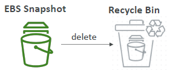

# EC2: Storage
## A. EC2 instant-store
### Intro
- better iops
- risk of data loss if h/w fails | manual backup.
- volume size is **fixed** 
  - determined by the EC2 instance type.
- fact : AMIs do not preserve instance store data :point_left:
- fixed to host machine
  - cannot be detached or reattached

---
## B. EC2: Storage: `EBS` 

### 1. Intro
- **AZ bounded** :point_left:
- Have **volumes**
- **network drive** (bit latency, same az), attach to ec2-i
- persist data, even after their termination
- only be mounted to **one instance** at a time. multiple volumes can be attached. `1-2-M`
- **deleteOnTermination** 
  - root volume - true
  - additional ebs volume - false
  
### 2. EBS: snapshot
- `point in time` snapshot.
  - no need to detach volumn while taking snapshot, but recommended.
- **cross az/region restore** :point_left:
  - 

- store snapshot to **archive tier**
  - 75% cheaper, save cost
  - but restore time 24-72 hrs 
  - 
  
- accidental delete 
  - setup **recycle bin** with retention policy (1 day to 1 year)
  - 

- **Fast Snapshot Restore** (FSR)  

### 3. security
- encrypt at rest, both - **volume and screenshot** using KMS

### 3. capacity planning
- choose below Storage-groups: [ size, iops, throughput/tp]
- `gp2` : `3 iops per GB` | size defines iops and tp | max- 16TB,    3k  iops, 125 Mbps
- `gp3` : `flexible`. configure all 3 independently |  max- 16TB, 3k-16k iops, 1000 Mbps
  - System boot volumes, Virtual desktops, Development and test environments
- `io2` : 64K iops | max- 16TB
- `io3` : 256k iops | max- 64TB | supports -` multi attach`.
  -  databases workloads
- `HDD` :  max-500 iops | max-500 Mbps
  -  Big Data, Data Warehouses, Log Processing
- `cold HDD` : max-250 iops | max-250 Mbps
  -  data that is infrequently accessed

```
General Purpose SSD (gp3):
- IOPS: Up to 16,000 IOPS.
- Throughput: Up to 1,000 MB/s.
- Use Case: Balanced price/performance for a wide variety of workloads.

Provisioned IOPS SSD (io2/io2 Block Express):
- IOPS: Up to 64,000 IOPS (io2), up to 256,000 IOPS (io2 Block Express).
- Throughput: Up to 1,000 MB/s (io2), up to 4,000 MB/s (io2 Block Express).
- Use Case: Critical applications requiring high performance and reliability.

Throughput Optimized HDD (st1):
- IOPS: Up to 500 IOPS.
- Throughput: Up to 500 MB/s.
- Use Case: Big data, data warehouses, and log processing.

Cold HDD (sc1):
- IOPS: Up to 250 IOPS.
- Throughput: Up to 250 MB/s.
- Use Case: Infrequently accessed data with lower cost requirements.
```


---
## C. EC2: Storage: `EFS`
- uses `POSIX` file system + standard POXIS API
- `3x times expensive` than EBS, because:
  - `no capacity planning`, auto-Scale in Size(PB) and auto/manual adjust performance.
  - supports `multi-AZ`/Regional +  singleAZ
  - attach to multiple EC2 ( Linux based AMI only)
  - high performance : 3GBps/R , 1GBps/W
  - can save cost with `storage class`.

- `usecase` :  content management, web serving, data sharing, Wordpress, big data, media processing.
    
### storage class
- lifecycle policy to move between : `standard` >> Infrequent-Access/`EFS-IA`(after n1 days) >> `Archive`((after n2 days)) 50%
- same like s3.

### performance Mode
- `general-purpose`( default)
  - **low-latency** operations :)
  - lower throughput and is not ideal for highly parallelized big data processing tasks.
  
- `max I/O` 
  - Highly parallelized applications and **big data workloads** that require higher throughput.
  -  supports thousands of concurrent connections and higher I/O operations.
  - slightly **higher latencies** compared to the General Purpose mode :(
  
- `enhanced` : throughput scale regardless of size
  - `elastic` : auto-scale with the best performance. (R/recommended)
  - `provision` :  
    - manually configure throughput.
    - If your workloads require even higher and consistent throughput
    - allows you to specify the throughput you need, independent of the amount of data stored.
  
### Max limit
-  storage size : (auto scale to `Petabyte`-scale)
-  R/W max speed : `3GiB/s for R` and `1GiB/s for W`

### Security
- choose VPC/subnet >  add `sg`
- Encryption at rest using `KMS` + enable/disable automatic backup

### demo:
  ```
  - Create EFS `efs-1` + efs-sg-1
  - Ec2-i1 and i2 : launch instance > attach efs-1
  - choose mount location : /mnt/efs/fs1
  - aws automatically adds sg
      - ec2-i1-sg : inbound rule : Type:NFS, protocol:TCP, port:2049, source:efs-sg-1
      - similary outbound rule.
  - ssh to ec2-i1 and echo "hello" >  /mnt/efs/fs1/hello.txt
  - ssh to ec2-i2 and cat  /mnt/efs/fs1/hello.txt
  ```
