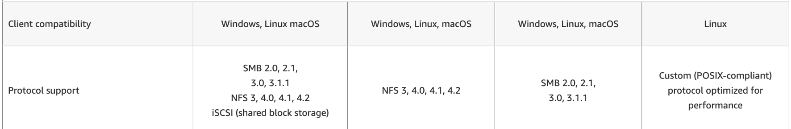

## Amazon FXs (serverless)
## 1. FXx : Intro
- **serverless fileSystem** + fully managed
- **high performance** FS. 
- **multi-AZ**  (regional)
- mount on:
  - on-prem ( for networking : `vpn` or `directConnect`)  :point_left:
  - ec2-instance
- KMS encrypted.
- automated backup to S3 :point_left:

## 2. File System type +  protocol types
- **File System type** (4):  Windows File System, Lustre (linux + cluster), ONTAP, OpenZFS
- **protocol types** : protocol for communication
  - **SMB** 
    -  Server Message Block
    - network file-sharing protocol
    - read, write, and manage files over a network
    - primarily used in **Windows**
    
  - **NTFS**
    - file system developed by Microsoft for the Windows OS
    
  - **NFS** 
    - Network File System 
    - distributed file system protocol
    - primarily used in **unix/linux**
    - Allows multiple clients to access shared directories
    - version
      - NFSv3 Stateless
      - NFSv4 Stateful
  
  - **Lustre Protocol**  
      
  - **iSCSI**
    - Internet Small Computer Systems Interface
    - transfer TCP/IP n/w
    
---
## 3. Fxs : Types (4)
### Fxs for `Windows File System`
- mount on :
  - ec2-i (windows  OS)
  - ec2-i (Unix/Linux OS) :point_left:
- supported protocol : `SMB` , `NTFS` 
- supported storage option : `SSD`,  `HDD`
- support **Microsoft’s Distributed File System (DFS)** :point_left: :dart:
- **size**: `100s PB` |  **iops** : `in millions`   | **throughput**  `10 GB/s`

- **more**
  - DR :  
    - fully managed **backups**
    - **availability** : offers single-AZ and `multi-AZ` deployment options
  - integrate with 
    - ms AD - self or AWS managed ms AD.
    - ACLs
    - ms DFS : group multiple FS 

---    
### Fxs for `Luster FS`
- mount on :
    - ec2-i (Unix/Linux OS) :point_left:
- supported storage option : `SSD` , `HDD`
- supported protocol : `Lustre Protocol`, `POXIS`
- **size**: `100s PB` |  **iops** : `in millions`   | **throughput**  `?`

- **More**
  - integrate with **S3**  :dart: :dart:
    - transparently presents `S3 objects as files` and allows you to write changed data back to S3
    - ability to both process the 
      - **hot data** in a parallel and distributed fashion.
      - **cold data** on Amazon S3
  - **use case** 
    - HPC, ||, ML, Modeling
  - **deployment option**  :point_left:
    - **scratch** : short term storage, 6x faster, `no data replication`
    - **persistent** : Long term storage: data replication in same AZ
    - 

----
### Fxs for `NetApp ONTAP` 
- **protocol** : `NFS, SMB, iSCSI` :point_left:
- **OS** : W | mac | Linux :point_left:
- compression
- Point-in-time instantaneous cloning
- compatible with lots of system.
  - 

----
### Fxs for `OpenZFS`
- **protocol** : `NFS` :point_left:
- **OS** : W | mac | Linux :point_left:
- compression.
- Point-in-time instantaneous cloning
- `compatible` with lots of system. 
  - same as netApp ontap FS.

---

## Exam
- FSx :: ontap | ZFS | windows | Luster :dart:
  - 

```text :dart:
1. 
Amazon FSx for Windows File Server
Supported OS: Windows, Linux (via SMB client)
Protocols: SMB (2.0, 2.1, 3.0, 3.1.1)

2. 
Amazon FSx for Lustre
Supported OS: Linux
Protocols: Lustre, POSIX-compliant

3. 
Amazon FSx for NetApp ONTAP
Supported OS: Windows, Linux, macOS
Protocols: NFS (v3, v4.0, v4.1), SMB (2.0-3.1.1), iSCSI

4. 
Amazon FSx for OpenZFS
Supported OS: Linux, Windows, macOS
Protocols: NFS (v3, v4, v4.1)
```


