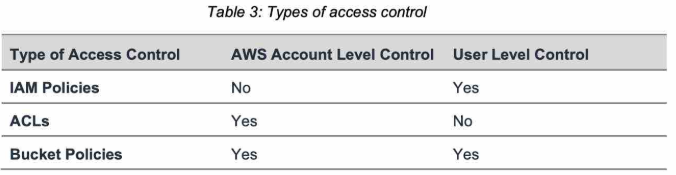

- https://chatgpt.com/c/677dffc9-dd0c-800d-93c3-3b72503bf82e
--- 
# SSS - Simple storage service / S3 (Regional) 
## 1. S3: Intro
- by default, the AWS **S3 bucket owner** has `full access` to the bucket and all objects within it :point_left:
- **infinitely scaling**  + highly **durable** + highly **available** 
- **always return latest version object** :dart:
- Also **foundation service**
  - other services use S3 as an integration 
  - main building blocks of AWS
  
- **bucket-naming convention** 
  - No uppercase, No underscore
  - 3-63 characters long
  - Not an IP
  - Must start with lowercase letter or number
  - Must NOT start with the prefix **xn--**
  - Must NOT end with the suffix **-s3alias**
  
- performance:
  - latency (low) : `100-200 ms` :point_left:
  - throughput : `3500-5500 request/sec/prefix` :dart: (notice per prefix)

- **upload option**
  - S3 directly - slow/internet
  - CF-distribution ==> origin:s3 
  - S3 transfer Acceleration (**S3TA**) - `to/from` :point_left:
    - Amazon’s high-speed backbone network
    - directs traffic to the nearest edge location
    - don't need to pay, S3TA failed. (which is additional `4 cent/GB` )
---
## 2. S3: Usecase
- **Hybrid-Cloud-storage** 
  - Archival
  - Backup (eg: snapshot : ebs,efs,db )
  - ...
- **hosting**
  - Media,
  - Static website 
  - Application/Software delivery
- **DR** 
  - cross-region-replication, 
  - move data from region/az to another then restore.
- **BigData Analytics**
  - run Data lakes in s3 

---
## 3. S3: Bucket
- s3://my-bucket/prefix-1/`my_file.txt`
  - looks like directory but **no-concept-of-directory**
  
- **bucket type**
  - general-purpose **
  - Directory (New)
  
- s3-bucket-1 > properties > access log  --> choose `another bucket-2` and log-format(default)  

### 3.1. Object
- max size :`5TB`
- can enable **version + replication**

#### access endpoint
- expose s3 object as public access endpoint
  - attach **access point policy**
  - select object by **prefix**
  - creates **dns** entry 
  - V**PC-endpoint** --> s3:access-point --> bucket:selected-object
    - 

#### access endpoint (with lambda )
- once object is fetch want to run some operation on object using lambda.
- kind of ETL::transform

#### pre-signed URL
- temp access on object
- generated from UI/cli a Pre-signed URL and share it
- can set expiry

- 

-    

---
### 3.2. Object: Storage Classes :green_circle:

#### Amazon S3 Standard / frequent
- General Purpose 
- highly durable/available.

#### Infrequent Access (IA) 
- low cost
- usecase - DR-backup/recovery
- min storage duration : `30 days`

#### One Zone-Infrequent Access 
- single-AZ,  low ava
- min storage duration : `30 days`
- use case - data which can recreate.
- `20% less` than S3 Standard-IA.

#### Amazon S3 Glacier 
-  99.999999999% **durability**
- low storage cost, **but** : :point_left:
  - has **longer**  - min storage duration
  - plus **retrival fee**
  - check below:
- 
- retrieval mode:
  - **Instant Retrieval** : 
    - in ms :smile:
      - same throughput as in Standard-IA storage classes
    - but, min storage duration : `90 days`
  - **Flexible Retrieval** 
    - 1-5 min
    - 3-5 hr 
    - 5-12 hr `free`
    - min storage duration : `90 days`
  - **Deep Archive** 
    - 12-48 hr `free`
    - min storage duration : `180 days`

#### Amazon S3 Intelligent Tiering
- move object b/w tier based on (usage + config)
- mix of above classes into single
- can set up an **expiration action** (to delete) + **transitional actions** :point_left:
- **tiers**
  - `Frequent Access` tier (automatic): default tier
  - `Infrequent Access` tier (automatic): objects not accessed for 30 days
  - `Archive Instant Access` tier (automatic): objects not accessed for 90 days
  - `Archive Access tier` (optional): configurable from 90 days to 700+ days
  - `Deep-Archive Access` tier (optional): config. from 180 days to 700+ days
- more
  - on bucketObject (standard GP / Standard IA) --> run **s3 analytics** --> take 24/28 hrs --> **CSV report**
  - report gives recommendation 
    - Standard -->  Standard IA :dart:
    - observes the infrequent access patterns
  
#### comparison
- 
- 
- 

```yaml
Storage Class	                Price (per GB) === 2 cent

S3 Standard	                    $0.023  
S3 Standard-IA	                $0.0125
S3 One Zone-IA	                $0.010
S3 Glacier Instant Retrieval	$0.004
S3 Glacier Flexible Retrieval	$0.00385
S3 Glacier Deep Archive	        $0.00099
```
### zero-day lifecycle policy :dart:
- AWS recommends using a zero-day lifecycle policy for cases where you want to move objects to a different storage class 
- **immediately** after they are uploaded to standard-s3.
- ideal for scenarios like **archival storage** 
  - will be charged for glacier, not standard-s3
---
## 4. S3 bucket: versioning :green_circle:
- enable for each bucket + UI:showVersion.
- can roll back to previous version/s
- protect again un-intended delete.
- delete:
  - `delete` : adds delete marker.
  - `delete marker` : undo delete.
  - UI: show-version > select version > `delete the version` : permanent deletes.
- Once you version-enable a bucket, 
  - it can never return to an unversioned state. (disable) :dart:
  - but can suspend
- can apply a **retention period** to an object version explicitly :dart:
  - specify a **Retain Until Date** for the object version.
  - Different versions of a single object can have different retention modes and periods
---
## 5. S3 bucket: Replication  :green_circle:
- async  
- enable versioning :point_left:
- create **replication rule**
  - replicate object 
  - replicate delete marker(y/n)
  - ...
  
### facts
- only **new object** will be replicated.
  - for existing old objects , use S3 Batch replication separately.
- **No chaining**
  - having b1 --> b2 | b2 --> b3
  - if obj-1 added in b1, it will be replicated to b2 only.
  
### Type
- **SRR** (same region replication)
- **CRR** (Cross region replication)
  - **single region keys keys)** 
    - `un-encrypted object` --> Replicated to region-2
    - `encrypted object` (sse-s3, sse-c) --> Replicated to region-2
    - `encrypted object` (sse-kms) : 
      - decrypt with key-region-1
      - Re-encrypt with key-region-2
        - update  **custom policy** for your specific access.
        - if using **default policy** : access already given to all principle in same account.
     
  - **keys multi-region kms key**
    - `un-encrypted object` --> Replicated to region-2 : same as abv
    - `encrypted object` (sse-s3, sse-c) --> Replicated to region-2  : same as abv
    - `encrypted object` (sse-kms) 
      - same key-1 is present in region-1 and region-2
      - but s3 will treat then as diff keys 
      - and, perform `decryption and rn-encryption` again  :point_left:

---
## 6. S3: Job/batch :yellow_circle:
- Perform **bulk operations** on **existing** S3 objects with a single request.
  - Modify object/s metadata, properties, tags, etc
  - manual object/s replication :point_left:
  - Encrypt un-encrypted objects
  - Modify object ACLs
  - Restore objects from S3 Glacier
  - Invoke Lambda function to perform custom action on each object
- **S3:job**
  - Define list of Objects
  - action
  - optional param
-  Flow
- `s3:Inventory` > `s3:Select` > `S3:Job`  > process each object

---
## 7. S3: Event Notification :yellow_circle:
- sends event to **target** :
  - s3:event --> `sns`
  - s3:event --> `Lambda` 
  - s3:event --> `SQS :: Standard-queue ` (**standard only**, not fifo) :x: :dart:
  - ...
  - s3:event --> EventBridge (filtering) --> target(18+ services)  
    - archive event
    - replay event

---
## 8. S3: Security
- At account level can enable/disable **public flag**

### S3 policies :dart:
- offer **more granular and advanced control** for access to **both** buckets and objects.
- cross Account access
- grant users 
  - within your AWS Account 
  - other AWS Accounts 
- further restrict access to specific resources based on certain **condition**
  - request time (Date Condition),
  - whether the request was sent using SSL (Boolean Conditions), 
  - a requester’s IP address (IP Address Condition), 
  - ...
  
### S3 ACLs  :dart:
- simpler/basic permissions(R/W/Full) typically on **individual objects** 
- cross Account access
- grant users
  - within your AWS Account
  - other AWS Accounts - NO :x:

### comparison


### 1. encryption
#### At REST
- **server side**
  - **sse-s3** (default) : 
    - encryption-key provided/owner by `aws:s3` , 
    - http header : "x-amz-server-side-encryption": `AES-256`
  
  - **sse-kms** 
    - encryption-key comes from `kms` 
    - http header : "x-amz-server-side-encryption": `aws:kms`
    - client create kms-key before.
  
  - **dsse-kms**  2023

  - **sse-c** : customer provide key (outside aws)
    - client upload encrypted key

  - 
  - 
  - 

- **client side encryption**
  - outside AWS
  - object enc/decr at client end.

- 

---
#### At transit (TLC/SSL)
- `https` endpoint --> update bucket policy : deny `http`
- add s3 bucket policy
  - allow/deny : putObject on bucket-1,  `condition: secureTransport=true`
- 

---
### 2. IAM policy
#### 2.1  User-Based IAM polices
- eg:
  - lambda role-1 - add permission for s3:*
  - IAM user - add permission for s3:*
  - 

#### 2.2 Resource-Based
- **S3 Bucket Policies**
  - bucket wide rules : effect,principal,Action,resource
  - eg:
    - allow **public access**
    - allow **cross account access**
    - **Force objects encryption** at upload
      - allow/deny : putObject on bucket-1,  `condition : sse-kms=true`
      - allow/deny : putObject on bucket-1,  `condition: secureTransport=true`
    - ...
    
- 
- 

- **ACL**
  - [03_S3-3-ACL.md](03_S3-3-ACL.md)
  - **Object ACL**
  - **Bucket ACL**

---
### 3. S3: MFA-delete
- with root account enable/disable **MFA delete**
```
aws s3api put-bucket-versioning 
    --bucket <bucket-name> 
    --versioning-configuration Status=Enabled,MFADelete=Enabled    # disabled 
    --mfa "arn:aws:iam::<account-id>:mfa/<mfa-device> <mfa-code>"
```
---
## 9. S3: More
### 9.1 S3 Transfer Acceleration (S3TA) :dart:
- speed up content transfers **to and from** Amazon S3 by as much as 50-500% 
  - for **long-distance transfer of larger objects** :point_left: :dart:
  - 10 GB+ object up/down globally
- internally uses:
  - fast AWS private global network/**edge-locations**
  - **CloudFront**’s globally distributed Edge Locations and over AWS backbone networks,
  - upload in **multipart** 
    - if 100MB+ use it,  recommended for 5GB+
    - delete incomplete multi-part
- 

### 9.2 byte-range fetch (DOWN)
- parallelize GETS to speed up download. can configure how many `bytes` to read.
- 
  
### 9.3 server side filtering
- use **S3-select** + **Glacier-Select**
- filters csv row and column, more like SQL queries. 
- 

### 9.4 requester pay
- network cost on requester
- 

---
## 10. S3: static website : `CORS`
```
// SPA
- server-1(ng:SPA) + server-2(api)
- browser --> server-1
- browser(ng)--> server-2(api) --> response:header:access-control-allow-Origin=server-1

// S3 static website
- bucket-1(index.html) + bucket-2(images, other resource, page-1.html)
   - update bucket policies:  getObject for all * prinicple.
- browser --> bucket-1
- browser(index.html) --> ajax::fetch(bucket-2/page-1.html) --> bucket-2 --> will work, only CORS is enabled to bucket-1 as origin 
- bucket-2 > permission tab > edit CORS > add json:origin-bucket-1
```


---
## 99. S3: hands on
```  
  - create bucket - bucket-1-us-west-2, will be created in all AZ.
  - disable : ACL, , versioning
  - enable : public access + attach BUCKET POLICIES (read from any principle, resource:*)
  - encryption: SSE-S3 *, SSE-KMS, DSSE-KMS
  - upload png file
  - https://bucket-1-us-west-2.s3.us-west-2.amazonaws.com/Screenshot+2024-07-16+002401.png
  - inspect : 
      - Open link --> `s3 pre-signed url`, credential-info are encode in url.
      - access with public-url :  failed | ok after making public.
  - static website hoisting : enable on bucket + index.html
    - endpoints: https://bucket-1.s3-website.region.amazon.com
    
  // Replication
  - create another  buvket-2-us-west-1
  - create replication rule:
    - add target bucket : bucket-1-us-west-2
    - enable versionsing
    - craete new IAM
    
  // storage classes:
  - bucket-1 > mgt > create Life Cycle rule
    - select object: ALL /  by-prefix/suffix / by-tag
    - create transistion Rule/s
      - rule-1 : move from class1 to clas2 after xxdays
      - ...
      - ... 
    - -create deletion Rule/s
      - delete old version/s
      - delete all version/s
      - mark for delete
``` 


  


