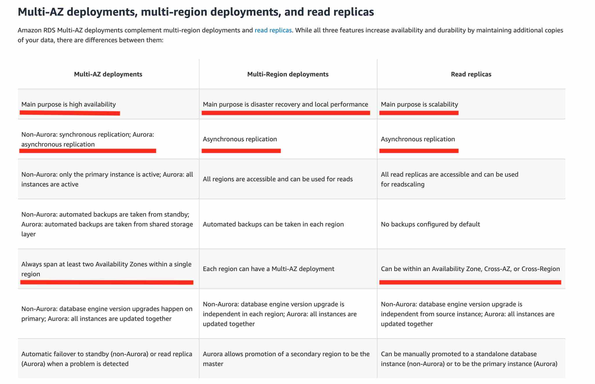

- reference:
  - https://chatgpt.com/c/675945a8-f8b8-800d-a789-e07e6db38e8d
--- 
# A. Choosing Right database
## `Data model`
  - RDBMS / NoSQL
  - Joins? Structured? Semi-Structured?
  - Strong schema? More flexibility?
  - Reporting? Search?
    
## performance 
  - Throughput, 
  - Read-heavy, write-heavy, balanced workload
  - Latency requirements
  - Concurrent users?
  
## Size
  - How much data to store and for how long? 
  - Will it grow? 
  - Average object size?
  
## availability (global DB) 
- replicate
- DR Support
- backup/recovery
- Aurora and DynamoDB are global database

## Security
  - MySQL + Postgres has IAM role based security

## cost
- 
---

# B. AWS Database Offerings

## B.1 Relational Databases
Relational databases are designed to handle structured data with predefined schemas and support SQL queries.

### 1. **Amazon RDS (Relational Database Service)**
- Fully managed relational database service.
- Supports multiple database engines:
    - **MySQL**
    - **PostgreSQL**
    - **MariaDB**
    - **Oracle**
    - **Microsoft SQL Server**
- Features:
    - Automated backups and snapshots.
    - High availability with Multi-AZ deployments.
    - Read replicas for scalability.

### 2. **Amazon Aurora**
- High-performance, fully managed relational database service.
- Compatible with:
    - **MySQL**
    - **PostgreSQL**
- Features:
    - Up to 5x performance of standard **MySQL** and 3x performance of standard **PostgreSQL**.
    - Automatic scaling.
    - Fault-tolerant and self-healing

---

## B.2 Non-Relational Databases
Non-relational databases are designed for unstructured or semi-structured data and support a variety of access patterns.

### 1. **Amazon DynamoDB**
- Fully managed NoSQL database service.
- Key-value and document database.
- Features:
    - Single-digit millisecond performance.
    - Serverless with auto-scaling.
    - Integrated with DynamoDB Streams for event-driven architecture.

### 2. **Amazon ElastiCache**
- Fully managed in-memory data store.
- Supports:
    - **Redis**
    - **Memcached**
- Features:
    - Ultra-low latency.
    - Ideal for caching, session management, and real-time analytics.

### 3. **Amazon `Neptune`** :dart:
- **Fully managed** graph database service.
  - relation b/w dataset
  - optimized for:
    - storing billions of relationships
    - querying the graph with milliseconds latency
- Supports:
    - **Property Graph**
    - **RDF (Resource Description Framework)**
- more:
    - High performance and scalability.
    - Neptune is secure with support for **HTTPS** encrypted client connections :point_left:
    - highly available, with read replicas, point-in-time recovery, continuous backup to Amazon S3, and replication across AZ.
    

### 4. **Amazon `DocumentDB` (with MongoDB compatibility)**
- Fully managed document database service.
- store, query, and index JSON data
- it does not have an in-memory caching layer :point_left:
- Compatible with **MongoDB**.
- Features:
    - Purpose-built for JSON workloads.
    - High availability and durability.

### 5. **Amazon `Keyspaces` (for Apache Cassandra)**
- Fully managed Cassandra-compatible database service.
- Features:
    - Serverless.
    - Handles large-scale, time-series data.

### 6. **Amazon `Timestream`**
- Fully managed time-series database service.
- Features:
    - Optimized for IoT and operational applications.
    - Query and analyze time-series data efficiently.

### 7. **Amazon `QLDB` (Quantum Ledger Database)**
- Fully managed ledger database.
- Features:
    - Immutable and cryptographically verifiable transaction logs.
    - Ideal for applications requiring an authoritative data source.

---

## B.3 Hybrid Solutions
### 1. **AWS Database Migration Service (DMS)**
- seamlessly migrate data `from` supported sources `to` :
  - **relational databases**,
  - **data warehouses**,
  - **streaming platforms** (KDS,MSK) :point_left: :dart:
  - and other data stores in AWS cloud.
- more:
  - **Continuous** Data Replication
  - Supports migrations between **relational and non-relational databases**. :point_left:
  - source database remains fully operational during the migration
  - **minimizing downtime** to applications that rely on the database.
- sources:
  - relational/non-relational databases
  - S3
  - ...
- usecase :dart:
  - S3 --> DMS --> KDS,MSK :point_left:
  
---

### Summary Table
| Database Service           | Type               | Use Case                       |
|----------------------------|--------------------|---------------------------------|
| Amazon RDS                | Relational         | General-purpose SQL workloads  |
| Amazon Aurora             | Relational         | High-performance SQL workloads |
| Amazon DynamoDB           | Non-Relational     | Key-value and document storage |
| Amazon ElastiCache        | Non-Relational     | Caching and session management |
| Amazon Neptune            | Non-Relational     | Graph-based queries            |
| Amazon DocumentDB         | Non-Relational     | JSON document storage          |
| Amazon Keyspaces          | Non-Relational     | Cassandra-compatible workloads |
| Amazon Timestream         | Non-Relational     | Time-series data               |
| Amazon QLDB               | Non-Relational     | Ledger use cases               |

---

This document outlines the core relational and non-relational database offerings from AWS, highlighting their use cases and features.

---

