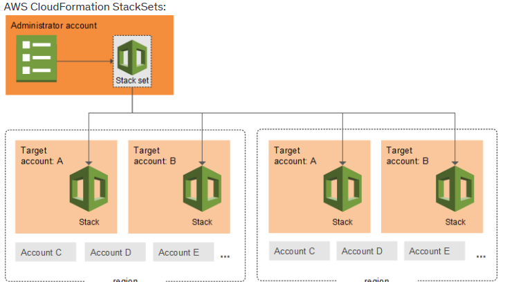

# A. AWS Organisation (global srv)
## 1. key term
- `organisation unit, OU` : Applied one policy(scp) : `AWSFULLAccess`
  - `OU (root)` :  
      - `Management-account` (main) : 
        - Don't apply SCP, have full access already.
        - even if we apply, no impact.
      - `member-account`-1
      - member-account-2
      - `ou (dev)`  : `SCP-2`, `SCP-3`
        - dev-account-1
        - dev-account-2
        - ...
      - `ou (prod)`
        - dev-account-1
        - dev-account-2
        - ...
      - ...
      - can have nesting > nesting> ...
    
## 2. organizational policies
### SCP (Service Control Policies)
- SCPs DONT **retroactively affect existing resources** :point_left:
- permission/policies :point_left: :dart:  
  - by default, allow NOTHING
  - applies to **member-acct**  :dart:
    - member-acct's :: [ root account , IAM user, IAM group, IAM role ] :point_left: **root** as well
    - does not affect **service-linked role** (AWS managed roles)
  - applies to **OU**
    - applies to member-acct-OU-1
    - applies to member-acct-OU-2
    - ...
- child OU inherit SCP from parent OU
- **strategies**
  - `AllowedList` : deny all first, then start adding allowed items.
  - `Blocklist` : allow all first, then start adding blocks.
  
### tag policies 
- create tags and create polices around it. 
- eg : ccgg has tag on attmid

### backup polices 
- org wide backup plan.

## 3. benefit / purpose
- `hierarchical structure of OUs`
  - API to create member-acct and organize them.
  - ou by business unit, ou by project, ou by env
  
- `Cost`
  - Aggr all usage and give more `saving`
  - `consolidated` billing.
  
- `security`
  - Configure `AWS SSO`/ `Identity Center` for centralized access management
    - create `cross account role` in permission-Set of IP
  - centrally manage and govern multiple AWS accounts.
  - policies
      
- `centralized log` : Send CloudWatch Logs to central account\

## 5. deploy IAC : `StackSet`
- **Stacks** are ideal for single-region deployments
- **StackSet** Manages Centralized deployment of resources across 
  - multiple regions 
  - multiple accounts 
  - in AWS org
- 

---
## 98. Screenshot
- 
- 

---
## 99. Exam scenario
```text
Scenario #1
You would like to migrate an AWS account from an AWS Organization A to an AWS Organization B. 
What are the steps do to it:
  - Remove the member account from the old organization. first
  - Send an invite to the member account from the new Organization. 
  - Accept the invite to the new organization from the member account

===  
Scenario #2
- AWS Org, member account MA-1 has NAT-gatway-1
- later on SCP-1 attached to  deny attaching new NAT gateway.
what will happen to new and existing NAT gateway ?

Solution:
- Existing NAT Gateway (NAT-Gateway-1) in MA-1 → ✅ Will continue to work because SCPs do not retroactively affect existing resources.
- New NAT Gateway Creation in MA-1 → ❌ Will be denied due to SCP-1 restricting new NAT gateway creation.
```

---
# B. AWS Control tower
## Intro
- Another service on top of AWS org 
  - to set-up new, secure, and compliant **multi-account AWS environmnet**, 
  - reducing the time and complexity involved.
- provides **interactive dashboard** to see:
  - compliance in all acct/s in org.

## guardrails
- Automate on-going policy management using **guardrails**
  - Detect policy violations - built-in governance and compliance 
  - remediate them

- Type:
  - **Preventive guardrails**  
    - restrict, using SCP
  - **detective guardrails**  
    - notify non-compliance using AWS config 
- 
- 
