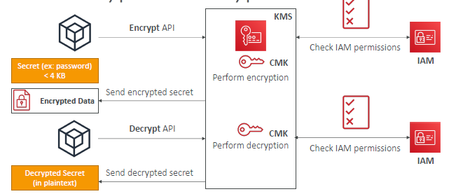
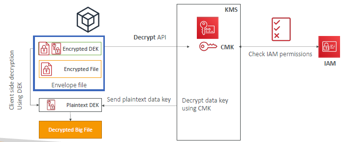
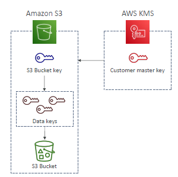

# AWS KMS

## 1. Encrypt/decrypt (< 4KB) 
- straight forward, nothing new
- 

---
## 2. Encrypt/decrypt (> 4KB) `big files`
- happens at client side :point_left:
- generating **data key**: `DEK` 
  - using it for en/de
  - can **cache** this and re-use
    - reduce the no of api call and save quota :point_left:
  - CLI/SDK simplifies it, so use it.
    - ``

```yaml
## === way-1 ===
## Step-1 generate DEK
- aws kms generateDatakey
  - plaintext DEK

- aws kms generateDatakey --CMK-1
  - plaintext DEK
  - plaintext DEK + CMK-1 ==> encrypted DEK (ciphertextBlob)

- aws kms generateDatakeyWithoutPlaintext --CMK-1
  - plaintext DEK + CMK-1 ==> encrypted DEK (ciphertextBlob)

## Step-2 perform encryption/decryption
...
...

# === way-2 ===
  pip i aws-encryption-sdk-cli

  aws-encryption-cli --encrypt \
  --input <input_file_or_directory> \
  --output <output_file_or_directory> \
  --wrapping-keys key=arn:aws:kms:region:account-id:key/key-id

  aws-encryption-cli --decrypt \
  --input <encrypted_file_or_directory> \
  --output <decrypted_file_or_directory>

```

### 2.1 **envelop encryption**


### 2.2 **envelop de-cryption**


- eg with s3
  - 
---

## 3. KMS request quota
- share quota across account.
- will get ThrottleException

