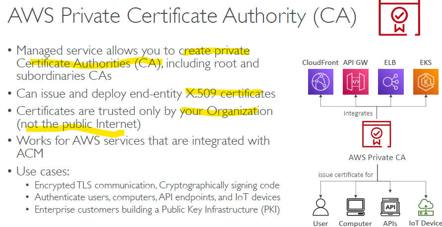

# ACM

## 1. certificate:
- **private**
  - 
  - cert can be used inside org
- **public** 
  - cert for public internet

## 2. Generate certificate
### by internal / ACM
- ACM generate cert
- import to ACM
- Auto-renew in `60 days ` before.
  
### bt External provider
- eg: **digicert**
- generate cert for **FQDN** or with wildcard
  - dev1.outbound.aws.org.com,  
  - dev2.outbound.aws.org.com
  - *.outbound.aws.org.com
  - *.aws.org.com
- import to ACM

## 3. certificate: Validation method
- **email** : ?
- **dns** 
  - just, create `cname` entry in R53 with above dns
  - no auto re-new
  - but sends eventBridge event to expiration, before `45 days`
    - can catch event --> SNS alert, lambda, 
  - `AWS-Config > rule:acm-cert-expiracy-check` --> change days from 45 to something else.
  - Also, add event-bridge rule to catch daily/monthly expiration events.

## 4. ACM: integration with services    
- **CloudFront** 
- **R-53**
- **ELB** : ALB, NLB, ... 
  - 
- **API gateway** (3 types)
  - edge-optimized : keep ACM cert in `us-east-1`
    - 
  - regional +  private(with In vpc) 
    - keep ACM cert in same region
    - 

