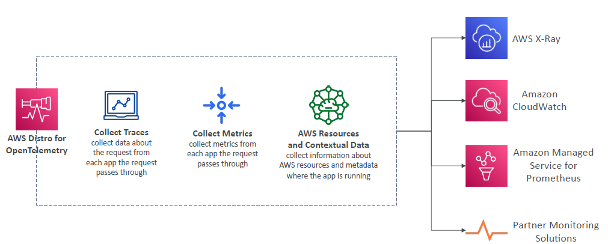

# A. OpenTelemetry 
 - an open-source **observability framework** under `CNCF`
 - designed to **capture and transmit telemetry** data (traces, metrics, and logs) 
 - **from** your applications 
 - **to** monitoring and analytics platforms. 
 - aims :point_left:
   - to standardize how observability data is collected, processed, and exported.

## component
- `API` 
  - Provides a unified interface for **generating** telemetry data (traces, metrics, and logs)
- `SDKs` 
- `OpenTelemetry Collector`
  - **gateway** to centralize telemetry data from multiple sources and route it to one or more backends
- `Exporters` 
  - Transmit data to various observability platforms:
    - Datadog 
    - AWS X-Ray
    - Prometheus 
    - Jaeger
    - ...
    - **mutliple destintion** :smile:
      - app --> `aws x-ray sdk` -->  sends data to x-ray (single destintion)
      - app --> `open telemetry lib ` --> multiple destintion/s

---
# B. AWS Distro  
## Intro
- Secure, production-ready AWS-supported distribution of OpenTelemetry project
- Auto-instrumentation Agents to collect traces without changing your code
- Send traces and metrics to :
  - multiple AWS services  : X-Ray, CloudWatch, ...
  - partner solutions: Prometheus, ...

