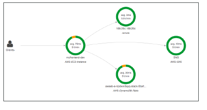
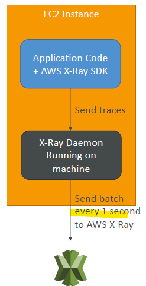
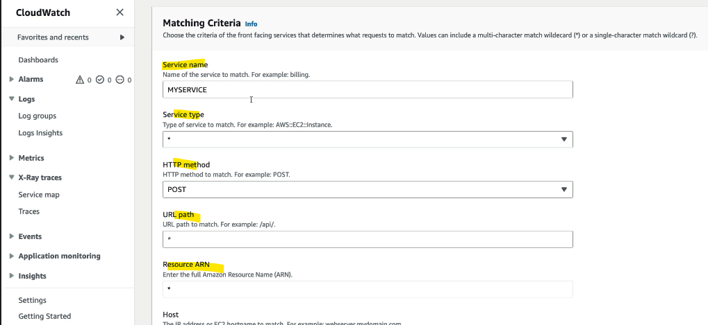

# AWS X-ray :books:
- :
  - 
- 
---
## A. Intro
- analyze **traces** `visually`
- Understand dependencies in a **microservice architecture**
- **compatible services** 
  - AWS Lambda
  - Elastic Beanstalk
  - ECS
  - ELB
  - API Gateway
  - EC2 Instances or any application server (even on premise)
  
- **concepts**
  - **request > has component/s (each adds its `traces`) > has segments and/or sub-segments**
    - `Segments`: each component (application / service) will send traces having segment/s
    - `Subsegments`: if need to more details in your segment
    - `Trace`: segments collected together to form an end-to-end trace
    - `Sampling`: decrease the amount of requests sent to X-Ray, reduce cost
    - `Annotations`: Key Value pairs used to **index traces** and use with **filters**
    - `Metadata`: Key Value pairs, **not indexed**, not used for **searching**
  
## B. SDK and daemon
- **SDK**
  - 
  - SDK will capture:
    - Calls to AWS services
    - HTTP / HTTPS requests
    - Database Calls (MySQL, PostgreSQL, DynamoDB)
    - Queue calls (SQS)
- **X-Ray daemon**
  - low level UDP packet interceptor
  - AWS Lambda / other AWS services already run the X-Ray daemon :point_left:
- can send traces in cross account
---
## C. Sampling rule
- control the amount of data that we record.
- no code changes, just configure it for deamon.
- https://www.udemy.com/course/aws-certified-developer-associate-dva-c01/learn/lecture/19730096#overview

- **Reservoir** (Reservoir-based sampling)
  - Defines the number of requests to sample per second, before the fixed-rate sampling is applied.
- **Rate** (Fixed-rate sampling):
  - Specifies the percentage of requests to sample.
  - 0.05 === 5 %
  - 1 == 100 %
- define **matching criteria**
  - 

- default : [ `Reservoir=1/sec, rate=5%`, criteria=* ]
- sample-rule-1 (priority 1), sample-rule-2 (priority 9999), ...
  - rule-2 will be applied
  
---
## B. X-Ray Security:
- IAM for authorization
- KMS for encryption at rest

---

## Z. extra :books:
### AWS X-Ray Troubleshooting

-  on **EC2**
  - Ensure the EC2 **IAM Role** has the proper permissions
  - Ensure the EC2 instance is running the **X-Ray Daemon**

-  on AWS **Lambda**
  - Ensure IAM execution role `AWSX-RayWriteOnlyAccess`
  - Enable  **X-Ray Active Tracing** 