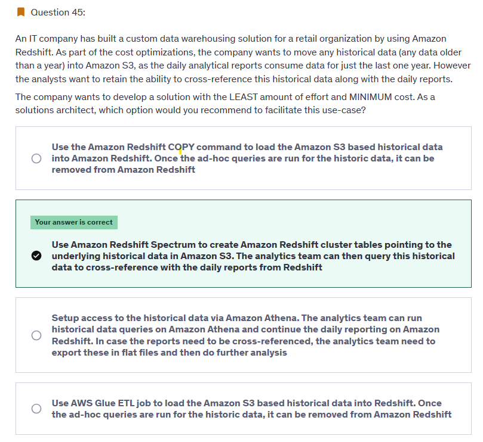

# Redshift (Not serverless)

## 1. Intro
- **OLAP** (online **analytic** processing) database
- **data warehousing** 
- load PB of data and perform query/analysis
- like athena, Integrated with **aws:glue** (crawler > catalog)
- analytic query **result** goes to:
  - S3 
  - Amazon QuickSight (dashboard) 
  - `Tableau`
  - ...

--- 
## 2. Data Source
- 
- load data from below  sources
  - **KDF**
  - s3
  - program(Java:SDK): **in-batches** 
  - AWS glue/ETL
  - ...

---
## 3. Cluster architecture
- Cluster => **leader Node** => **compute Node** => 1000s of **spectrum**
  - performance `(10x)`, than other data warehouses and athena
- **parallel query engine** 
  - run complex SQL
  - faster-joins
  - faster-aggregation
  - uses indexes + Columnar storage

---
## 4. cross-referencing
- Analysts can use Redshift SQL queries to access both :
  - **Redshift tables** (`recent` data) 
  - **data in S3** (`historical` data) **without moving data into redshift** :point_left:
    -  **Spectrum**, allows you to run queries on data stored in Amazon S3,
    - without having to move that data into your Redshift cluster.
  

---
## 5. DR
- **single-AZ** (by default)
- **Multi-AZ**  replication 
- **cross region-replication** - explicitly enable
  - incremental-snapshot(only new change), in every 8 hr. 
    - retention: 35 days.
    - stored in s3.
  - restore snapshot/s into new region : **manually/automate**.
  - 

---

## Exam
- App 
  - less than year older data --> **redshift** --> `analytic-report-1`
  - older than year --> **s3**
  - `analytic-report-2`,  reference from --> s3 + redshift
  - how to cross-reference s3 :point_left:
  - 

