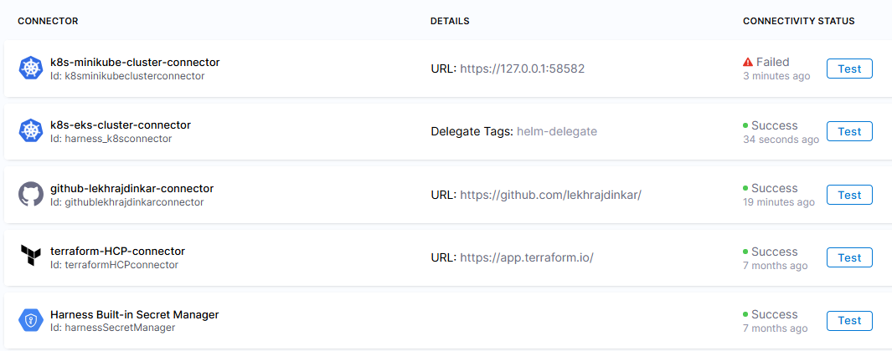

- https://developer.harness.io/docs/continuous-delivery/get-started/key-concepts
---
# Harness
## A. onboarding
- https://app.harness.io/ng/account/e0wDKKO_S46x3M75TWv0iw/all/settings/
- **Account**: `lekhrajdinkar`  
  - **Organization**: `default`
    - **project**
      - **outbound-api : dashboard**
        - pipelines 
        - users 
        - Environments
        - Services
      - outbound-ui : dashboard
        - ...
        - ...
--- 
## B. project 1 - app-outbound-api :green_circle:
### B.1. pre-work (plateform team) :yellow_circle:
#### 1 setup : secrets
- **aws**
  - aws_eks_get_token
    - **aws eks get-token  --cluster-name maps-outbound-us-west-2-dev2-eks-fargate-cluster --region us-west-2**
    - Need to update token manually, once expired
    - https://app.harness.io/ng/account/e0wDKKO_S46x3M75TWv0iw/all/settings/secrets/aws_eks_get_token/overview
  - aws_eks_cluster_ca_data
  - aws_533267082359_secret_access_key
- **minikube**
  - minikube-admin-client-key
  - minikube-admin-client-crt
  - C:\Users\Manisha\.minikube\profiles\minikube
- **github**-access-token-org
- **terraform**-hcp-dev

#### 2 setup : delegates
[02_delegates.md](02_delegates.md)

#### 3 setup : connectors
- **kubernetes**
  - k8s-eks-cluster-connector
  - k8s-minikube-cluster-connector
- **github**-lekhrajdinkar-connector
- **terraform**-hcp-connector
- **aws**
  - aws-secret-manager-connector
  - aws-account-connector
- **more**
  - nexus-repo-connector 
  - service-now-connector



#### 4 Access control
- **service account** : none
- **user group** : `app_DevLead` (LDAP role)
  - u1, u2
- **roles**
  - found 19, built-in. eg: pipeline-executor
  - create custom role
    - pipeline-owner
    - pipeline-developer
  - role has defined granular **permission**.
    - **resource/s : action/s**
    - service  : R , W, Edit, View, etc
    - template : R , W, Edit, View, etc
    - pipeline : R , W, Edit, View, etc
    - ...

---
### B.2. CD pipeline (developer team) :yellow_circle:
#### 1 Template
- can create template for : **step, stages, pipeline**
- then re-use it.
  
#### 2 pipeline :point_left: :point_left:
- https://app.harness.io/ng/account/e0wDKKO_S46x3M75TWv0iw/all/orgs/default/projects/mapsoutboundapi/pipelines
- pipeline > stages (build, deploy, another pipleline) > steps (run, image push, etc)
  - pipeline variable
    - input-set-env-1
    - input-set-env-2
    - ...
  - triggers : on git actions
  - codebase : github connector + repoName
  - studio/yaml
  - save : inline / gitrepo

#### 3 services :x:
#### 4 environment :x:
- **env-group**
  - oz-dev
    - dev1 (pre-prod)
    - dev2 (pre-prod)
    - prod\
- created but not used/referenced in pipeline. ??    
---
## D. project 2 - ccgg :green_circle:
### D.0. platform team shared templates
#### template : gauntlet-scan
- input: image-container-registry + image(tf,k8s,aws)
- env var: **git-branch, atm, env_gate (oz_dev)**
#### template : serviceNow
- input: CRQ no

### D.1. M-app :pipelines
#### :parking: 1. iac-terraform-pipeline ( input::component - in, out, kafka, engine)
- stage1
  - gauntlet scan
  - bash :: **TRF_PLAN**
- stage2 - **TRF_PLAN_APPROVAL**
  - harness-template-2 :: manual approval
- stage3
  - gauntlet scan
  - bash :: **TFR_APPLY**
  
```bash
terraform -v
tfr_workspace=<+pipeline.variables.tf_ws>
tfe_ws_id=<+pipeline.variables.tf_ws_id>
tfe_host=<+pipeline.variables.tf_host>

# login
# option-1
wget ccggAnsible/tfeSync.zip
unzip tfeSync.zip
./tfesync -w tfe_ws_id
# option-2
terrafom login -p $TFE_TOKEN

# create :: credential.trfc.son with $TFE_TOKEN
# create :: backend.tf with tf_ws_id
terrafom init
terrafom plan -var-file ./env/${ENV}.tfvars
```

#### :parking: 2. interface-pipeline-dev/qa/prod (3 diff pipeline)
- stage 1 : **BUILD**
  - gauntlet scan
  - get version (from branch name)
  - `harness-template-1` :: **build and push to docker Hub**, or
  - `harness-template-2` :: **build and push to AWS-ECR**, or :point_left:
    - aws connector (aws secret key from broadAccessRole)
    - aws account id + region
    - image name
    - codebase, already present in pipeline

- stage 2 (only for prod pipeline)  : **servicenow**
- stage 3  : **DEPLOY**
  - `bash` :: deploy to ECS
  
  ```bash
  # === 1 git version ===========
  
  GIT_BRANCH = <+pipeline.variables.GIT_BRANCH>
  VERSION = $GIT_BRANCH.split('\/')[1]
  VERSION_WITH_SEQ = "${VERSION}-"<+pipeline.sequenceId>
  
  # === 2 deploy to ECS  =========== 
  
  current_role = $(aws sts get-caller-identity)
  export $(printf "AWS_ACCESS_KEY=%s AWS_SECRET_ACCESS_KEY=%s AWS_SESSION_TOKEN=%s")
  $(aws sts assume --role harness-pipleline-role --session-name --query "Credential.[AccesskeyId, SecretAccesskey, SessionToken] --output text")
  
  current_role = $(aws sts get-caller-identity)
  
  old_tasks=$(aws ecs list-task --cluster --service-name --region    --query tasjArn[*] --output text)
  for task in old_tasks; 
  do aws ecs stop task --cluster --service-name --region
  aws ecs stop task --cluster --service-name --region --force-new-deployment
  ```
---
### D.2. P-app :pipelines (common for all env)
#### :parking: 1. app-pipeline
- Stage 1 **Build** : 
  - gauntlet scan 
  - get version(from helm) 
  - dind > dockerize 
  - push app-image to nexus-dev 
  - update helm-value.yml with new image detail
  - push helm-chart to nexus-dev
- Stage 2 **Deploy-dev/qa** : 
  - copy2ECR (primary) > helm (primary)
  - copy2ECR (secondary) > helm (secondary)
- Stage 3 **service-now**
- Stage 4 **Deploy-prod**
  - gauntlet scan - image (not codebase) - input:imageName+version
  - **promote to prod (nexus dev >> nexus-prod)**
  - copy2ECR (primary) > helm (primary)
  - copy2ECR (secondary) > helm (secondary)

  ```bash
  #========== 1 get version (from helm chart) ===========
  
  helmVersion=$(cat $HELM_CHART_DIR/chart.yaml | grep version:)
  appVersion=$(cat $HELM_CHART_DIR/chart.yaml | grep version:)
  # major and minor version using regex in $major $minor
  
  #========== 2 dockerize ===========
  
  docker login -u <+pipeline.getvalue(nexus_user)> -p  <+pipeline.getvalue(nexus_password)>
  docker build -t nexus-dev/$image:appVersion --label git_branch= --label=commit_id=
  docker push  nexus-dev/$image:appVersion
  
  #========== 3  update helm (new image) >> push helm-chart to nexus-dev  ===========
  yq --version
  helm e -i '.image.name = env(repoAndImageName)' $HELM_CHART_DIR/value.yaml
  helm e -i '.image.tag = env(version)' $HELM_CHART_DIR/value.yaml
  
  helm lint  $HELM_CHART_DIR --value=$HELM_CHART_DIR/value.yaml
  helm package  $HELM_CHART_DIR
  helm registry login -u <+pipeline.getvalue(nexus_user)> -p  <+pipeline.getvalue(nexus_password)>
  helm push  $image:helmVersion nexus-dev
  
  #========== 4 copy2ECR  (nexus dev >> ecr) ===========
  crane version
  crane auth login -u <+pipeline.getvalue(nexus_user)> -p  <+pipeline.getvalue(nexus_password)> nexus-dev-registry
  
  # copy from nexus to ecr 
  export $(printf "AWS_ACCESS_KEY=%s AWS_SECRET_ACCESS_KEY=%s AWS_SESSION_TOKEN=%s")
  $(aws sts assume --role harness-pipleline-role --session-name --query "Credential.[AccesskeyId, SecretAccesskey, SessionToken] --output text")
  ecr_password=$(aws ecr get-login-password --region)
  crane auth login -u AWS -p  ecr_password erc-repo
  
  # copy app-image and helm
  crane cp nexus-prod/$app_image:$app_image $ecr-repo-prod/$app_image:$app_image
  crane cp nexus-prod/$app_image:$app_image-helm $ecr-repo-prod/$app_image:$app_image-helm
  
  #========== 5 Promote to prod (nexus dev >> nexus prod >> ECR) ===========
  
  crane version
  crane auth login -u <+pipeline.getvalue(nexus_user)> -p  <+pipeline.getvalue(nexus_password)> nexus-dev-registry
  crane auth login -u <+pipeline.getvalue(nexus_user_prod)> -p  <+pipeline.getvalue(nexus_password_prod)> nexus-prod-registry
  
  # copy from nexus to ecr (of Life cycle AWS )
  export $(printf "AWS_ACCESS_KEY=%s AWS_SECRET_ACCESS_KEY=%s AWS_SESSION_TOKEN=%s")
  $(aws sts assume --role harness-pipleline-role --session-name --query "Credential.[AccesskeyId, SecretAccesskey, SessionToken] --output text")
  ecr_password=$(aws ecr get-login-password --region)
  crane auth login -u AWS -p  ecr_password erc-repo
  
  # copy app-image : nexus dev >> nexus prod >> ECR
  crane cp nexus-dev/$app_image:$app_image nexus-prod/$app_image:$app_image 
  crane cp nexus-prod/$app_image:$app_image $ecr-repo-prod/$app_image:$app_image
  
  # copy helm  : nexus dev >> nexus prod >> ECR
  crane cp nexus-prod/$app_image:$app_image-helm $ecr-repo-prod/$app_image:$app_image-helm
  crane cp nexus-dev/$app_image:$app_image-helm nexus-prod/$app_image:$app_image-helm 
  
  #========== 6. Helm install ===========
  kubectl version
  helm version
  
  export $(printf "AWS_ACCESS_KEY=%s AWS_SECRET_ACCESS_KEY=%s AWS_SESSION_TOKEN=%s")
  $(aws sts assume --role harness-pipleline-role --session-name --query "Credential.[AccesskeyId, SecretAccesskey, SessionToken] --output text")
  
  aws ssm get-parameter --region --name "mc/cluster-1/kubeconfig" --query "parameter.Value" --output text > kubeconfig
  
  export KUBECONFID="$PWD/kubconfig"
  kubectl auth can-i create deployment -n ns-1
  
  ecr_password=$(aws ecr get-login-password --region)
  helm registry login -u AWS -p ecr_password
  
  helm pull oci://$ecr_repo/$image:$appVersion  --version $helmVersion
  tar ...  
  helm upgrade --install $RELEASE_NAME $image:$appVersion --value ./values.yaml -n --wait 300s --atomic
  ```
#### :parking: 2. lambda layer pipeline
```bash
  export $(printf "AWS_ACCESS_KEY=%s AWS_SECRET_ACCESS_KEY=%s AWS_SESSION_TOKEN=%s")
  $(aws sts assume --role harness-pipleline-role --session-name --query "Credential.[AccesskeyId, SecretAccesskey, SessionToken] --output text")
   
  pip3 install ${requiements_path} --target ./python/lib/python3.11/site-packages
  python3 -c "import shutil.make_archive(${ZIP_FILE} , 'zip', root_dir = '.' base_dir='python')"
  aws s3 cp ${layer_name}.zip
```

---
### D.3. F-app :pipelines
- later
