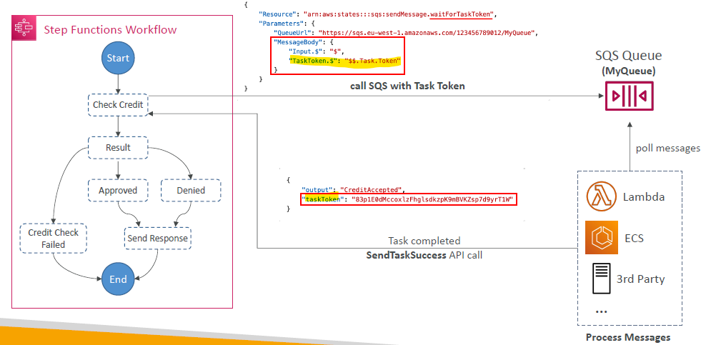
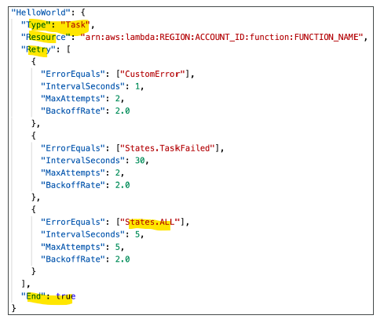

# Step Function (serverless)
-  https://aws.amazon.com/step-functions/

## 0. intro
- **function orchestrator** that makes it easy to sequence AWS Lambda functions and multiple AWS services into **business-critical applications**
-  can create and run a series of checkpointed and event-driven workflows
- output of one step acts as an input to the next
- visual workflows
- **Improve resiliency**
  - manages state, checkpoints and restarts for you to make sure that your application executes in order and as expected.
  - Built-in try/catch, retry and rollback capabilities deal with errors and exceptions automatically
  
--- 
## 1. State machine
- model **workflow** as state-machine
  - from workflow studio / console UI
  - create `ASL` (Amazon State lamguage), json.
- has **states** to do some work, like
  - 
  - 
  
- **type**: 
  - standard 
  - express
  


---
## 2. state
- **type**
  - `pass`
  - `choice`
  - `wait`
  - `parallel`
  - `fail`
  - **Activity task** :point_left:
    - have poll mechanism.
    - **activity worker** (lambda, ec2, ecs) polls for task (taskToken-1)
      - API : **getActivityTask**
    - send back : 
      - API : **sendTaskSuccess** / **SendTaskfailure**
        - output/error
        - taskToken-1
    - waits for worker, options:
      - option-1: worker-1, periodically send heardbeat, API: **SendtaskHeartBeat**
        - upto 1 year :point_left:
      - option-2 : configure `TimeOutSecond`
    - 

---
## 3. wait for task Token
- similar to activity task
- task --> depend on 3rd app response




---
## 4. Error handing
- can handle in Application code
- can handle in state machine using **retry** and  **catch**
- [udemy Video ref](https://www.udemy.com/course/aws-certified-developer-associate-dva-c01/learn/lecture/26101912#overview)

### Retry


### Catch
- **error/exception**
  - note: `CustomError` in screenshot : coming from Application/lambda code
```
• States.ALL        : matches any error name
• States.Timeout    : Task ran longer than TimeoutSeconds or no heartbeat received
• States.TaskFailed : execution failure
• States.Permissions: insufficient privileges to execute code
```
- 

- **resultpath** : input to next state
  - 

---
## 5. security


