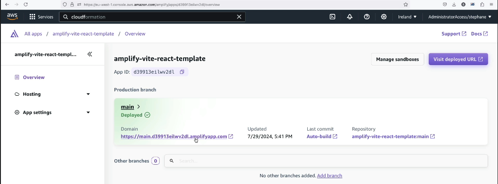

# Amplify (serverless)

## Intro
- set of tools, for creating :
  - mobile App
  - web application
  
- has **integrations** with :
  - `storage` : dynamoDB, S3
  - `security` : cognito
  - `API` : appsync (GraphQL)
  - `UI` : **frontend lib**
  - `ML`
  - `Hosting` : cloudfront
  - `testing` : **Cypress** testing framework
  - note: use cloudFormation for provision resource.
  - 

---
## Amplify studio(visual) + CLI
- amplify **init**
- amplify add **auth**
- amplify add **api**
- amplify add **hosting**

---
## screenshot

