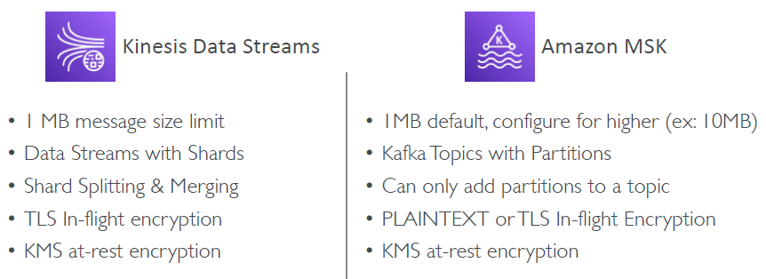

# MSK

## A. Intro
- Alternative to Amazon KDS.
- Fully managed **Apache Kafka** on AWS.

---
## B. provision
###  B.1 **serverless**: 
  - Don't provision cluster capacity, 
  - resource, 
  - compute, 
  - storage,etc

### B.2 **MSK-regular**, we provision:
  - Cluster
  - Kafka `brokers nodes` 
  - `Zookeeper` nodes
  - deploy in `Multi-AZ`
  - Data stored in `EBS` (as long as paying for volume)
  - `recovery` from failure

---  
## C. Consumer 
- **managed Service for Apache Flink**
- **Glue**
- **lambda** 
- custom app
  - ecs,eks,etc
- 

---
## D. comparison with kafka 
