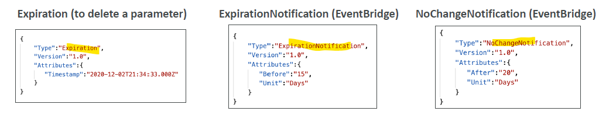

# SSM (serverless)

## 1. Intro
- serverless, fully managed
- **parameter-store**
  - organize in structure/hierarchy pattern
  - versioning enabled. :point_left:
  
- **integration** with:
  - **CloudFormation** : template can read configs.
  - **IAM** : enforce restricted access.
  - **eventBidge** : get events from store actions like : add,delete,update,access,etc
  - **KMS** : security, encrypt/decrypt configs
    - 
    
- `string`, `StringList`, `SecureString` (kms-key-1)

## 2. Type 
### 2.1. Standard `free`
- `10k` params
- each, max size - `4 KB`

### 2.2 Advance `paid`
- 100K params
- each, max size - `8 KB` , 
- **additional feature**
  - attach iam-policies for secured access.
  - 
- **pricing**
  - 5 cent/month


--- 
## 3. use case
- Store **IAM policy**
- Store config data for CloudFormation, Codebuild,etc
- Store **secret**
  - 

---
## 4. CLI :books:
```yaml
aws ssm put-parameter \
--name "/my-app/config/db-password" \
--value "MySecurePassword123" \
--type SecureString \
--key-id "alias/my-kms-key"


aws ssm get-parameter \
--name "/my-app/config/db-password" \
--with-decryption

aws ssm get-parameters \
--names "/my-app/config/db-password" "/my-app/config/db-username" \
--with-decryption

aws ssm delete-parameter \
--name "/my-app/config/db-password"
```

---
## 99. hands on
```
- create : /parent/child-1/param-1 - string
- create : /parent/child-2/param-1 - SecuredString
  - choose : kms-key-1
-  standard 4096 chars max, 4kb max

// ready

aws cli :
  - get-parameter /parent/child-1/param-1
  
  - get-parameter /parent/child-2/param-1
  - get-parameter /parent/child-2/param-1 --with-cecryption
  
  - get-parameter-by-path /parent
  - get-parameter-by-path /parent/child-1
  
  - access from lambda-1
    - set env var: child='child-2'
    - ssm=boto3.client('ssm', region1)
    - ssm.get_parameters(names=['/parent/'+ child +'/param-1'], WithDecryption=true)
    - failed:
    - fix: update lambda iam role:
      - allow read > ssm:path-/parent
      - allow kms : kms-key-1
```


