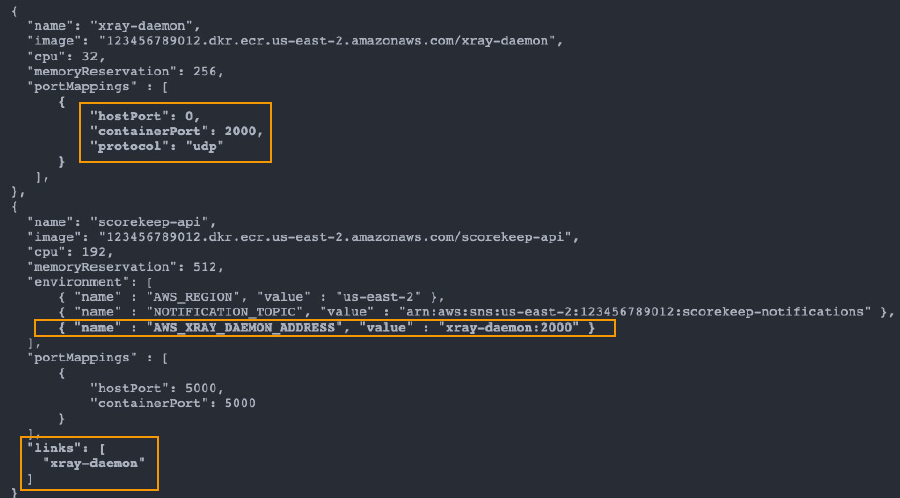
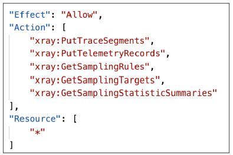

- https://chatgpt.com/c/677c6111-b1a8-800d-b8c6-462a6e11d1d6
---

# AWS X-ray :books:
## A. Intro
- analyze **traces** `visually`
  - 
- Understand dependencies in a **microservice architecture**
- **compatible services** 
  - AWS Lambda, API Gateway
  - Elastic Beanstalkok
  - 
  - ELB
  - ECS, EC2
  - on-prem server with daemon installed
  
- **concepts**
  - **request > has component/s (each adds its `traces`) > has segments and/or sub-segments**
    - `Segments`: each component (application / service) will send traces having segment/s
    - `Subsegments`: if need to more details in your segment
    - `Trace`: segments collected together to form an end-to-end trace
    - `Sampling`: decrease the amount of requests sent to X-Ray, reduce cost
    - `Annotations`: Key Value pairs used to **index traces** and use with **filters**
    - `Metadata`: Key Value pairs, **not indexed**, not used for **searching**
  
## B. SDK and daemon
- **SDK**
  - 
  - SDK will capture:
    - Calls to AWS services
    - HTTP / HTTPS requests
    - Database Calls (MySQL, PostgreSQL, DynamoDB)
    - Queue calls (SQS)
- **X-Ray daemon**
  - low level UDP packet interceptor
  - AWS Lambda / other AWS services already run the X-Ray daemon :point_left:
- can send traces in cross account

---
## C. Sampling rule
- control the amount of data that we record.
- no code changes, **just configure it for deamon**. :point_left:
- https://www.udemy.com/course/aws-certified-developer-associate-dva-c01/learn/lecture/19730096#overview

- **Reservoir** (Reservoir-based sampling)
  - Defines the number of requests to sample per second, before the fixed-rate sampling is applied.
- **Rate** (Fixed-rate sampling):
  - Specifies the percentage of requests to sample.
  - 0.05 === 5 %
  - 1 == 100 %
- define **matching criteria**
  - 

- default : [ `Reservoir=1/sec, rate=5%`, criteria=* ]
- sample-rule-1 (priority 1), sample-rule-2 (priority 9999), ...
  - rule-2 will be applied
  
---
## B. X-Ray Security:
- IAM for authorization
- KMS for encryption at rest

---
## C. X-Ray with:
### C.0 Ec2/on-prem server
- Ensure the EC2 **IAM Role** has the proper permissions
- Ensure the EC2 instance is running the **X-Ray Daemon**
- application code is instrumented with the X-Ray SDK

### C.1 AWS lambda
- Ensure IAM execution `AWSX-RayWriteOnlyAccess` role
- Enable  **X-Ray Active Tracing**
- application code is instrumented with the X-Ray SDK

### C.2 beanStalk
- includes the x-ray deamon, just enable it.
- .ebextensions/xray.config
  - Upload this file as part of your application source bundle
```yaml
option_settings:
  aws:elasticbeanstalk:xray:
    XRayEnabled: true
```
- from console:
  - Enable X-Ray Daemon checkbox
  
- next, ec2 instance role:
  - attach `AWSXRayDaemonWriteAccess` role

- **application code is instrumented with the X-Ray SDK**
- attach permission/role

### C.3 ECS
- **daemon**
  

- **task definition**
  - container-1 : deamon (`2000:udp`)
  - container-2 : app itself
  - link both container from n/w standpoint using **link** 
  - 
  
---
## D. X-Ray IAM `permission`
### Put
```yaml

- `PutTraceSegments`: Uploads segment documents to AWS X-Ray
  
- `PutTelemetryRecords`: Used by the AWS X-Ray daemon to upload telemetry.
  - SegmentsReceivedCount
  - SegmentsRejectedCounts
  - BackendConnectionErrors…
  
- `GetSamplingRules`: Retrieve all sampling rules (to know what/when to send)
  
- `GetSamplingTargets & GetSamplingStatisticSummaries`: advanced

```



### Get
```yaml

- GetServiceGraph: main graph
  
- BatchGetTraces: 
  Retrieves a list of  traces specified by ID. Each trace is a
  collection of segment documents that  originates from a single request.
  
- GetTraceSummaries: 
  Retrieves IDs  and annotations for traces available for
  a specified time frame using an  optional filter. To get the full traces,
  pass the trace IDs to BatchGetTraces.
  
- GetTraceGraph: 
  Retrieves a service  graph for one or more specific trace  IDs.

```


