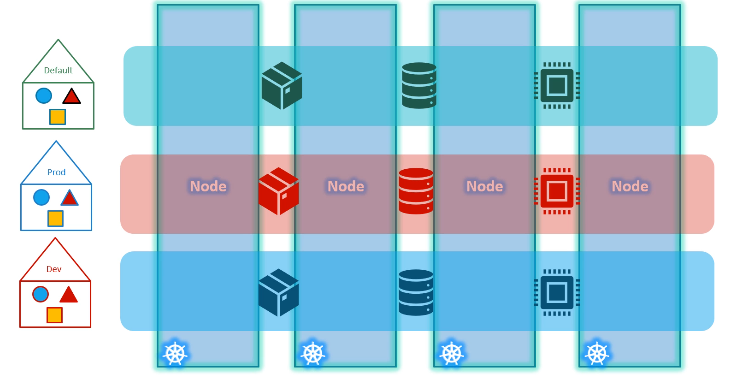
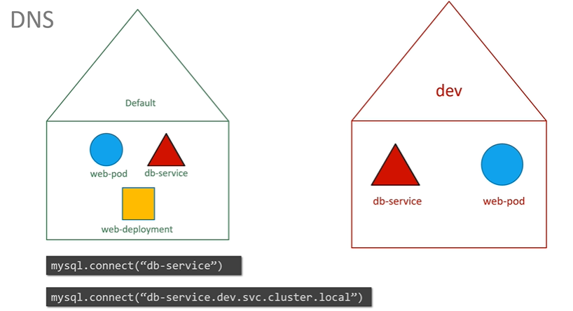
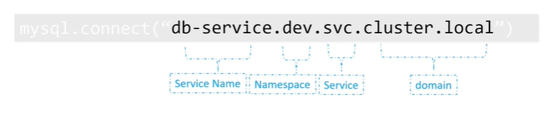

## namespace



- `--namespace=name-1`
- `metadata > namespace:name-1`
- used for **isolation**
- **ResouceQuota** : to limit resource usage
- ns already added by k8s:
    - kube-system
    - kube-public
    - default
    - ...

- if having big-cluster which soo many pods, then better to create custom namespace 
    - namespace-1 : `team-1` - pod-1, pod2, pod-3,etc
    - namespace-2 : `team-2` - pod-1, pod2, pod-3
    - ...

- Access services:
    - can access any service in **same** namespace by service-name(DN)
    - can access any service in **different** namespace using this DN format:






## sample  yaml
```
kubectl create ns dev-ns

apiVersion: v1
kind: Namespace
metadata:
  name: dev
  
kubectl create  -f  x.yaml
kubectl get pods --all-namespace

```
