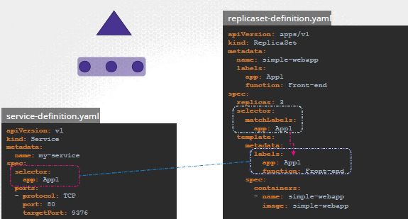

## annotation
- used to record detail for infomatory purpose.
- eg: metadata > annotations
    - buildVersion: v23.78

---
## labels and selectors
- NodeSelector
- PodSelector
- key concepts used to organize, identify, and manage Kubernetes objects (like pods, services, deployments, etc.).
- Key-value pairs
- query and select objects based on labels
- eg: service select pods
- eg: rs selects pods

```
metadata:
  🔸labels: 
    app: frontend
    tier: web
    env: production
    
------
🔸selector:
  matchLabels: 🔷
    app: frontend
    tier: web
  
🔸selector: 
  matchExpressions: 🔷
    - key: app
      operator: In 
      values:
        - frontend
        - backend
    # OR
    - key: tier
      operator: NotIn
      values:
        - db

```



