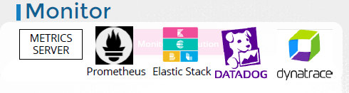
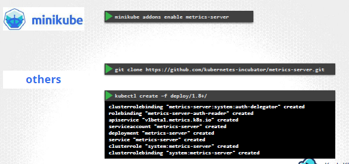

--- 
## addon: metric-Server
- heapster is deprecated, use metric Server
- **in memory** analytic, does not store on disk
- `kubelet` has `C-advisor`, responsible to receiver **performance data** and send to metric-server
  


## commands
- k top node
- k top pod
- k logs -f pod-1 # all containers
- k logs -f pod-1 **container-1**
- k logs -f pod-1 **container-2**

## Checking Logs from Multiple Kubernetes Pods
- kubectl logs -l **app=my-app** -n my-namespace  [-c <container-name> ] **--tail=100**  // label
- kubectl logs **pod/pod-1 pod/pod-2** --prefix
- Kubernetes Dashboard provides a GUI. eg: **lens**.
- kubectl logs -l app=my-app **--previous** // for Crashed Pods
- filter log:
    -  | **jq** 'select(.level == "error")'
    -  | **grep** "ERROR"
- Default Location --> Node-level: /var/log/containers/
    - Rotated every 10MB, max 5 files
    - --container-log-max-size, --container-log-max-files

## AWS CW::log
- By default, EKS doesn't send application logs to CloudWatch - only control plane logs
    - /aws/eks/<cluster-name>/cluster
    - /aws/eks/<cluster-name>/workload/**<namespace>/<pod-name>**
```
aws logs filter-log-events \
  --log-group-name "/aws/eks/my-cluster/workload/my-namespace/my-pod" \
  --start-time $(date -d '1 hour ago' +%s000) \
  --filter-pattern "ERROR"
```

## take heap dumps from pod before, it died
- `-XX:+HeapDumpOnOutOfMemoryError -XX:HeapDumpPath=/path/to/dump.hprof`
- JVisual, jhat for local
- actuator will die, so cant use it.

## Default Log Behavior in Fargate (No CloudWatch)
- Fargate does not store logs on disk
- CloudWatch Logs is disabled
- logs are ephemeral—they disappear when the pod terminates or crashes.
- use **Sidecar Container** for Log Forwarding to S3
    - image: amazon/aws-for-fluent-bit:latest
    - env : AWS_REGION, S3_BUCKET
    - awslogs driver

```yaml
      containers:
      - name: app
        image: nginx
        # Add logging driver
        logging:
          driver: awslogs
          options:
            awslogs-group: "/eks/fargate-logs"
            awslogs-region: "us-east-1"
            awslogs-stream-prefix: "my-app"
```