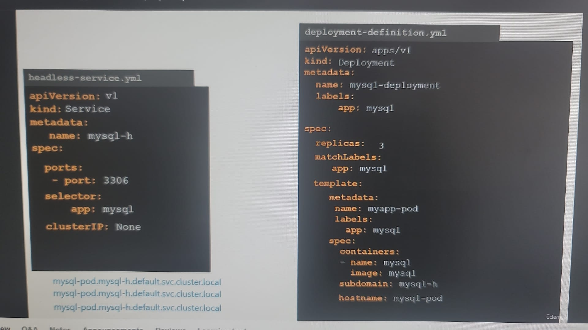
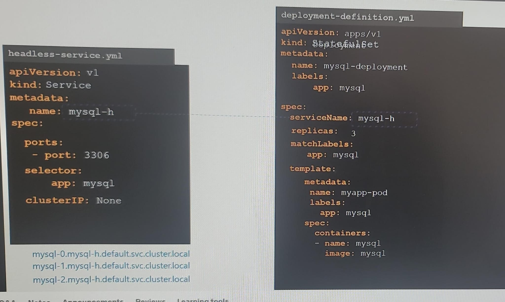
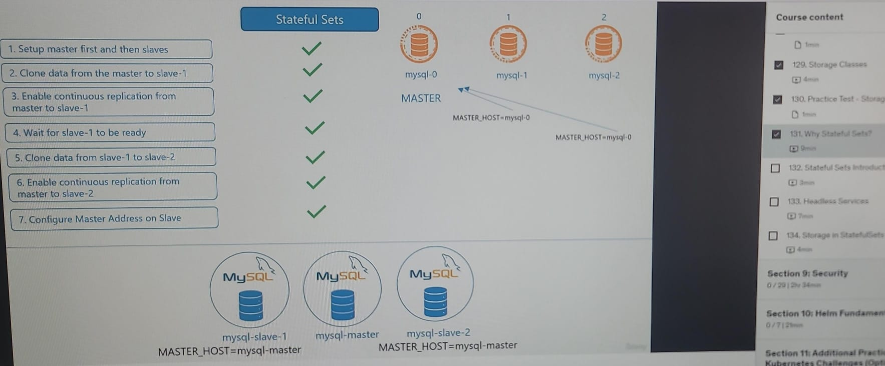
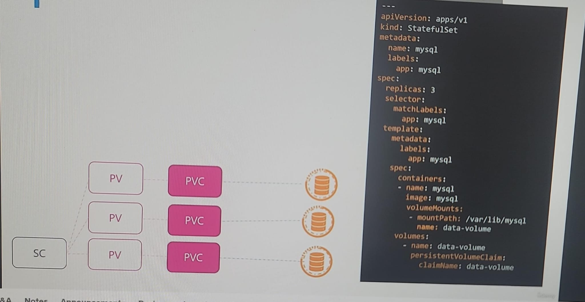
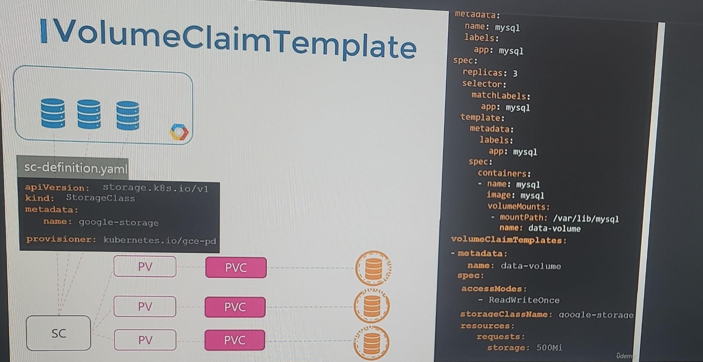

## keypoint
- pod come up **sequentially** by default.
- spec > `podManagemnetPolicy : OrderedReady` (default)
- change to `Parallel`, if needed.
- **no random pod name**, each pod has **ordinal-index** at end.
- first pod is always `MASTER`
- yaml is same like deployment.

---  
## headless service ( **optional** ) 🟡
- **scenario** 
    - mysql-pod-0 MASTER `(R/W)`
    - mysql-pod-1 (R)
    - mysql-pod-2 (R) 
- create regular service srv1, with `ClusterIP: None`
- add  `StatefulSet>spec>serviceName: srv1` 
- it automatically assigns subdomain(mysql-h) and hostname(mysql-index) for pod/s (better).
- **local DNS**
    - headless-service (No ClusterIP): **pod-1**.service-1.namespace-1.svc.cluster.local
    - service (clusterIP): service-1.namespace-1.svc.cluster.local
  



  
### example : mysql-pod (DB replica)



---
## StatefulSet::volume 🟡
- all pod share **same** PVC 👈🏻👈🏻
- need create **separate** PVC for each pod ? solution :
- add `volumeClaimTemplate` in statefulSet.  (outside spec)
- if pod goes down, new pod will be attached to **same** PVC. thus stable storage.

```yaml
volumeClaimTemplates:
- metadata:
    name: data
  spec:
    accessModes: [ "ReadWriteOnce" ]
    storageClassName: "gp3"
    resources:
      requests:
        storage: 50Gi
    volumeMode: Filesystem
    allowVolumeExpansion: true  # Enable volume expansion
```



