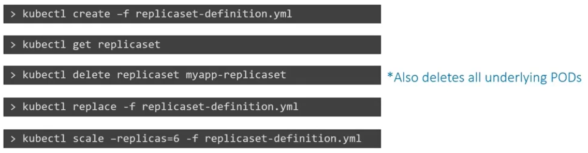
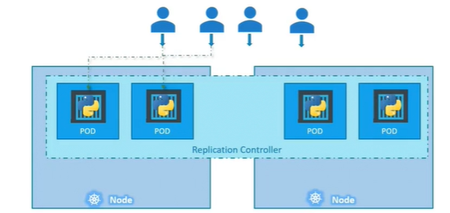
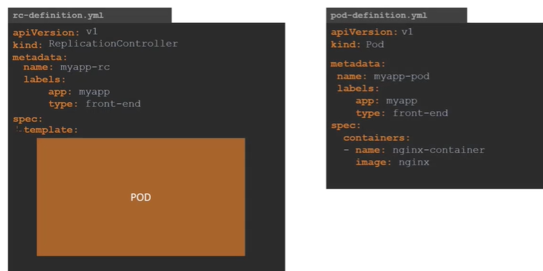
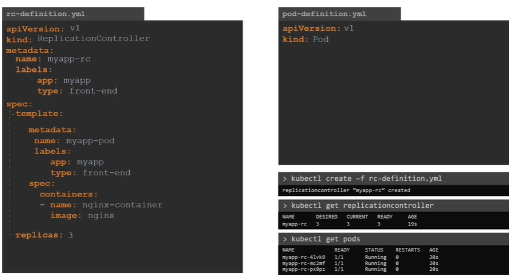

## A. ReplicaSet (new) ✅
- concept and yml are almost same.
- but it also manages pods which are **not defined in template section.**
- Maintain pod availability
- Self-healing mechanism
- usually don’t create ReplicaSets directly — Deployments manage ReplicaSets internally.
- Use ReplicaSet only if  **don't need rolling updates**

```yaml
apiVersion: apps/v1
kind: ReplicaSet
metadata:
  name: frontend-rs
spec:
  replicas: 3 🔷
  selector:
    matchLabels:
      app: frontend
```

## labels and selectors
- key concepts used to organize, identify, and manage Kubernetes objects (like pods, services, deployments, etc.).
- Key-value pairs
- query and select objects based on labels
- eg: service select pods
- eg: rs selects pods

```
metadata:
  🔸labels: 
    app: frontend
    tier: web
    env: production
    
------
🔸selector:
  matchLabels: 🔷
    app: frontend
    tier: web
  
🔸selector: 
  matchExpressions: 🔷
    - key: app
      operator: In 
      values:
        - frontend
        - backend
    # OR
    - key: tier
      operator: NotIn
      values:
        - db

```

### commands:
- kubectl get replicaset
- kubectl create -f <yaml>
- kubectl scale --replicas=6 -f replicaSet-definition.yaml ⬅️
- kubectl scale --replicas=6 replicaset replicaset-1 ⬅️
- kubectl delete replicaset rs-1
  - all linked pods will be deleted.
-  kubectl get replicaset -o yaml > sample.yaml



---

## B. replication Controller (old) ❌
- makes sure specified number of pods running all the time.
- span across node/s
- manages pods, defined in template section only ⬅️
  





