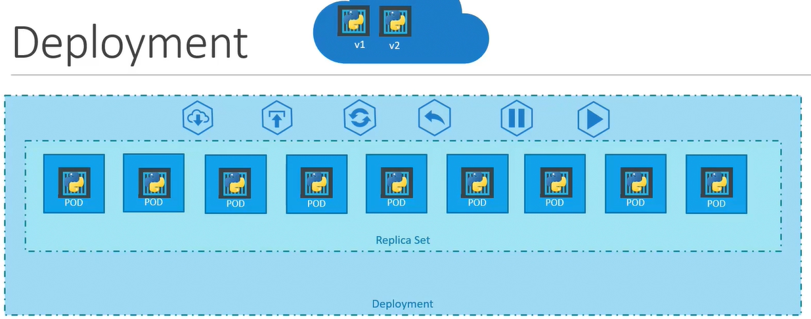
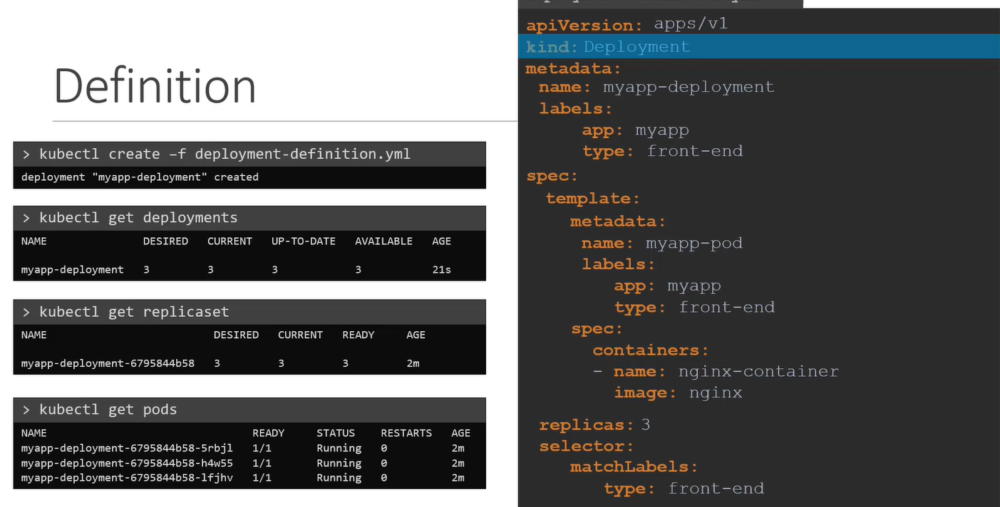

## Deployment Object
```
- deployment (has "all revision history of rs") 🔷
  - replicationSet-1 (revison=1)
  - replicationSet-2 (revison=2)
  - ...
  - replicationSet-n (current)
```

- higher-level abstraction that manages ReplicaSets, which in turn manage pods. 
- Supports **rolling updates, rollbacks, and scaling** (3)
- yaml is same as rs

| Feature        | ReplicaSet | Deployment |
| -------------- | ---------- | ---------- |
| Pod scaling    | ✅          | ✅          |
| Self-healing   | ✅          | ✅          |
| Rolling update | ❌          | ✅          |
| Rollback       | ❌          | ✅          |

## commands
``` 
create first deploymnet ✅
  - kubectl create deployment --image=nginx nginx
  - kubectl create deployment --image=nginx nginx --dry-run -o yaml > def.yaml 🔷
  - kubectl apply -f deployment.yaml
 
  get/describe
  - kubectl get deployments
  - kubectl get deployment frontend-deployment -o yaml

Scaling ✅
  - kubectl scale deployment nginx --replicas=4

Rolling update ✅  
  - kubectl edit deployment d1 
  - kubectl set image deployment/frontend-deployment nginx-container=nginx:1.25
  - kubectl rollout status deployment frontend-deployment 🔄️
  
  Can edit "ANY" field of the POD/template. 👈🏻
  it deletes and recreates new pods with new rs (v2)

Rollback ✅
  - kubectl rollout undo deployment frontend-deployment
  - kubectl rollout status deployment frontend-deployment 🔄️
    
```

## Example/yaml
```yaml
apiVersion: apps/v1
kind: Deployment
metadata:
  name: frontend-deployment
  labels:
    app: frontend
spec:
  replicas: 3
  🔸minReadySeconds: 10
  🔸revisionHistoryLimit: 5
  🔸progressDeadlineSeconds: 600
  selector:
    matchLabels:
      app: frontend
  strategy:
    type: RollingUpdate
    rollingUpdate:
      maxSurge: 1
      maxUnavailable: 1
      
      
  template:
    metadata:
      labels:
        app: frontend
    spec:
      securityContext 🔷:
        runAsUser: 1000
        fsGroup: 2000
      nodeSelector 🔷:
        disktype: ssd
      tolerations:
        - key: "dedicated"
          operator: "Equal"
          value: "frontend"
          effect: "NoSchedule"
      affinity:
        nodeAffinity:
          requiredDuringSchedulingIgnoredDuringExecution:
            nodeSelectorTerms:
              - matchExpressions:
                  - key: kubernetes.io/e2e-az-name
                    operator: In
                    values:
                      - us-west-1a
                      - us-west-1b
      initContainers:
        - name: init-myservice
          image: busybox
          command: ['sh', '-c', 'echo Initializing... && sleep 5']
      containers:
        - name: nginx-container
          image: nginx:1.25
          ports:
            - containerPort: 80
          readinessProbe:
            httpGet:
              path: /
              port: 80
            initialDelaySeconds: 5
            periodSeconds: 10
          livenessProbe:
            httpGet:
              path: /
              port: 80
            initialDelaySeconds: 15
            periodSeconds: 20
          resources:
            requests:
              memory: "64Mi"
              cpu: "250m"
            limits:
              memory: "128Mi"
              cpu: "500m"
          volumeMounts:
            - name: config-volume
              mountPath: /etc/config
      volumes:
        - name: config-volume
          configMap:
            name: my-config
```

### yaml::properties
- **progressDeadlineSeconds**: 600 , **terminationGraceperiodSeconds**: 30
- **revisionHistoryLimit** : 10
- **strategy**
  - rollingUpdate
    - maxSurge:
    - maxUnavailable: 
  - type: recreate / rollingUpdate  *
- **dnsPolicy**: clusterFirst  
  - how DNS resolution is handled within the pod.
  - `clusterFirst` : 
    - Uses the `cluster’s DNS` service first for resolution. 
    - If the DNS query fails, it will fall back to the `host’s DNS`.
  - Default : `host’s DNS`
  - `None`

| Field                                        | Type       | Description                                        |
| -------------------------------------------- | ---------- | -------------------------------------------------- |
| `spec.strategy.type`                         | string     | Deployment strategy: `RollingUpdate` or `Recreate` |
| `spec.strategy.rollingUpdate.maxUnavailable` | string/int | Max pods that can be unavailable during update     |
| `spec.strategy.rollingUpdate.maxSurge`       | string/int | Max extra pods allowed during update               |
| `spec.minReadySeconds`                       | integer    | Time to wait before marking pod as ready           |
| `spec.revisionHistoryLimit`                  | integer    | Number of old ReplicaSets to retain                |
| `spec.progressDeadlineSeconds`               | integer    | Max time to wait for a rollout to complete         |
| `spec.paused`                                | boolean    | If true, deployment is paused                      |


### annotations 

| Annotation Key                                 | Purpose                                            |
|------------------------------------------------| -------------------------------------------------- |
| `kubernetes.io/change-cause`                   | Track deployment reason (shown in rollout history) |
| `deployment.kubernetes.io/revision`            | Auto-managed by K8s, tracks rollout revision       |
| `prometheus.io/scrape`                         | Enable Prometheus scraping                         |
| `prometheus.io/port`                           | Specify port to scrape                             |
| `checksum/config`                              | Track config changes (used in rolling updates)     |
| `traffic.sidecar.istio.io/includeInboundPorts` | Istio traffic injection behavior                   |
| `sidecar.istio.io/inject`                      | Enable/disable sidecar injection                   |
| `app.kubernetes.io/name`                       | Name of the application                              |
| `app.kubernetes.io/version`                    | Application version (e.g., semantic version)         |
| `app.kubernetes.io/component`                  | Component within the app (e.g., `frontend`, `db`)    |
| `app.kubernetes.io/instance`                   | A unique name for this instance of the app           |
| `app.kubernetes.io/part-of`                    | Name of the higher-level application this belongs to |
| `app.kubernetes.io/managed-by`                 | Tool managing this (e.g., Helm, ArgoCD)              |


| Annotation Key  **(AWS)**                                           | Used On                 | Purpose                                                            |
|-----------------------------------------------------------------| ----------------------- | ------------------------------------------------------------------ |
| `eks.amazonaws.com/role-arn`                                    | `ServiceAccount`        | Attach IAM Role to Pod using IRSA (IAM Roles for Service Accounts) |
| `alb.ingress.kubernetes.io/scheme`                              | `Ingress`               | `internet-facing` or `internal` load balancer                      |
| `alb.ingress.kubernetes.io/target-type`                         | `Ingress`               | `ip` or `instance` (pod vs node-level routing)                     |
| `alb.ingress.kubernetes.io/certificate-arn`                     | `Ingress`               | ARN of ACM certificate for HTTPS                                   |
| `alb.ingress.kubernetes.io/listen-ports`                        | `Ingress`               | Configure ALB listeners (e.g., `"[{\"HTTPS\":443}]"`)              |
| `alb.ingress.kubernetes.io/healthcheck-path`                    | `Ingress`               | Path used for ALB health checks                                    |
| `service.beta.kubernetes.io/aws-load-balancer-type`             | `Service`               | Classic (`classic`) or NLB/ALB (`nlb`, `external`)                 |
| `service.beta.kubernetes.io/aws-load-balancer-internal`         | `Service`               | `true` to create an internal ELB                                   |
| `service.beta.kubernetes.io/aws-load-balancer-backend-protocol` | `Service`               | `http`, `https`, `tcp`                                             |
| `ebs.csi.aws.com/volume-type`                                   | `PersistentVolumeClaim` | Set EBS volume type: `gp3`, `io1`, etc.                            |
| `ebs.csi.aws.com/throughput`                                    | `PersistentVolumeClaim` | Set EBS volume throughput (e.g., `125`)                            |
| `ebs.csi.aws.com/iops`                                          | `PersistentVolumeClaim` | Set provisioned IOPS                                               |

---
## screenshot


