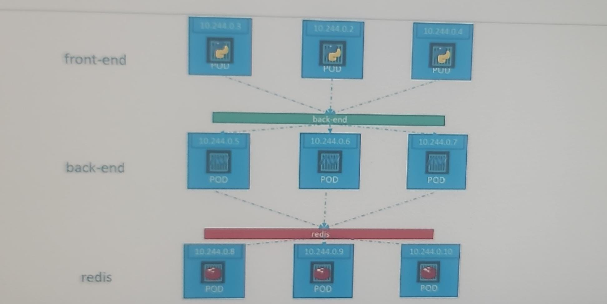
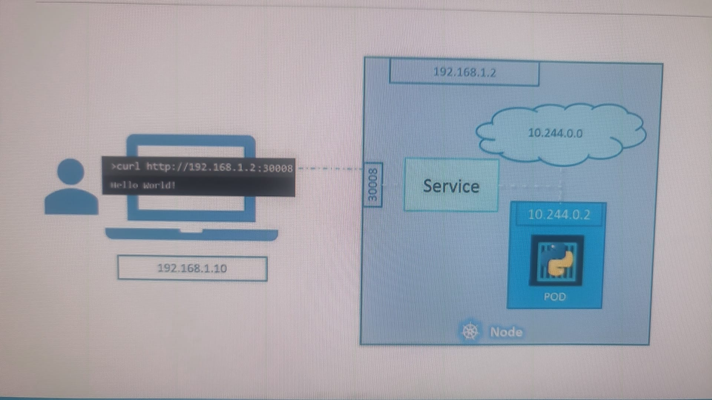
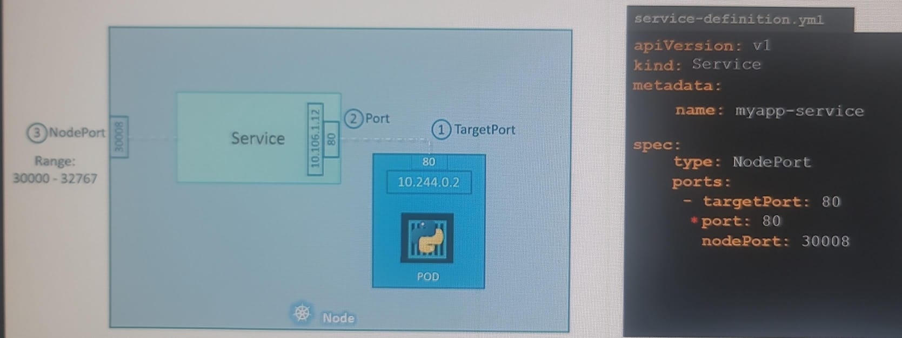
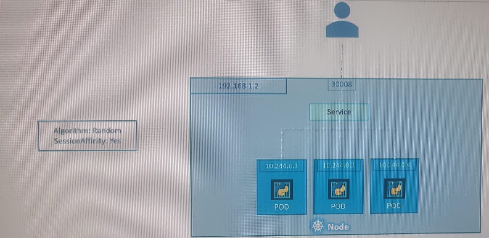
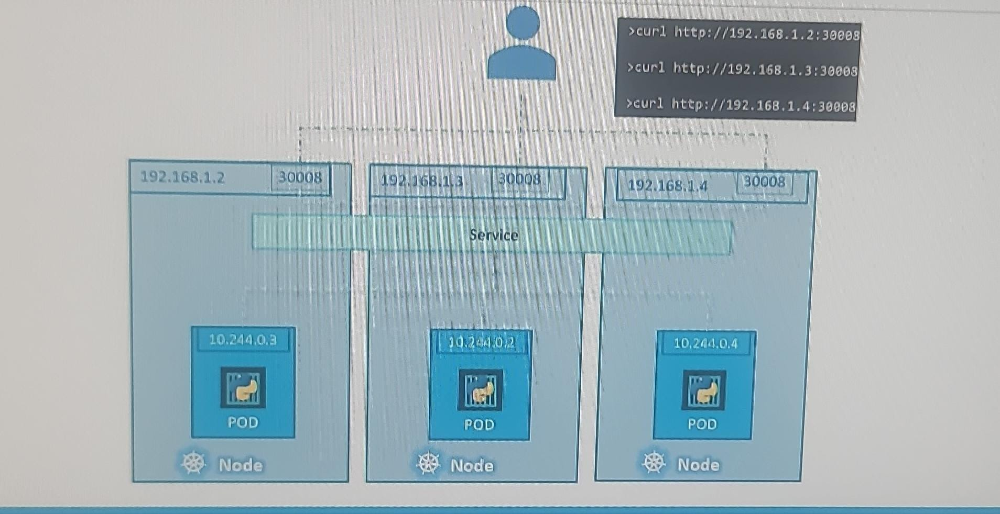

## container comm within pod
- pod-1 : c1 (process-1 exposed on port p1 )  |  c2 (process-1 exposed on port p2 )
- no k8s service needed
- just use **localhost** + port

## k8s Services
### ClusterIP
- Exposes the service internally within the cluster. 
- check for service IP (internal cluster IP, stable) 
  - manually grab it and use.
  - or use auto generated env var. `<service-Name>_SERVICE_HOST`
  - or use **coreDNS** - `<service-Name>.<namespace>`
- Accessible only within the cluster via a stable IP.
- also performs load balancing.
- enables loose coupling between pod/microservices

---
### NodePort
- external-client --> internet --> k8s-cluster -->  `node-1|2|..[static-node-ip:node-port] `--> `nodePort-service[internal-ip:service-port] `--> `pod/s[internal-ip:target-port]`  
  - maps `port-on-Node` to `pod`::container::process(port)
  - listens traffic on node-port and forward traffic to pod.
  - Can be accessed externally using `<NodeIP>:<NodePort>`.
  - Kubernetes cluster allocates a port (usually between 30000-32767) on all nodes.
  - `uascase` : external-load-balance (aws-alb) --> send traffic to node-port service/s (so, 3 node === 3 services, once on each Node/ec2)
    - manually create exter alb ahead of time.
  - 
  - 
    - note: cloud-logo with 10.244.0.0, represents internal-network, here.
  - multipod service
    - 
    - 
    - span over multiple nodes
- Node IP can be changed. 
  - if 3 nodes, then 3 endpoints
  
---
### LoadBalancer
- calls cloud provider API and automatically creates external lb inside cloud infra, that routes the traffic to this service.
- so use this, if deploying services on AWS,etc
- Note: for minikube
  - **minikube service lb-service-name** --> it will give external url.
  - in EKS, we don't need this additional step, can always see external url.

---
### headless service
- outside <==>  pod, directly.
- allows direct access to individual pod IPs without a load balancer or cluster IP. 
- Key Features:
    - `clusterIP: None`
    - `DNS-based Pod Discovery`:
        - Each pod gets its own DNS entry, useful for stateful applications where each pod has a unique identity 
        - (e.g., databases like Cassandra or StatefulSets).
    - `Direct Pod Access`:
        - Clients connect to pods directly, without load balancing.

- Use Cases:
  - `Stateful` applications (e.g., databases) that require direct access to specific pods.
  - Service discovery for applications that need `pod-level DNS` (e.g., my-headless-service-0.my-headless-service).
- This approach offers more control over **pod communication** compared to standard services.

---
# deploy frontend on K8s
- deploy frontend as pod/deploymnet object in k8s cluster
- have fe-service (expose on 8080), **loadbalance** Type
- host fe with **nginx**. 
- front end code --> while makeing api call, use `/my-be/***`
- in **nginx.conf** file
    - location `/my-be/` { proxy-pass https://fe-sevice.namespace1:8080 } 

---
# understand yaml
## properties
- `Enableservicelink`  : T/F - environment variables for services are automatically injected into the pod
- `sessionAffinity` : None
- `internalTrafficPolicy` Cluster or local(node)
- `ipFamily` :IPv4
- `ipFalimilyPolicy`: singleStack

## annotation
- soon

---

## scenario
### Access a service running in Kubernetes without exposing it publicly in dev env.
- forward traffic from your local machine to a Kubernetes service
    - kubectl **port-forward** svc/my-app-service 5000:80 -n <namespace>
    - 8080 is the port on your local machine.
    - 80 is the port exposed by the my-app-servic
- forward directly to a pod (if the service has no pods
    - kubectl port-forward pod/my-pod-name 5000:80

