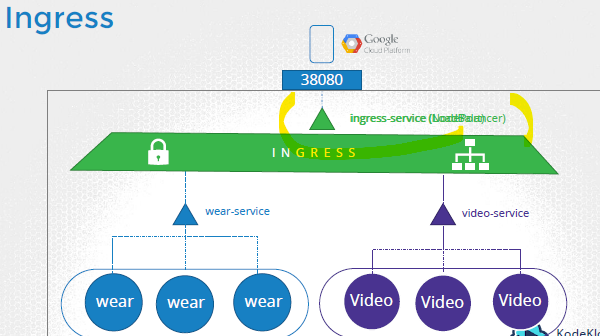
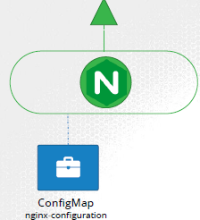
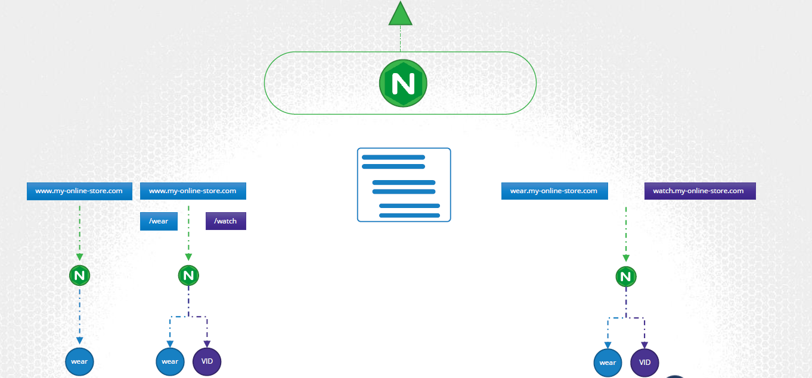
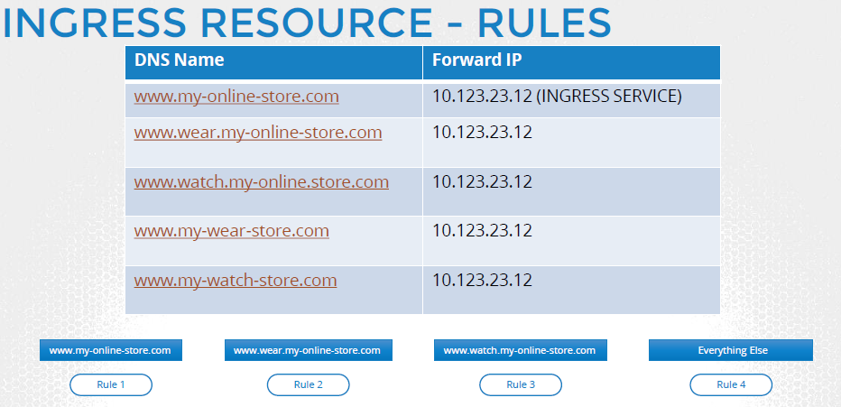
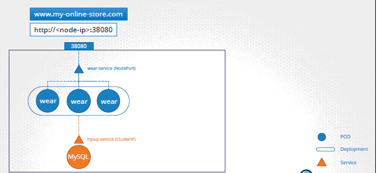
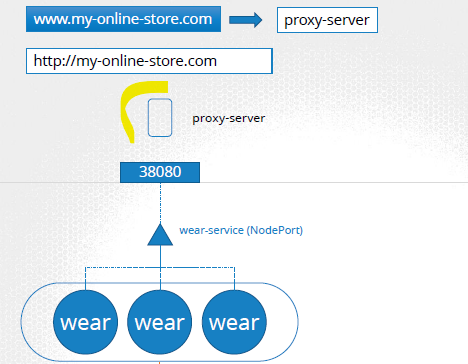

| Component              | Description                                                                 |
| ---------------------- | --------------------------------------------------------------------------- |
| **Ingress**            | Kubernetes object that defines rules to route external traffic to services. |
| **Ingress Controller** | A pod that implements the Ingress API to manage traffic routing.            |


## ingress
- Another k8s object, think of as **Layer-7 load balance** 
- manages external access to services, typically HTTP(S).
- provides routing rules
- to forward traffic to multiple k8s service/s

## ingress controller
- add firewall
- proxy server

| Ingress Controller | Description                                                         |
| ------------------ | ------------------------------------------------------------------- |
| **NGINX**          | Most widely used; supports annotations and custom configuration.    |
| **AWS ALB**        | Works with AWS Application Load Balancer. Integrates IAM, ACM, WAF. |
| **Traefik**        | Lightweight and modern, with built-in observability.                |
| **Istio Gateway**  | Works as part of the Istio service mesh.                            |

| Feature                | Notes                                                    |
| ---------------------- | -------------------------------------------------------- |
| **TLS Termination**    | Use secrets with certs + `spec.tls`.                     |
| **Authentication**     | Use annotations (e.g., basic auth, JWT via sidecars).    |
| **Rate Limiting**      | Available via annotations in NGINX.                      |
| **Rewrite/Redirect**   | Annotations like `rewrite-target`, `force-ssl-redirect`. |
| **Path-based Routing** | Route `/api` to one service, `/ui` to another.           |

---
## example
### annotation

| Annotation Key                                       | Value Example                           | Description                                                |
| ---------------------------------------------------- | --------------------------------------- | ---------------------------------------------------------- |
| `alb.ingress.kubernetes.io/backend-protocol`         | `HTTP`                                  | Protocol used between ALB and backend pods.                |
| `alb.ingress.kubernetes.io/certificate-arn`          | `{{ .Values.certificateArn }}`          | SSL certificate ARN for enabling HTTPS via ACM.            |
| `alb.ingress.kubernetes.io/group.name`               | `{{ .Values.component }}-ingress-group` | Group multiple Ingresses under a single ALB.               |
| `alb.ingress.kubernetes.io/listen-ports`             | `[{"HTTP": 80},{"HTTPS": 443}]`         | Configure ALB to listen on HTTP and HTTPS.                 |
| `alb.ingress.kubernetes.io/load-balancer-attributes` | *various*                               | Set attributes like access logging, S3 bucket for logs.    |
| `alb.ingress.kubernetes.io/scheme`                   | `internal`                              | Makes ALB internal (only accessible within the VPC).       |
| `alb.ingress.kubernetes.io/ssl-policy`               | `ELBSecurityPolicy-FS-1-2-Res-2020-10`  | TLS policy for enforcing encryption standards.             |
| `alb.ingress.kubernetes.io/ssl-redirect`             | `"443"`                                 | Redirect HTTP to HTTPS.                                    |
| `alb.ingress.kubernetes.io/tags`                     | `"k1=v1,...”`                           | Tag the ALB with metadata like cost center or environment. |
| `alb.ingress.kubernetes.io/target-type`              | `ip`                                    | Target backend pods directly by IP (used in EKS).          |
| `external-dns.alpha.kubernetes.io/hostname`          | `{{ .Values.hostname }}`                | Used by ExternalDNS to create/update Route53 records.      |

### yaml (5)
```yaml
  #1 
  kind: ConfigMap🔸
  apiVersion: v1
  metadata:
    name: nginx-configuration
  spec:
    
---
  #2
  kind: ServiceAccount 🔸
    apiVersion: v1
  metadata:
    name: nginx-ingress-sa-1
  spec:
   # Roles ?
   # ClusterRole ?
   # RoleBinding ?

---
    #3
    apiVersion: v1
    kind: Service🔸
    metadata:
      name: nginx-ingress
    spec:
      type: NodePort
      ports:
        - port: 80
          targetPort: 80
          protocol: TCP
          name: http
        - port: 443
          targetPort: 443
          protocol: TCP
          name: https
      selector:
        name: nginx-ingress

---
## ingress-controller ✅
  apiVersion: extensions/v1beta1
    kind: Deployment 🔸
  metadata:
    name: nginx-ingress-controller
  spec:
    replicas: 1
    selector:
      matchLabels:
         name: nginx-ingress
    template:
      metadata:
        labels:
        name: nginx-ingress
      spec:
        containers:
          - name: nginx-ingress-controller
            image: quay.io/kubernetes-ingresscontroller/nginx-ingress-controller:0.21.0 👈🏻👈🏻
            args:
            - /nginx-ingress-controller
            - --configmap=$(POD_NAMESPACE)/nginx-configuration
            env:
            - name: POD_NAME
              valueFrom:
                fieldRef:
                  fieldPath: metadata.name
            - name: POD_NAMESPACE
              valueFrom:
                fieldRef:
                  fieldPath: metadata.namespace
            ports:
            - name: http
              containerPort: 80
            - name: https
              containerPort: 443
  
--- 
# ingress ✅
apiVersion: extensions/v1beta1
kind: Ingress 🔸
metadata:
  name: ingress-1
spec:
  rules:
  - host: my-online-store.com
    http:
      paths:
      - path: /wear
        backend:
          serviceName : wear-service
          servicePort : 80
      - path: /watch
        backend:
          serviceName : watch-service
          servicePort : 80 
             
  - host: watch.my-online-store.com
    http:
      paths:
      - path: *
        backend:
          serviceName : wear-service
          servicePort : 80
          
  - host: watch.my-online-store.com
    http: 
      paths:
      - path: *
        backend:
          serviceName : watch-service
          servicePort : 80
```


---
## Screenshot




---
## Scenario to understand concept (old) ❌
- K8s Cluster has :
- `app-1` : online shop - **deploymnet-object-1**
  - 
  - access app-1:
    - with nodeIp:port
    - with proxy
      - 
    - with `loadBalancer-service-1` + `gcp-lb-1`

- `app-2` : video-stream app - **deploymnet-object-2**
  - deploy it same cluster, as new deploymnet object
  - access : with `loadBalancer-service-2` + `gcp-lb-2`

- add `gcp-lb-3` --> forward/route traffic to  gcp-lb-1 or gcp-lb-2
  - routing rules:
    - /apparel --> gcp-lb-1
    - /video --> gcp-lb-2
- **end result** : gcp-lb-3 >> gcp-lb-1/2 >> k8s service-1/2

- Next, add security (SSL, firewall). but where ? best place,  having less maintenance :
  - add at app-1/2 level : problem , if application grows
  - add at proxy / gcp-lb-1/2/3 level
--- 
