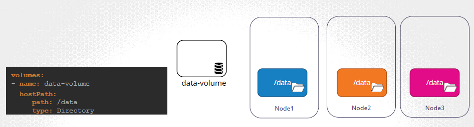
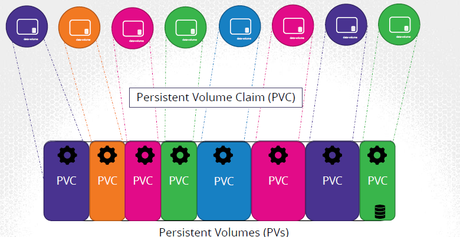
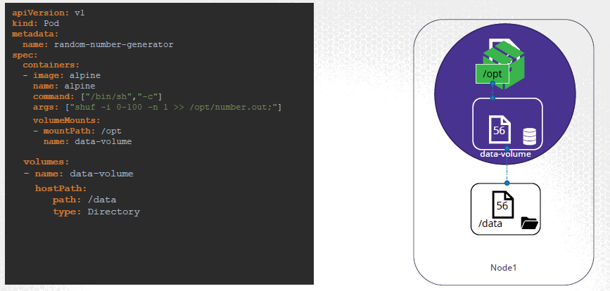
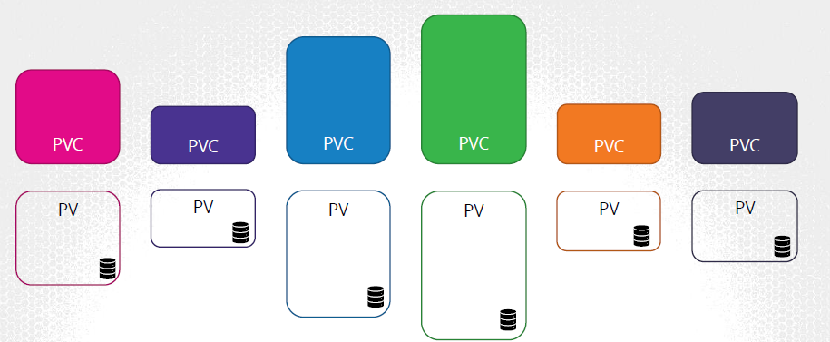
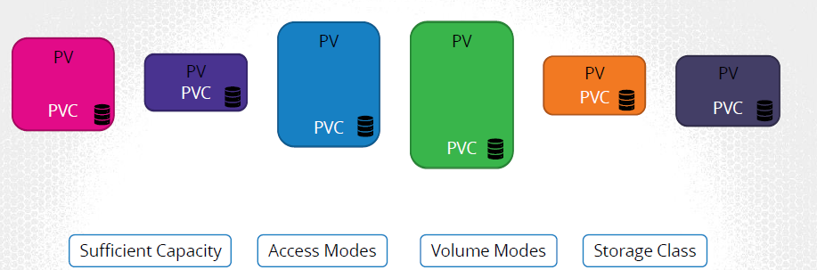
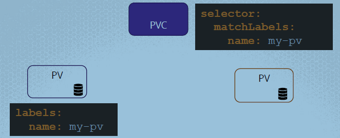
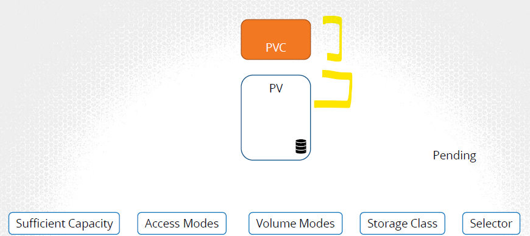

## 🟡Volume created in individual pod
- by-default pop are **transient** 
- data in not retained after pod is terminated. use volume
- **volume Types**:
    -  `emptyDir` - Temporary storage created when a pod starts, Deleted when the pod is terminated
    -  `nfs`: Mounts a remote NFS server directory into the pod.
    -  `awsElasticBlockStore / gcePersistentDisk / azureDisk`
    -  `csi` : third-party storage providers to integrate with Kubernetes
    - `hostpath` - mount File or directory from the host node's filesystem into a pod
  

  
- Create volume and mount it in single pod.  
```yaml
apiVersion: v1
kind: Pod                       <<<<<
metadata:
    name: 
spec:
    containers:
    - name:
      image:  
      volumeMounts🔸:
        - mountPath: /opt
          name: data-volume

    volumes🔸:                    #<<<<<< CONFIGURED VOLUME WITHIN POD
    - name: data-volume
      hostPath:                 # source-1 - Node local dir
        path: /data
        type: Directory
    #---- OR ----
    - name: aws-ebs  
      awsElasticBlockStore:     # source-2 - aws EBS
        volumeID: 
        fsType:  
    # ----- OR -----
    - name: mypd
      persistentVolumeClaim🔸:   # PVC
        claimName: myclaim
```

---
## 🟡Centralized Volume 

### 🔸PV - Persistent Volume
- having multiple pod, then maintain storage `centrally`
- and carve out part of to each pod using `claims` (PVC)
- usually admin creates PV. 
- developers creates PVC

```yaml
apiVersion: v1
kind: PersistentVolume
metadata:
    name: pv-vol1
spec: 
    accessModes:   # how to mount
    - ReadWriteOnce  # ReadOnlyMany,  ReadWriteOnce,  ReadWriteMany
    capacity:
        storage: 1Gi
    hostPath:                   # source-1
        path: /tmp/da
    #---- OR ----    
    awsElasticBlockStore:       # source-2
        volumeID: 
        fsType:
    #---- OR ----    
    azureDisk:
        ...    
```

---
###  🔸PVC - Persistent Volume claims
- **request** for binding to storage/PV based on :
    - capacity
    - accessMode/s
    - volume Modes
    - storage class
    - labels and selectors.
- `1-to-1` b/w PV and PVC
    - once a PV is bind
    - then no other PVC will get bind to that PV>
- if delete PVC, then PV is retain (by default). even data inside PV
    - `pesistentVolumeClaimPolicy: Retain` 
    - options:
        - `retain` - keep PV with data (default)
        - `Delete` - delete PV
        - `recycle` -  keep PV only, scrap all Data
  
```yaml
# - we don't define binding in definition
# - it just finds matching one at runtime.

  apiVersion: v1
          kind: PersistentVolumeClaim
      metadata:
          name: myclaim
      spec:
        # storageClassName: 
        accessModes:
          - ReadWriteOnce
        resources:
          requests:           #<<< request
            storage: 500Mi
            ...
            ...
---

# USE it :: pod,RS,D object:
spec:
  volumes:
    - name: mypd
      persistentVolumeClaim:
        claimName: myclaim
```

---  
### Screenshots:









