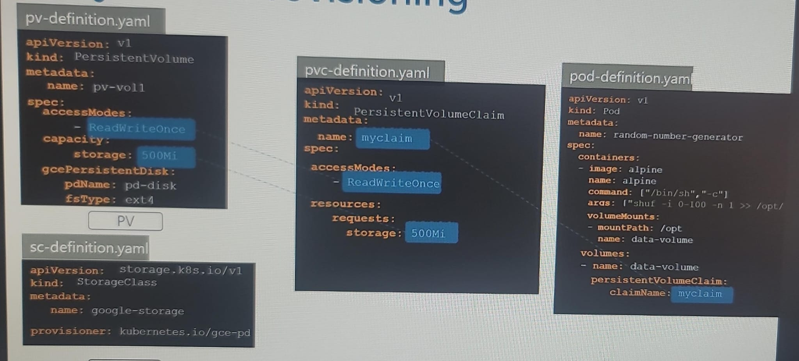
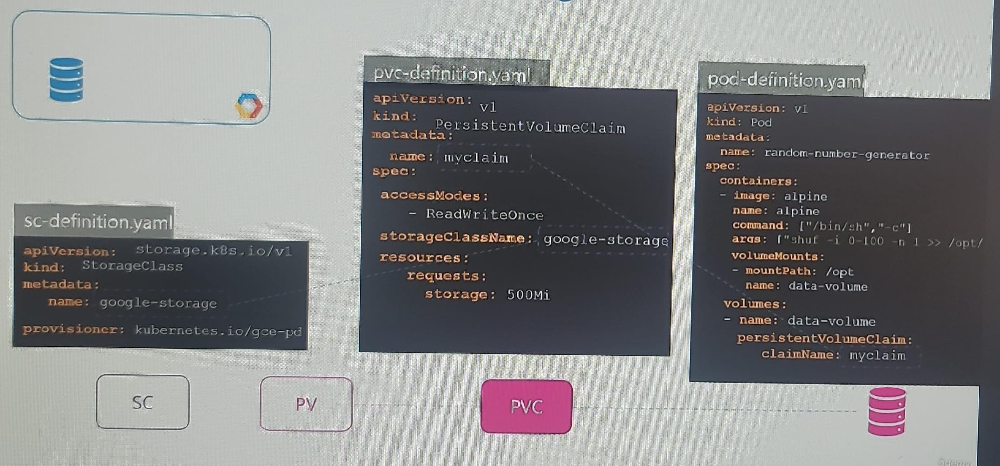

## Storage class
- `static` provisioning 
  - specify PV first. Storage created ahead of time with static config
  - then define PVC
    - if matches then get bind
- `dynamic` provisioning
  - define storageClass/SC with parameter
  - then define PVC
    - PVC will use SC to provision needed storage dynamically

- [VolumeClaimTemplate](../01_Core/04_Stateful-sets.md#volume) 👈🏻

## Mount S3 in Kubernetes Pod (Read/Write)
```
apiVersion: storage.k8s.io/v1
kind: StorageClass
metadata:
  name: s3-storage
provisioner: s3.csi.aws.com
parameters:
  bucket: my-bucket
  region: us-west-2
```
> ⚠️ AWS does not provide an official CSI driver for S3. Use S3 sync/copy jobs instead, or mount via user-space like goofys or s3fs inside a pod.

---

##  Mount EFS  with EFS CSI Driver
```
# ✅ install EFS CSI Driver (once per cluster) 
kubectl apply -k "github.com/kubernetes-sigs/aws-efs-csi-driver/deploy/kubernetes/overlays/stable/ecr/?ref=release-1.7"

#  ✅ Create EFS File System in AWS (manually or via Terraform)

# PV ✅
apiVersion: v1
kind: PersistentVolume 🔸
metadata:
  name: efs-pv
spec:
  capacity:
    storage: 5Gi
  volumeMode: Filesystem
  accessModes:
    - ReadWriteMany
  persistentVolumeReclaimPolicy: Retain
  
  csi: 🔸
    driver: efs.csi.aws.com
    volumeHandle: fs-12345678  # EFS ID

# PVC ✅
apiVersion: v1
kind: PersistentVolumeClaim
metadata:
  name: efs-pvc
spec:
  accessModes:
    - ReadWriteMany
  resources:
    requests:
      storage: 5Gi

# Mount PVC in Your Pod ✅
apiVersion: v1
kind: Pod
metadata:
  name: app-with-efs
spec:
  containers:
    - name: app
      image: amazonlinux
      command: [ "sleep", "3600" ]
      volumeMounts: 🔸
        - name: efs-volume
          mountPath: /mnt/data
  volumes:  🔸
    - name: efs-volume
      persistentVolumeClaim: 🔸
        claimName: efs-pvc

```

## Screenshots (old for reference)






