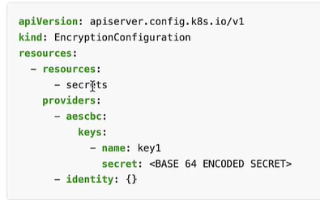
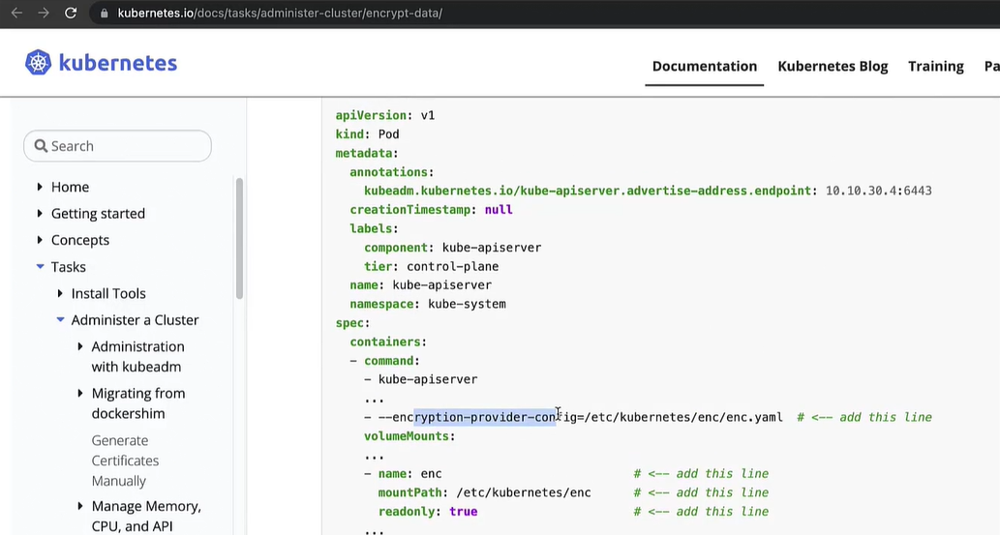

## Secrets (safe)
- Secret Store CSI Driver: https://www.youtube.com/watch?v=MTnQW9MxnRI&ab_channel=KodeKloud
- secret created at namespace-1, anyone who has access can see it.
  - can add role based access to secrets
- can also use 3rd secrets : AWS secret manange and integrate with k8s.
- Secrets are `not encrypted`, so it is not safer in that sense.
- just base64 encoded
- way kubernetes handles secrets:
  - A secret is only sent to a node if a pod on that node requires it.
  - Kubelet stores the secret into a tmpfs so that the secret is not written to disk storage.
  - Once the Pod that depends on the secret is deleted, kubelet will delete its local copy of the secret data as well.
- better way : Helm Secrets, HashiCorp Vault , AWS secret manager.
--- 
- kubectl get/describe secrets
- create (imperative)
  - kubectl create secret <type> s-1 --from-literal=k1=v1 --from-literal=k2=v2 ...
  - kubectl create secret generic s-1 --from-file=abc.properties
  - type:
    - `docker-registry`   Create a secret for use with a Docker registry
    - `generic` **           Create a secret from a local file, directory, or literal value
    - `tls`               Create a TLS secret

- create (declarative)
```
apiVersion: v1
kind: Secret
metadata
  name:s-1
data:
  K_1: V_1 (encoded with base64)
  K_2: V_2 (encoded with base64)
  ...
```

---
## inject secret as env var into `pods`
- whole config
```
envFrom:
    - secretRef:
        name: S-1
```

- specific single value
```
env:
    - name: ENV_1
      valueFrom:
        secretKeyRef:
            name:
            key:  
```

---
## Encryption Configuration
- trying : encryption at rest (secrets in etcd)
- create EncryptionConfiguration, then add this pod > container >
  -  `--encryption-provider-config=/etc/kubernetes/enc/enc.yaml`

- enc.yaml :
  - mount this file to pod volume
  - 
  - provider (4) - order matters. keep `aescbc` first in provider array.
  - there is commands to mention base64 `secret`. check official doc.

- pod > conatiner :
  - 

- after this if we create any new secret it will encrypted.
- 
---

## Mount ConfigMap/Secret as volume
```yaml
apiVersion: v1
kind: Pod
metadata:
  name: my-pod
spec:
  containers:
  - name: app
    image: nginx
    volumeMounts:
    - name: config-volume
      mountPath: /etc/config  <<<
  volumes:
  - name: config-volume
    configMap:
      name: my-config-1
```
