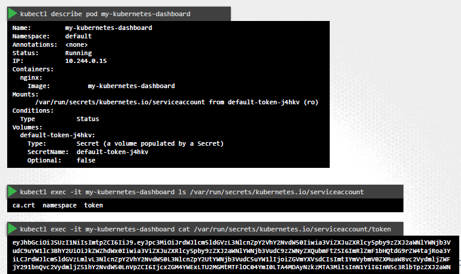

## service Account
- `user Acct`
- `system Acct` . eg:
  - jenkins, to deploy on appl on cluster
  - account used by an **app** to interact with kube cluster
    - my-app.py --> get list of all pods from cluster

---    
- create :: `k create serviceaccount sa-1`
- then attach role-based-permission: how ?
  - pending... using RBAC ?
  - `token`(JWT) with same that permission will be auto-created
  - token has `no-expiry`
- link sa-1 to pod :
  - spec > `serviceAccountName` (non-editable field)
  - delete and re-create pod with new sa-2, if need to change. cant edit sa once pod created.
  
---  
- `default` serviceAccount - for every namespace, get created automatically
  - `k get serviceaccount`
  - has basic permission 
  - and serviceAccount **token** get mounted to every pod in that namespace as **volume mount**
  - describe any pod-1 and check `mounts` and `volumes` section
    - k exec -it pod -- ls  mount-1(dir loc)
    - cat token
  - Disable : `automountServiceAccountToken : false`, manually
  - 

--- 
## Service Account `Token`
- k describe serviceaccount a1
  - notice : `token: token-1 `
  - stored inside `secret` ( secret name: token-1)
  - this secret-object is linked to serviceaccount-object
  - k describe secret token-1
    - can see entire: JWT token
    - can be used as auth bearer token for to call kube-api
    - curl kube-api --http-header "Authorization : Bearer JWT-token"
- v1.22
  - can request token with token-api, for sa-1
  - > k create token sa-1
  - having expiry (default 1hr)
  - before, we create sa which automatically creates token.
  - secret(token) --> mount --> pod
  - > command : ?
- v1.24
  - reduction of secret-based ServiceAccountToken
  - token --> mount --> pod
  - > command : ?
  - can still create non-expiry old way token
    - ```
      Secret:
        
      metadata:
        name:
        annotations: 
          kubernetes.io/service-account.name: sa-1 # create first
      spec:
        ...
        ...
      ```

### Scenario
- **App-1** (hosted outside cluster) 
  - share token with this app
- **App-2** (hosted/deployed inside cluster itself):
  - no need to share
  - just mount service-account's secret 
  - write code to read it

---

## understand yaml
### annotation
- `eks.amazonaws.com/role-arn`: arn-1
- `helm.sh/hook`: pre-install

### properties

