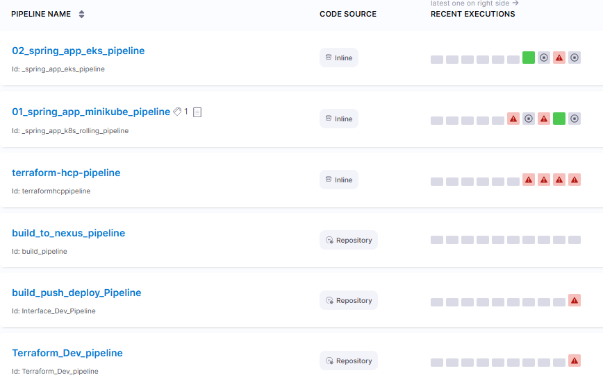

## ✔️Account setup
- [my harness dashboard](https://app.harness.io/ng/account/e0wDKKO_S46x3M75TWv0iw/all/settings/)
- [developer.harness.io](https://developer.harness.io/docs/continuous-delivery/get-started/key-concepts)
- **Account**: `lekhrajdinkar`  
- **Organization**: `default`
- **project**
    - project-1
    - project-2


## ✔️setup ::secrets
### 🔸EKS cluster
- aws_eks_get_token
    - **aws eks get-token  --cluster-name maps-outbound-us-west-2-dev2-eks-fargate-cluster --region us-west-2**
    - Need to update token manually, once expired
    - https://app.harness.io/ng/account/e0wDKKO_S46x3M75TWv0iw/all/settings/secrets/aws_eks_get_token/overview
- aws_eks_cluster_ca_data
- aws_533267082359_secret_access_key (harness_role)

### 🔸minikube cluster ❌
- didn not work 
- minikube-admin-client-key
- minikube-admin-client-crt
- C:\Users\Manisha\.minikube\profiles\minikube
- **github**-access-token-org
- **terraform**-hcp-dev


## ✔️setup::delegates
[delegates](02_delegates.md)

## ✔️setup::connectors
- **k8s-eks-cluster-connector**
- **k8s-minikube-cluster-connector**
- **github**-lekhrajdinkar-connector
- **terraform**-hcp-connector
- aws-secret-manager-connector
- aws-account-connector
- nexus-repo-connector 
- service-now-connector


## ✔️RBAC
- **service account** : none
- **user group** : `app_DevLead` (LDAP role)
  - u1, u2
- **roles**
    - found 19, built-in. eg: pipeline-executor
    - create custom role
        - pipeline-owner
        - pipeline-developer
    - role has defined granular **permission**.
        - **resource/s : action/s**
        - service  : R , W, Edit, View, etc
        - template : R , W, Edit, View, etc
        - pipeline : R , W, Edit, View, etc
        - ...

## ✔️create global-templates
- can create template for : **step, stages, pipeline**
- re-usable

### 🔸template : code-scan 
- synk
- wiz
- template arg: app-image, git repo
- env var: 

### 🔸template : snow
- input: change request

---
## ✔️pipeline/s
- [all pipelines :: project-1](https://app.harness.io/ng/account/e0wDKKO_S46x3M75TWv0iw/all/orgs/default/projects/mapsoutboundapi/pipelines)

```
- pipeline 
  - stages (build, deploy, another pipleline) 
    - steps (run, image push, etc)
    
  - pipeline variable
  - stage variable
  - step variable
  
- triggers : on git actions

- codebase 
    github connector 
    repoName
```



## ✖️services

## ✖️environment

