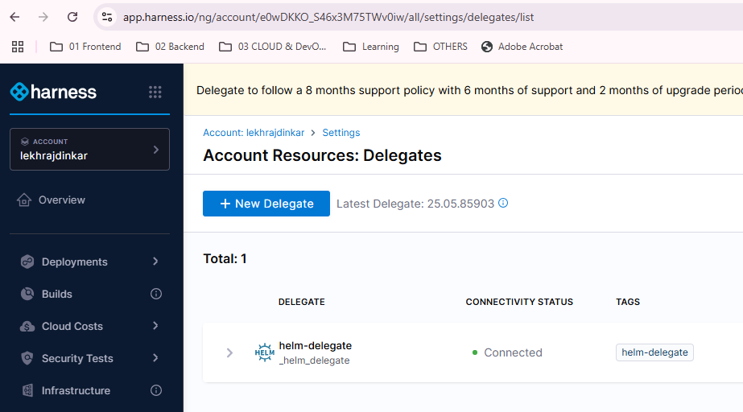

## harness delegate

## intro
- **lightweight**, secure **worker process** that runs within our infrastructure
  - Kubernetes cluster
  - VM
- execute tasks on behalf of the Harness Platform.
- It acts as a communication **bridge** between `Harness SaaS` and `our environment`
  - ensuring secure
  - scalable
  - efficient pipeline operations

- **Key Roles of a Delegate**
  - **Task Execution**:
    - Delegates perform **pipeline actions** directly in your environment, such as:
    ```
    - git clone
    - prepare image - Dind
    - run terrafom - login plan apply.
      - deploy aws iac ; inbound, outbound,etc
      - kafka iac
    - prepare version from pipeline variable.
    - Deploying artifacts to Kubernetes, ECS, or VMs.
      - run helm
      - run k8s manifest
    - Running scripts (e.g., Shell, PowerShell).
      - push to ecr
      - restart ecs
    - Connecting to cloud providers (AWS, Azure, GCP).
    - Integrating with tools like Terraform, or databases.
    - Push to Nexus
    - push helm package to nexux/ecr
    ```

  - **Security**:
    - Delegates make outbound connections to Harness SaaS
    - They execute tasks within our network, avoiding exposure of sensitive credentials to external systems.

  - **Connectivity**:
    - Harness SaaS **sends tasks** to the Delegate via a persistent connection (**gRPC/HTTPs**).
    - The Delegate polls for tasks, executes them locally, and sends results back.
  - **Scalability**: 
    - Add multiple Delegates for high availability or workload distribution.
    - Harness auto-scales task execution **across available Delegates**.

- Types of Delegates:
  - **Kubernetes Delegate**: Runs as a Pod (most common for containerized environments).
  - **Docker Delegate**: Runs as a container on VMs or bare metal.
  - Shell Script Delegate: Installed via script on Linux/Windows hosts.

---
## Run delegate
### 1. terraform provider
- this terraform module, deploys helm chart on K8s cluster (minikube)
- trf: [terraform-helm-delegate](../../deployment/terraform_iac/config-4-harness-delegate)
- **kubeconfig** set to minikube
- delegate added : https://app.harness.io/ng/account/e0wDKKO_S46x3M75TWv0iw/all/settings/delegates/list 




---
### 2. docker
<details> <summary>docker</summary>

```bash
        docker run  --cpus=1 --memory=2g \
        -e DELEGATE_NAME=docker-delegate \
        -e NEXT_GEN="true" \
        -e DELEGATE_TYPE="DOCKER" \
        -e ACCOUNT_ID=e0wDKKO_S46x3M75TWv0iw \
        -e DELEGATE_TOKEN=MGY2OGJmMWQwYjMwZGM5NDYzZDM5NGFlMDg5Mzk4NzY= \
        -e DELEGATE_TAGS="" \
        -e LOG_STREAMING_SERVICE_URL=https://app.harness.io/log-service/ \
        -e MANAGER_HOST_AND_PORT=https://app.harness.io harness/delegate:24.10.84200
        
        docker run  --cpus=1 --memory=2g -e DELEGATE_NAME=docker-delegate -e NEXT_GEN="true" -e DELEGATE_TYPE="DOCKER" -e ACCOUNT_ID=e0wDKKO_S46x3M75TWv0iw -e DELEGATE_TOKEN=MGY2OGJmMWQwYjMwZGM5NDYzZDM5NGFlMDg5Mzk4NzY= -e DELEGATE_TAGS="" -e LOG_STREAMING_SERVICE_URL=https://app.harness.io/log-service/  -e MANAGER_HOST_AND_PORT=https://app.harness.io harness/delegate:24.10.84200
```
</details>

### 3. K8s manifest
<details> <summary>yaml</summary>

```yaml
apiVersion: v1
kind: Namespace
metadata:
  name: harness-delegate-ng

---

apiVersion: rbac.authorization.k8s.io/v1
kind: ClusterRoleBinding
metadata:
  name: harness-delegate-ng-cluster-admin
subjects:
  - kind: ServiceAccount
    name: default
    namespace: harness-delegate-ng
roleRef:
  kind: ClusterRole
  name: cluster-admin
  apiGroup: rbac.authorization.k8s.io

---

apiVersion: v1
kind: Secret
metadata:
  name: kubernetes-delegate-account-token
  namespace: harness-delegate-ng
type: Opaque
data:
  DELEGATE_TOKEN: "MGY2OGJmMWQwYjMwZGM5NDYzZDM5NGFlMDg5Mzk4NzY="

---

# If delegate needs to use a proxy, please follow instructions available in the documentation
# https://ngdocs.harness.io/article/5ww21ewdt8-configure-delegate-proxy-settings

apiVersion: apps/v1
kind: Deployment
metadata:
  labels:
    harness.io/name: kubernetes-delegate
  name: kubernetes-delegate
  namespace: harness-delegate-ng
spec:
  replicas: 1
  minReadySeconds: 120
  selector:
    matchLabels:
      harness.io/name: kubernetes-delegate
  template:
    metadata:
      labels:
        harness.io/name: kubernetes-delegate
      annotations:
        prometheus.io/scrape: "true"
        prometheus.io/port: "3460"
        prometheus.io/path: "/api/metrics"
    spec:
      terminationGracePeriodSeconds: 3600
      restartPolicy: Always
      containers:
      - image: us-docker.pkg.dev/gar-prod-setup/harness-public/harness/delegate:25.05.85903
        imagePullPolicy: Always
        name: delegate
        securityContext:
          allowPrivilegeEscalation: false
          runAsUser: 0
        ports:
          - containerPort: 8080
        resources:
          limits:
            memory: "2048Mi"
          requests:
            cpu: "0.5"
            memory: "2048Mi"
        livenessProbe:
          httpGet:
            path: /api/health
            port: 3460
            scheme: HTTP
          initialDelaySeconds: 10
          periodSeconds: 10
          failureThreshold: 3
        startupProbe:
          httpGet:
            path: /api/health
            port: 3460
            scheme: HTTP
          initialDelaySeconds: 30
          periodSeconds: 10
          failureThreshold: 15
        envFrom:
        - secretRef:
            name: kubernetes-delegate-account-token
        env:
        - name: JAVA_OPTS
          value: "-Xms64M"
        - name: ACCOUNT_ID
          value: e0wDKKO_S46x3M75TWv0iw
        - name: MANAGER_HOST_AND_PORT
          value: https://app.harness.io
        - name: DEPLOY_MODE
          value: KUBERNETES
        - name: DELEGATE_NAME
          value: kubernetes-delegate
        - name: DELEGATE_TYPE
          value: "KUBERNETES"
        - name: DELEGATE_NAMESPACE
          valueFrom:
            fieldRef:
              fieldPath: metadata.namespace
        - name: INIT_SCRIPT
          value: ""
        - name: DELEGATE_DESCRIPTION
          value: ""
        - name: DELEGATE_TAGS
          value: ""
        - name: NEXT_GEN
          value: "true"
        - name: CLIENT_TOOLS_DOWNLOAD_DISABLED
          value: "true"
        - name: DELEGATE_RESOURCE_THRESHOLD
          value: ""
        - name: DYNAMIC_REQUEST_HANDLING
          value: "false"

---

apiVersion: autoscaling/v2
kind: HorizontalPodAutoscaler
metadata:
   name: kubernetes-delegate-hpa
   namespace: harness-delegate-ng
   labels:
       harness.io/name: kubernetes-delegate
spec:
  scaleTargetRef:
    apiVersion: apps/v1
    kind: Deployment
    name: kubernetes-delegate
  minReplicas: 1
  maxReplicas: 1
  metrics:
  - type: Resource
    resource:
      name: cpu
      target:
        type: Utilization
        averageUtilization: 70
  - type: Resource
    resource:
      name: memory
      target:
        type: Utilization
        averageUtilization: 70

---

kind: Role
apiVersion: rbac.authorization.k8s.io/v1
metadata:
  name: upgrader-cronjob
  namespace: harness-delegate-ng
rules:
  - apiGroups: ["batch", "apps", "extensions"]
    resources: ["cronjobs"]
    verbs: ["get", "list", "watch", "update", "patch"]
  - apiGroups: ["extensions", "apps"]
    resources: ["deployments"]
    verbs: ["get", "list", "watch", "create", "update", "patch"]

---

kind: RoleBinding
apiVersion: rbac.authorization.k8s.io/v1
metadata:
  name: kubernetes-delegate-upgrader-cronjob
  namespace: harness-delegate-ng
subjects:
  - kind: ServiceAccount
    name: upgrader-cronjob-sa
    namespace: harness-delegate-ng
roleRef:
  kind: Role
  name: upgrader-cronjob
  apiGroup: ""

---

apiVersion: v1
kind: ServiceAccount
metadata:
  name: upgrader-cronjob-sa
  namespace: harness-delegate-ng

---

apiVersion: v1
kind: Secret
metadata:
  name: kubernetes-delegate-upgrader-token
  namespace: harness-delegate-ng
type: Opaque
data:
  UPGRADER_TOKEN: "MGY2OGJmMWQwYjMwZGM5NDYzZDM5NGFlMDg5Mzk4NzY="

---

apiVersion: v1
kind: ConfigMap
metadata:
  name: kubernetes-delegate-upgrader-config
  namespace: harness-delegate-ng
data:
  config.yaml: |
    mode: Delegate
    dryRun: false
    workloadName: kubernetes-delegate
    namespace: harness-delegate-ng
    containerName: delegate
    delegateConfig:
      accountId: e0wDKKO_S46x3M75TWv0iw
      managerHost: https://app.harness.io

---

apiVersion: batch/v1
kind: CronJob
metadata:
  labels:
    harness.io/name: kubernetes-delegate-upgrader-job
  name: kubernetes-delegate-upgrader-job
  namespace: harness-delegate-ng
spec:
  schedule: "0 */1 * * *"
  concurrencyPolicy: Forbid
  startingDeadlineSeconds: 20
  jobTemplate:
    spec:
      template:
        spec:
          serviceAccountName: upgrader-cronjob-sa
          restartPolicy: Never
          containers:
          - image: harness/upgrader:latest
            name: upgrader
            imagePullPolicy: Always
            envFrom:
            - secretRef:
                name: kubernetes-delegate-upgrader-token
            volumeMounts:
              - name: config-volume
                mountPath: /etc/config
          volumes:
            - name: config-volume
              configMap:
                name: kubernetes-delegate-upgrader-config

```
</details>