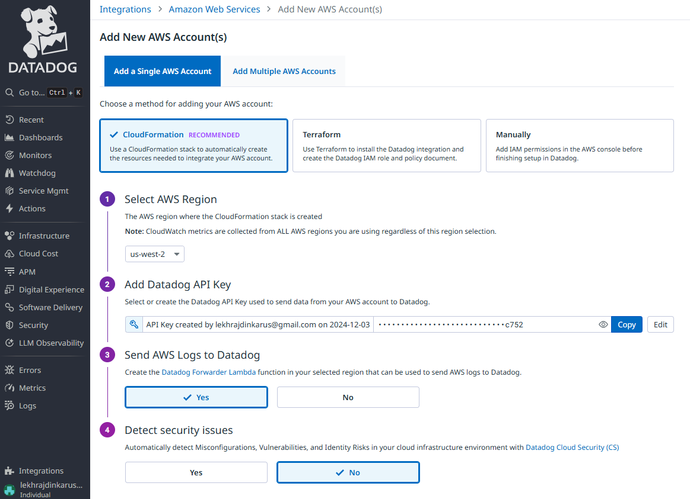

# Datadog
- DASHBOARD : https://us5.datadoghq.com/dashboard/lists?p=1 | ldus@g
--- 
## 1. Kubernetes - Install the Datadog-Agent
- Reference:
  - https://us5.datadoghq.com/signup/agent?platform=kubernetes
  - https://docs.datadoghq.com/containers/kubernetes/distributions/?tab=datadogoperator
  - OpenTelemetry Collector : https://docs.datadoghq.com/opentelemetry/setup/ddot_collector/
  
- **Step-1** Install the **Datadog Operator** in k8s cluster
  - manage your Datadog Cluster Agents
    ```bash
    kubectl create namespace datadog 
  
    # ✔️install the Datadog Operator, from helm
    # release name : datadog-operator
    helm repo add datadog https://helm.datadoghq.com
    helm install datadog-operator datadog/datadog-operator --namespace=datadog  --set datadog.logs.containerCollectAll=true
    kubectl create secret generic datadog-secret --from-literal api-key=XXXX -n datadog
    # get api-key= from aws secret manager
    
    # ✔️check manifest post install
    helm get manifest datadog-operator -n datadog > datadog-operator-manifest.yaml
    
    # ✔️check helm release
    helm list -n datadog
    NAME                    NAMESPACE       REVISION        UPDATED                                 STATUS          CHART                   APP VERSION
    datadog-operator        datadog         1               2025-06-04 17:40:48.5564105 -0700 PDT   deployed        datadog-operator-2.9.2  1.14.0
    ```
- **Step-2** Deploy the **Datadog Agent**
  - kubectl apply -f datadog-agent.yaml
  - [datadog-agent.yaml](datadog-agent.yaml) :point_left:

- **Autodiscovery**  
  - **K8s**: https://us5.datadoghq.com/logs/onboarding/container
    - just ANNOTATE pod
      ```yaml
      annotations:
        ad.datadoghq.com/<container identifier>.logs: '[<LOGS_CONFIG>]'
    
      eg: ad.datadoghq.com/nginx.logs: '[{"source":"nginx","service":"webapp"}]'
      ```
  - https://us5.datadoghq.com/logs/onboarding/server?source=java
  - https://us5.datadoghq.com/logs/onboarding/server?source=python
  - https://us5.datadoghq.com/logs/onboarding/server?source=node
  - https://us5.datadoghq.com/logs/onboarding/server?source=kafka
  - https://us5.datadoghq.com/logs/onboarding/server?source=rabbitmq
  - https://us5.datadoghq.com/logs/onboarding/server?source=nginx
  - https://us5.datadoghq.com/logs/onboarding/server?source=postgres
  - Js: https://us5.datadoghq.com/logs/onboarding/client
---
## 2 AWS integration :parking:
- AWS lambda Datadog Forwarder : https://docs.datadoghq.com/logs/guide/forwarder/?site=us5&tab=cloudformation
- CloudFormation template : https://datadog-cloudformation-template-quickstart.s3.amazonaws.com/aws/v2.1.13/main_v2.yaml
- 
---
## 101 Monitors

---
## 102 Dashboard