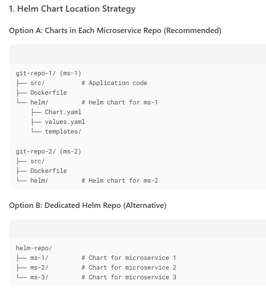

## Container orchestrators
- framework for managing containers at scale at **runtime**
- For Distributed-System (ms), provides **deployment patterns of container**.
- orchestrators make things easier, when managing hundreds or thousands of containers.
- **Automates:**
- release - rollout / rollback
- scale
- service discovery + networking
- storage
- config + secrets

## offerings
- Docker Swarm (native)
- Kubernetes/k8s - minikube, EKS, AKS
- AWS - ECS
- marathon

---
## Scenarios
### 1
```text
having 3 microservice - ms1, ms2, ms3.
need to install in production first time. then upgrade it.
trigger from CD pipeline-1 > stage: bashScript (run helm command)
```



```bash
# install first time
helm install ms1 ./ms1 --namespace production --values values-v1.yaml
helm install ms2 ./ms2 --namespace production
helm install ms3 ./ms3 --namespace production

---
# Upgrade with atomic rollback on failure
helm upgrade $RELEASE_NAME $CHART_PATH \
  --namespace $NAMESPACE \
  --atomic \
  --timeout $TIMEOUT \
  --install \ # Creates release if not exists
  --values values-v2.yaml  # Override prod values
  --create ?
---  
# Post-Deployment Checks  
kubectl rollout status deploy/ms1 -n production  
```

---
### 2 one or multi helm
```text
ms-1 - git-repo-1
ms-2 - git-repo-2
ms-3 - git-repo-3
in which repo helm chart ?
Do i need to change helm chart manually everytime new code in commited into git repo, new image is push 
to aws ECR. how to automate it helm deploymnet ?
--
Key Files to Modify in CI/CD pipeline:
    helm/values.yaml - image tag
    Chart.yaml	- version
    templates/*.yaml	- ?
```


