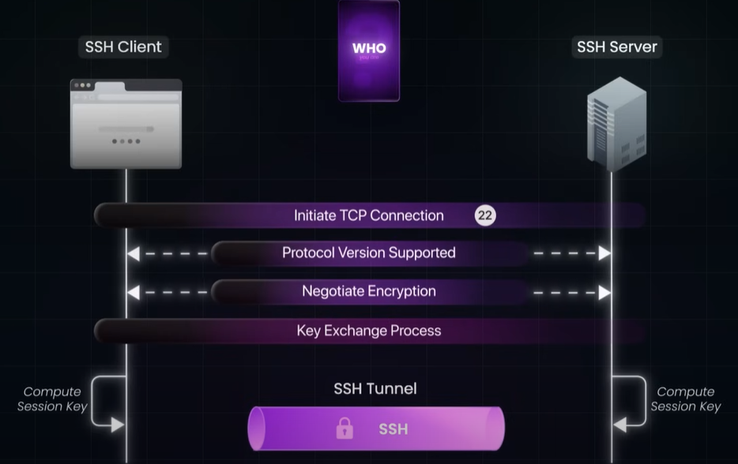
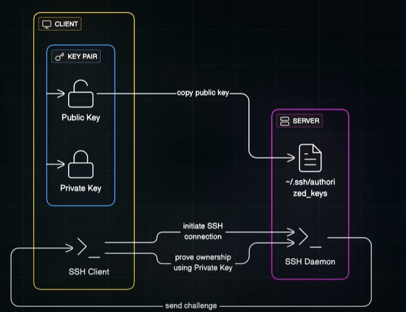

## 🔶SSH
- **resource**:
  - https://www.youtube.com/watch?v=s-vhqtyUF4I&ab_channel=ByteMonk
  - https://www.perplexity.ai/search/ssh-https-www-youtube-com-watc-ScmhmYP.RDe3ZxozAqsjMg
- securely connect to and control remote machines
- all with strong encryption protecting your session and credentials.
- **Step-1 :: SSL handshake** 
  - public key exc + 
  - mutual generated same private key (without sharing over internet.)

- **Step-2 :: Authentication**

- eg: 
  - `aws` added **.pem** file on ec2 that is **private key**
  - `github`, add public key, verifies client key with every push
- **bastion host** (SSL server)
  - like gateway, sits in front
  - take SSL traffic/request
  - forward to backend private server
  
---
## 🗣️examples
- [user onboarding example in organisation](../SD_99_Examples/byteMonk/02_IDP%2Bfederation.md)

---
## 🔗Reference:
- 📺 YouTube playlist :: [https://www.youtube.com/playlist?list=PLKX-zWo5N7Wdf00rGvzvnUZuAJvg0ndcy](https://www.youtube.com/playlist?list=PLKX-zWo5N7Wdf00rGvzvnUZuAJvg0ndcy)
- 📃[blogs_01_byteByteGo.md #security](../blogs_01_byteByteGo.md#security)
