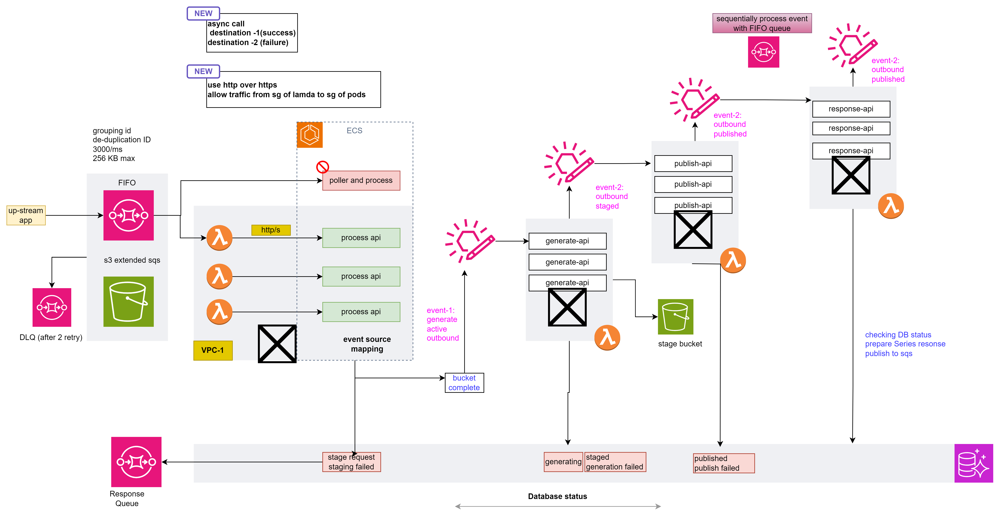

## Event drivern Architecture

---
## B2B::Design pattern
- **Serverless + fully managed**
- **Cloud first**
    - AWS : core service
    - confluent kafka
    - AWS : RDS serverless
    - ...
- **single region + standBy region withDR switch plan**
- **Distributed / clustered**
- **scalable** ( robust + maintainable)
    - autoscaling
    - manual scaling

- **service oriented**
    - service first
    - separation of concern

  