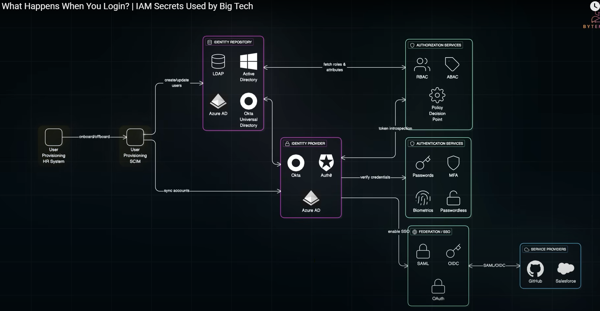

## IAM

---

### Identity and Access Management (IAM) Architecture — Mind Map Summary

**1. User Provisioning**

- HR System: Manages personnel identity data
- SCIM: Standard for automated identity provisioning into identity repositories

**2. Identity Repository** (Stores user identity data)

- LDAP
- Active Directory (AD)
- Azure Active Directory (Azure AD)
- Okta Universal Directory

**3. Identity Provider (IdP)** (Issues authentication tokens)

- Okta
- Auth0
- Azure AD

**4. Authentication Services** (Verify user identity)

- Passwords
- Multi-Factor Authentication (MFA)
- Biometrics
- Passwordless methods

**5. Authorization Services** (Determine user permissions)

- Role-Based Access Control (RBAC)
- Attribute-Based Access Control (ABAC)
- Policy Decision Point (PDP) evaluating access policies

**6. Federation / Single Sign-On (SSO)**

- SAML
- OpenID Connect (OIDC)
- OAuth

**7. Service Providers** (Applications or systems users access via federation)

- GitHub
- Salesforce

### Key Concepts and Flow

- Provision user identities from HR and SCIM into Identity Repository.
- Identity Provider authenticates users based on repository data.
- Authentication services verify identity using MFA, password, or biometrics.
- Authorization services enforce permissions using RBAC/ABAC policies.
- Federation enables SSO to external applications or service providers.

--- 
## Reference Architecture ✔️

https://www.youtube.com/watch?v=esw0GzYWUyw&ab_channel=ByteMonk