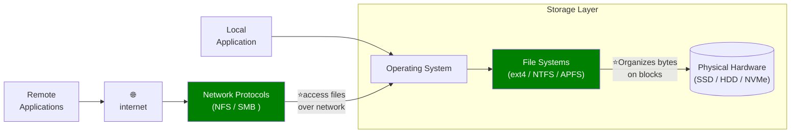

# AWS Storage service
- https://chatgpt.com/c/677dbc0a-3414-800d-8960-b0d969c9ffda | ebs,efs,Fxs,snowball
- https://chatgpt.com/c/6a717fbf-d7c0-83e8-801c-b6e597b5d89d | EFS `8/2026`
---
## Overview
Check these 3 aspects:
- **size** (capacity)
- **iops**
    - read iops
    - write iops
- **throughput** (data transfer rate like 100 MB/s)

## categories
| Storage type   | AWS service   | Access model                            |
| -------------- | ------------- |-----------------------------------------|
| Block storage  | EBS           | Disk volumes attached to compute        |
| File storage   | **EFS / FSx** | Directories and files (over network)    |
| Object storage | S3            | Objects(any file) accessed through APIs |

---
## 1. EC2 instant store
[01_instance_store.md](01_instant-store.md)

## 2. EBS
[01_EBS.md](02_EBS.md)

## 3. EFS
[02_EFS.md](03_EFS.md)

## 4. FSx
[02_FSx_serverless-FS.md](04_FSx.md)

## 5. S3
- [05_01_S3.md](05_01_S3.md)
- [05_02_S3-advance.md](05_02_S3-advance.md)

---

## More
- [07_more_01_Storage-gateway.md](07_more_01_Storage-gateway.md)
- [07_more_02_AWS-transfer.md](07_more_02_AWS-transfer.md)
- [07_more_03_snowball.md](07_more_03_snowball.md)
- [07_more_04_AppFlow.md](07_more_04_AppFlow.md)
- [07_more_05_DataSync.md](07_more_05_DataSync.md)

---

## Fundamental

### 1. File System
A file system defines how data is organized and stored, manage:
- File names
- Directories
- Permissions
- File size
- Timestamps
- Location of file data on disk

| Operating system | Common file systems |
| ---------------- | ------------------- |
| Linux            | ext4, XFS           |
| Windows          | NTFS                |
| macOS            | APFS                |

### 2. Access storage over network

  | network Protocol           | Mainly used by               | AWS example                     |
  |----------------------------| ---------------------------- | ------------------------------- |
  | **NFS**                    | Linux and Unix systems       | EFS, FSx for OpenZFS            |
  | **SMB**                    | Windows systems              | FSx for Windows File Server     |
  | **Lustre protocol/client** | High-performance computing   | FSx for Lustre                  |
  | **iSCSI**                  | Block storage over a network | Some enterprise storage systems |

| AWS service                     | Main client OS    | Protocol               |
| ------------------------------- | ----------------- | ---------------------- |
| **Amazon EFS**                  | Linux             | NFSv4                  |
| **FSx for Windows File Server** | Windows           | SMB                    |
| **FSx for NetApp ONTAP**        | Linux and Windows | NFS, SMB, iSCSI        |
| **FSx for OpenZFS**             | Linux             | NFS                    |
| **FSx for Lustre**              | Linux             | Lustre client protocol |
