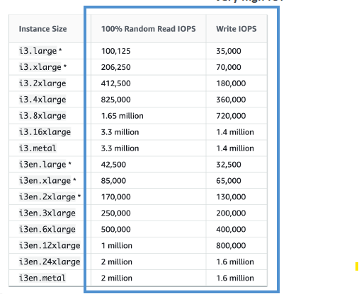

# EC2 instant-store (block-storage)
## Overview
- **better Read/write iops** :smile:
    - high-performance hardware disk
    - depends on ec2-i family type.
    - 
- risk of data loss if h/w fails
- **manual backup**
- volume size is **fixed**
    - determined by the EC2 instance type.
    - so dont have option to choose custom instant store :dart:
- fact : AMIs do not preserve instance store data :point_left:
- fixed to host machine
    - cannot be detached or reattached
- can be used as boot volume :point_left: not preferred
- AMI does NOT preserve instance store volumes.
    - only EBS backed AMI :dart: