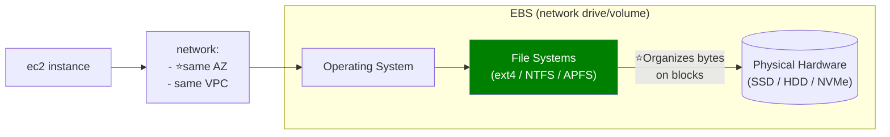
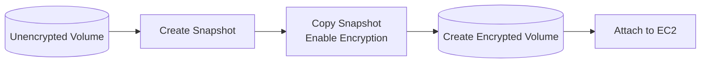

# EBS
## Overview
- Amazon EBS is block storage, attach/detach over network in same AZ
- EBS appears to the EC2 operating system like a **raw hard disk (volumes)**
- Common file system gets created on EBS as per ec2's OS

| Operating system       | Common file system created on EBS |
| ---------------------- |  --------------------------------- |
| Linux                  |         ext4, XFS                         |
| Windows                |        NTFS, ReFS                        |
| Other EC2-supported OS |     Depends on OS                     |




---
## ✔️EBS: Configuration
- **deleteOnTermination** 
  - for root volume - `true`
  - additional ebs volume - `false`
- **label**
```
aws cli : ec2label
 - ec2-1 root volume > snapshot-1 > created volume-2 > attached to ec2-2 as additional volume, vol-2
 - vol-1 is root vol for ec2-2
 - reboot ec2-2, it will boot from vol-2, rather than vol-1
```
---  
## ✔️EBS: snapshot
> Build an AMI on Ec2 instance, will also create EBS snapshots 👈
- Snapshots are checkpoint on backup (s3)
- point in time snapshot | Fast Snapshot Restore (FSR)
  - _no need to detach volume while taking snapshot, but recommended._

**Cross AZ/Region restore** 


**store snapshot to archive tier**
- 75% cheaper, save cost, 
- but restore time 24-72 hrs 


  
**Recover snapshot from accidental delete** 
- setup **recycle bin** with retention policy (1 day to 1 year)


---
## ✔️EBS: Types

| Category                     | Type                       |           Size | Baseline performance                                           | Burst behavior                                                   | Maximum performance               | Boot? | Best use                                                       |
| ---------------------------- |----------------------------| -------------: | -------------------------------------------------------------- | ---------------------------------------------------------------- | --------------------------------- | ----: | -------------------------------------------------------------- |
| **General Purpose SSD**      | **gp2**                    |   1 GiB–16 TiB | **3 IOPS/GiB**; minimum 100 IOPS; maximum baseline 16,000 IOPS | Volumes below 1 TiB can burst up to **3,000 IOPS** using credits | **16,000 IOPS**, **250 MiB/s**    |     ✅ | Boot volumes, general applications, dev/test                   |
| **General Purpose SSD**      | **gp3**                    |   1 GiB–64 TiB | **3,000 IOPS + 125 MiB/s** included                            | No burst-credit model; sustains provisioned performance          | **80,000 IOPS**, **2,000 MiB/s**  |     ✅ | Recommended default, apps, virtual desktops, medium databases  |
| **Provisioned IOPS SSD**     | **io1**                    |   4 GiB–16 TiB | No fixed baseline; you provision required IOPS                 | No burst-credit model                                            | **64,000 IOPS**, **1,000 MiB/s**  |     ✅ | Older high-performance database workloads                      |
| **Provisioned IOPS SSD**     | **io2 <br> Block Express** |   4 GiB–64 TiB | No fixed baseline; you provision required IOPS                 | No burst-credit model                                            | **256,000 IOPS**, **4,000 MiB/s** |     ✅ | Mission-critical databases, consistent sub-millisecond latency |
| **Throughput Optimized HDD** | **st1**                    | 125 GiB–16 TiB | **40 MiB/s per TiB**; maximum baseline 500 MiB/s               | **250 MiB/s per TiB**, using credits; capped at 500 MiB/s        | About **500 IOPS**, **500 MiB/s** |     ❌ | Big data, ETL, logs, data warehouses                           |
| **Cold HDD**                 | **sc1**                    | 125 GiB–16 TiB | **12 MiB/s per TiB**; maximum baseline 192 MiB/s               | **80 MiB/s per TiB**, using credits; capped at 250 MiB/s         | About **250 IOPS**, **250 MiB/s** |     ❌ | Infrequently accessed, large sequential data                   |


---
## Security__
**Encryption**
- encrypt at rest both - **volume and snapshot** using KMS
- Existing unencrypted resources are not automatically changed.
- Encryption by default is Region-specific
- You cannot enable encryption directly on an existing unencrypted volume.


- You cannot directly change the KMS key assigned to an existing volume or snapshot.
```
Encrypted snapshot
      ↓
Copy snapshot using a different KMS key
      ↓
Create a new volume
```
**IAM**
- EBS does not use security groups because it is not exposed as an NFS or SMB network endpoind.
- Access is controlled through IAM polies, EC2 permission


---
## Cost__
> We pay mainly for what you provision, not only what you use.

| Cost component             | What you pay for                            | Exam point                                              |
| -------------------------- | ------------------------------------------- | ------------------------------------------------------- |
| Volume storage             | Provisioned GiB per month                   | A mostly empty 1-TiB volume is still billed as 1 TiB    |
| Provisioned IOPS           | Extra IOPS on `gp3`, `io1`, and `io2`       | Higher performance increases cost                       |
| Provisioned throughput     | Extra throughput on `gp3`                   | First 125 MiB/s is included with `gp3`                  |
| Snapshots                  | Actual changed blocks stored                | Snapshots are incremental                               |
| Snapshot Archive           | Archived snapshot storage                   | Cheaper, but slower restore and minimum retention apply |
| Cross-Region snapshot copy | Data transferred between Regions            | Used for disaster recovery                              |
| Fast Snapshot Restore      | Enabled snapshot per AZ                     | Additional charge                                       |
| Provisioned initialization | Faster volume initialization from snapshots | Additional charge                                       |

- Prefer gp3 (20% cheap) over gp2. 
- Delete unused volumes
- Remove old snapshots carefully
- **Amazon Data Lifecycle Manager** for EBS snapshots and EBS-backed AMIs
---
## Exam 🎯  
### Tips
- Trap 1: EBS is not automatically backed up
- Trap 2: Snapshot is Regional, volume is AZ-specific
- Trap 3: Multi-Attach is not a shared file system
- Trap 4: A stopped EC2 instance can still cost money
  - Compute billing may stop,
  - but attached EBS volumes and snapshots continue generating storage charges.
- Trap 5: KMS key deletion can make data inaccessible
- Trap 6: Security groups do not control EBS

### Question
#1 EBS volume : automate:
- every 12 hr screenshot
- delete older screenshot
- options:
  - use event rule schedular > lambda > ...
  - use Amazon **Data Lifecycle manager** **


#### Question 1: Reduce gp2 Cost

A company has several `gp2` volumes. The volumes are oversized only because the application requires 3,000 IOPS. The company wants to reduce cost without changing application performance.

**Which solution should a solutions architect recommend?**

- A. Move the volumes to `st1`
- B. Move the volumes to `gp3` and provision the required IOPS
- C. Increase the size of the `gp2` volumes
- D. Move the data to Amazon S3 Glacier

<details>
<summary>Answer</summary>

**Correct answer: B**

`gp3` allows storage capacity, IOPS, and throughput to be configured independently. This avoids provisioning unnecessary storage just to obtain higher IOPS.

</details>

---

#### Question 2: Encrypt All New EBS Volumes

A company must automatically encrypt all newly created EBS volumes in every AWS Region it uses.

**What should the company do?**

- A. Add an inbound security group rule
- B. Enable EBS encryption by default in each Region
- C. Enable encryption only on the EC2 AMI
- D. Store the data in an encrypted S3 bucket

<details>
<summary>Answer</summary>

**Correct answer: B**

EBS encryption by default is configured per AWS account and per Region. It encrypts newly created EBS volumes and snapshot copies.

</details>

---

#### Question 3: Encrypt an Existing Unencrypted Volume

An existing EBS volume is unencrypted. The company needs to encrypt it using a customer-managed AWS KMS key.

**Which process should be used?**

- A. Modify the existing volume and enable encryption
- B. Attach the volume to an encrypted EC2 instance
- C. Create a snapshot, copy it with encryption, and create a new volume
- D. Enable default encryption and restart the EC2 instance

<details>
<summary>Answer</summary>

**Correct answer: C**

Encryption cannot be enabled directly on an existing unencrypted EBS volume.

```text
Unencrypted volume
        ↓
Create snapshot
        ↓
Copy snapshot with encryption
        ↓
Create a new encrypted volume
```

</details>

---

#### Question 4: Share an Encrypted Snapshot

A company needs to share an encrypted EBS snapshot with another AWS account.

**What is required?**

- A. Encrypt the snapshot with the AWS-managed `aws/ebs` key
- B. Make the encrypted snapshot public
- C. Use a customer-managed KMS key and share both the snapshot and KMS key access
- D. Copy the snapshot to Amazon EFS

<details>
<summary>Answer</summary>

**Correct answer: C**

An encrypted snapshot can be shared privately when it is encrypted with a customer-managed KMS key. The company must share:

1. The EBS snapshot.
2. Permission to use the KMS key.

Snapshots encrypted with the AWS-managed `aws/ebs` key cannot be shared with another account.

</details>

---

#### Question 5: Recover an EBS Volume in Another AZ

An EC2 application runs in `us-east-1a`. The company must recover the application in `us-east-1b` after an Availability Zone failure.

**Which solution is appropriate?**

- A. Attach the original EBS volume directly to an instance in `us-east-1b`
- B. Create an EBS snapshot and restore a new volume in `us-east-1b`
- C. Change the subnet associated with the EBS volume
- D. Attach another security group to the EBS volume

<details>
<summary>Answer</summary>

**Correct answer: B**

An EBS volume is restricted to one Availability Zone. An EBS snapshot is Regional and can be used to create a new volume in another Availability Zone in the same Region.

</details>

---

#### Question 6: Stopped Instance Cost

A company stops an EC2 instance for three months. The instance has a 2-TiB EBS data volume attached.

**Which statement is correct?**

- A. Charges stop for both EC2 and EBS
- B. EC2 compute charges stop, but EBS storage charges continue
- C. EBS storage is automatically converted to a snapshot
- D. The EBS volume is automatically deleted

<details>
<summary>Answer</summary>

**Correct answer: B**

Stopping an EC2 instance stops normal instance compute charges, but attached EBS volumes continue to incur storage charges.

</details>

---

#### Question 7: Automated Snapshot Retention

A company wants to automatically create daily EBS snapshots and delete snapshots older than 30 days.

**Which AWS service is the most direct solution?**

- A. Amazon Data Lifecycle Manager
- B. AWS Auto Scaling
- C. Amazon EventBridge Scheduler only
- D. Elastic Load Balancing

<details>
<summary>Answer</summary>

**Correct answer: A**

Amazon Data Lifecycle Manager can automate the creation, retention, copying, and deletion of EBS snapshots and EBS-backed AMIs.

</details>

---

#### Question 8: High-Performance Critical Database

A mission-critical database requires predictable, sustained IOPS, very low latency, and high durability.

**Which EBS volume type is the best choice?**

- A. `sc1`
- B. `st1`
- C. `gp2`
- D. `io2 Block Express`

<details>
<summary>Answer</summary>

**Correct answer: D**

`io2 Block Express` is intended for mission-critical, I/O-intensive database workloads requiring predictable high performance and high durability.

</details>

---

#### Question 9: Sequential Log Processing

An EC2-based analytics application processes several terabytes of log files using large sequential reads. The files are accessed frequently, and cost should be lower than SSD storage.

**Which EBS volume type is appropriate?**

- A. `io2`
- B. `gp3`
- C. `st1`
- D. `sc1`

<details>
<summary>Answer</summary>

**Correct answer: C**

`st1` is Throughput Optimized HDD storage designed for frequently accessed, large sequential workloads such as logs, ETL, and data warehouses.

</details>

---

#### Question 10: Multi-Attach Requirement

A clustered application requires one EBS volume to be attached to several Nitro-based EC2 instances in the same Availability Zone.

**Which solution meets this requirement?**

- A. Use `gp3` with Multi-Attach
- B. Use `io1` or `io2` with EBS Multi-Attach
- C. Use `st1` with NFS
- D. Use an EBS snapshot shared by all instances

<details>
<summary>Answer</summary>

**Correct answer: B**

EBS Multi-Attach is supported for eligible `io1` and `io2` volumes. The instances must be in the same Availability Zone, and the application or clustered file system must coordinate concurrent writes.

</details>

---

# Quick Exam Reminders

```text
EBS volume = Availability Zone scoped
EBS snapshot = Regional

gp3 = recommended general-purpose SSD
io2 Block Express = critical database workloads
st1 = frequently accessed sequential data
sc1 = infrequently accessed sequential data

Existing unencrypted volume:
Snapshot → encrypted copy → new encrypted volume

Stopped EC2:
Compute charge stops
EBS storage charge continues
```
