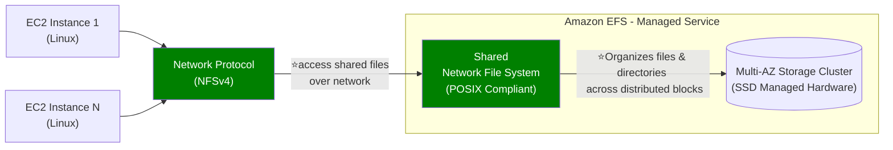

# EFS (regional)
## Overview


EFS provides:
- File and directory hierarchy
- File names and paths
- Shared concurrent access
- **POSIX-compliant File system**
  - Unix-style user IDs, group IDs, and rwx permissions

Managed service:
- No capacity planning, autoScale to **petabyte scale**.
- high availability (mutli-AZ, single-AZ)
- high performance
  - Read - `3 GB / s`
  - Write - `1 GB / s`

Attach to multiple EC2 ( **Linux based AMI** only) ⭐


---
## EFS - Storage class
- **lifecycle policy** to move between 
  - **standard** (with One-Zone option as well)
  - **Infrequent-Access** (with One-Zone option as well) 
  - **Archive** 50% low cost

---
## EFS - Throughput Modes
- **Bursting Throughput** ( default)
  - throughput scales with file system size

- **elastic Throughput**
  - throughput scale regardless of size
  - auto-scale with the best performance. (R/recommended)

- **provisioned Throughput**
  - manually configure throughput.
  - If your workloads require even higher and consistent throughput
  - allows you to specify the throughput you need, independent of the amount of data stored.

---
## EFS - Performance Mode
- **general-purpose** ( default)
  - **low-latency** operations :)
  - lower throughput
  - and is not ideal for highly parallelized/concurrent big data processing tasks.
  
- **max I/O** 
  - Highly `parallelized` applications and **big data workloads** that require higher throughput.
  -  supports thousands of `concurrent` connections and higher I/O operations.
  -  **higher latencies**
  - higher throughput

| **Category**          | **Option**              | **Description**                                                                                  | **Best For**                           |
|------------------------|-------------------------|--------------------------------------------------------------------------------------------------|-----------------------------------------|
| **Performance Modes**  | **General Purpose**     | Low latency, limited concurrency, fixed throughput per client.                                  | Latency-sensitive workloads.            |
|                        | **Max I/O**            | Higher latency, massive concurrency, elastic throughput scaling.                                | High-concurrency workloads.             |
| **Throughput Modes**   | **Bursting Throughput** | Default mode; scales with file system size.                                                     | Variable workloads with spiky demand.   |
|                        | **Provisioned**        | Fixed throughput, independent of file system size.                                              | Consistent high-throughput workloads.   |
|                        | **Elastic Throughput** | Automatically scales throughput to match workload needs (Enhanced Mode).                       | Unpredictable or spiky workloads.       |


---  
## Security
- choose VPC/subnet >  add security group.
- Encryption at rest using `KMS` + enable/disable automatic backup

---  
## DR
- EFS cross region replication : enable. `preferrered` :point_left: :dart:
- DataSync also, as alternative.

---
## Cost
> 3x times expensive** than EBS(gp2)

**price compare**
```yaml
Storage Class	            Price (per GB)  

EBS General Purpose (gp3)	$0.08
EBS General Purpose (gp2)	$0.10
EBS Provisioned IOPS (io1)	$0.125
EBS Provisioned IOPS (io2)	$0.125
EBS Magnetic (standard)	    $0.05

=== SSD 12 cent , for HDD 5 cent

EFS Standard	            $0.30
EFS Standard-IA	            $0.025
EFS One Zone	            $0.16
EFS One Zone-IA	            $0.0133

=== standard 30 cent , IA - 2 cent
```

---
## Target Mount 🎯
- 
- Allows EC2 instances in a VPC to access an EFS file system
    - not needed for **lambda**.
    - not needed for **on-prem**  ( if DX/VPN, is setup)
- configure:
    - Subnet ID
    - Security Groups
- EFS mount targets are:
    - created **per AZ**, not per subnet.
    - EFS is **not multi-VPC**, use VPC peering :point_left:
    - eg:
  ```text
    - tm-1 create for az-1, and for VPC-1
    - VPC-1 has 3 subnets for az-1  
    - VPC-2 has 3 subnets for az-1
    - Next, VPC-1 --- peer --- VPC-2
    - update security group
    - then can mount EFS on ec2 intance of VPC-2
   ```
---
## use case
- content management, web serving, data sharing, Wordpress, big data, media processing.

---
## Extra

```
  === hands on ===
  - Create EFS `efs-1` + efs-sg-1
  - Ec2-i1 and i2 : launch instance > attach efs-1
  - choose mount location : /mnt/efs/fs1
  - aws automatically adds sg
      - ec2-i1-sg : inbound rule : Type:NFS, protocol:TCP, port:2049, source:efs-sg-1
      - similary outbound rule.
  - ssh to ec2-i1 and echo "hello" >  /mnt/efs/fs1/hello.txt
  - ssh to ec2-i2 and cat  /mnt/efs/fs1/hello.txt
```

- 
- 


---
## Exam 🎯
- #1 need high-frequency reading and writing (20 MB file) max 1 TB total size.
  - **EFS with Provisioned Throughput mode** :point_left:
    - supports concurrent access 
    - Provisioned Throughput, Ensures consistent performance for high I/O workloads
  - **DynamoDB** :x:
    - Not optimized for large file storage & high-frequency writes.
    
- #2 EBS volume : automate:
  - every 12 hr screenshot
  - delete older screenshot
  - options:
    - use event rule schedular > lambda > ...
    - use Amazon **Data Lifecycle manager** **