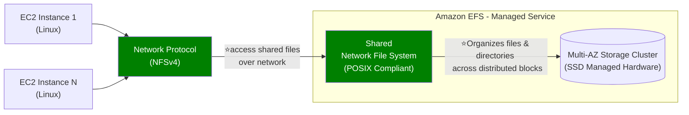
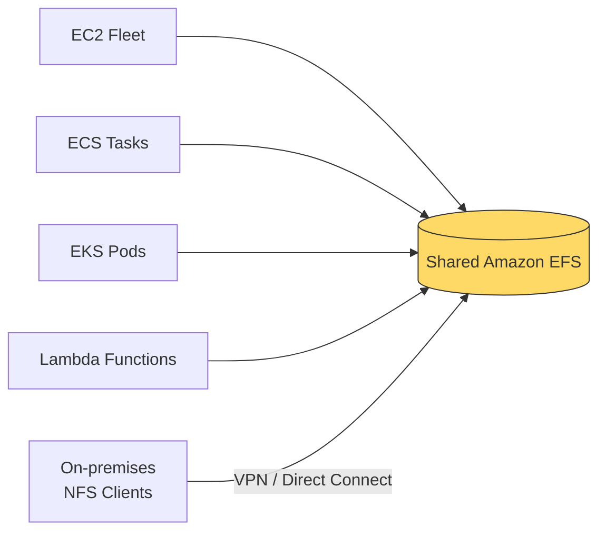
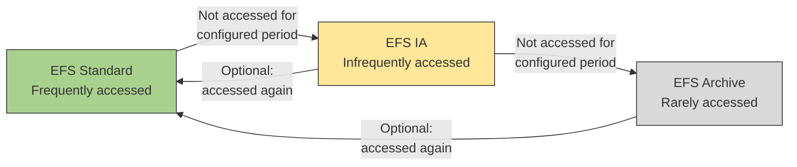
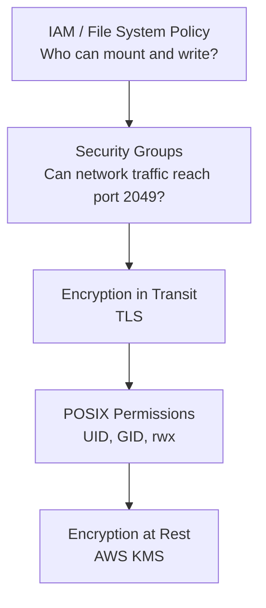
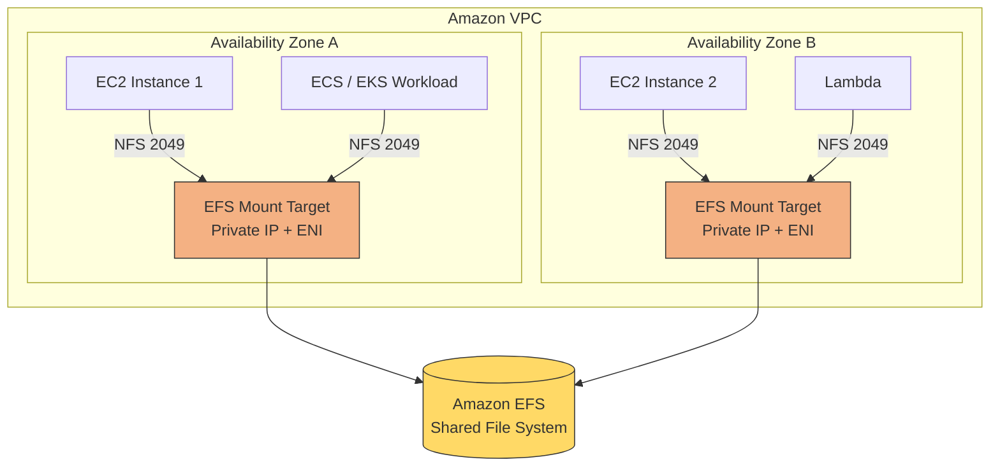
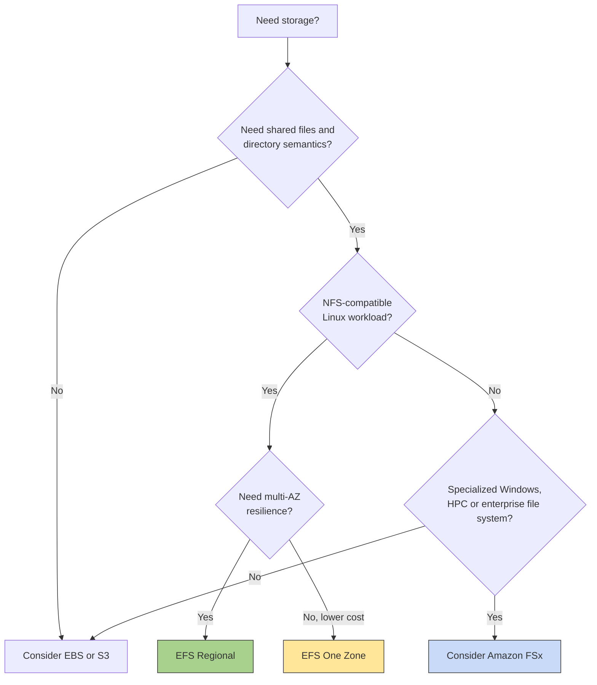

# EFS (regional)
> - high performance network file system (protocol:NFS) | Read - `3 GB / s` | Write - `1 GB / s`
> - Attach to multiple EC2 ( **Linux based AMI** only) ⭐
---
## Overview


EFS provides:
- File and directory hierarchy
- File names and paths
- Shared concurrent access
- **POSIX-compliant File system**
  - Unix-style user IDs, group IDs, and rwx permissions

Managed service:
- No capacity planning, autoScale to **petabyte scale**.
- high availability (mutli-AZ, single-AZ)  `99.99`
- 11 nines of durability `99.9999999`
- AWS Backup (cross region),  PITR
- EFS Replication (aync)



---
## use case__
- content management,
- web serving,
- data sharing,
- Wordpress,
- big data,
- media processing.

---
## ✔️EFS - Storage class
- **lifecycle policy** to move between 
  - **standard** (with One-Zone option as well)
  - **Infrequent-Access** (with One-Zone option as well) 
  - **Archive** 50% low cost

| Storage class                  | Intended usage                        |     Relative latency | Cost behavior                            |
| ------------------------------ | ------------------------------------- | -------------------: | ---------------------------------------- |
| **EFS Standard**               | Frequently accessed files             |               Lowest | Higher storage price                     |
| **EFS Infrequent Access — IA** | Accessed a few times per quarter      | Tens of milliseconds | Lower storage price plus access charges  |
| **EFS Archive**                | Accessed a few times per year or less | Tens of milliseconds | Lowest storage price plus access charges |

**Life cycle example**
```
Move into IA after 30 days without access
Move into Archive after 90 days without access
Do not automatically move the file back to Standard unless configured
```

---
## ✔️EFS - Performance Mode (iops vs latency)
- **general-purpose** ( default)
    - **low-latency** operations :)
    - lower throughput
    - and is not ideal for highly parallelized/concurrent big data processing tasks.

- **max I/O**
    - Highly `parallelized` applications and **big data workloads** that require higher throughput.
    -  supports thousands of `concurrent` connections and higher I/O operations.
    -  **higher latencies**
    - higher throughput
  
---
## ✔️EFS - Throughput Modes
- **Bursting Throughput** ( default)
  - throughput scales with file system size

- **elastic Throughput**
  - throughput scale regardless of size
  - auto-scale with the best performance. (R/recommended)

- **provisioned Throughput**
  - manually configure throughput.
  - If your workloads require even higher and consistent throughput
  - allows you to specify the throughput you need, independent of the amount of data stored.

| **Category**          | **Option**              | **Description**                                                                                  | **Best For**                           |
|------------------------|-------------------------|--------------------------------------------------------------------------------------------------|-----------------------------------------|
| **Performance Modes**  | **General Purpose**     | Low latency, limited concurrency, fixed throughput per client.                                  | Latency-sensitive workloads.            |
|                        | **Max I/O**            | Higher latency, massive concurrency, elastic throughput scaling.                                | High-concurrency workloads.             |
| **Throughput Modes**   | **Bursting Throughput** | Default mode; scales with file system size.                                                     | Variable workloads with spiky demand.   |
|                        | **Provisioned**        | Fixed throughput, independent of file system size.                                              | Consistent high-throughput workloads.   |
|                        | **Elastic Throughput** | Automatically scales throughput to match workload needs (Enhanced Mode).                       | Unpredictable or spiky workloads.       |

---  
## Security__



---  
## DR__
- EFS cross region replication : enable. `preferrered` :point_left: :dart:
- DataSync also, as alternative.

---
## Cost
> 3x times expensive than EBS(gp2)

**price compare with EBS**
```
Storage Class	                    Price (per GB)  
---
EBS General Purpose (gp3)	          $0.08
EBS General Purpose (gp2)	          $0.10
EBS Provisioned IOPS (io1)	          $0.125
EBS Provisioned IOPS (io2)	          $0.125
EBS Magnetic (standard)	              $0.05
---
EFS Standard      (multi-AZ)	            $0.30
EFS Standard-IA	  (multi-AZ)	            $0.025
EFS Standard      (One Zone)	            $0.16
EFS Standard-IA   (One Zone)	            $0.0133

```

---
## Target Mount 🎯
- 
- Allows EC2 instances in a VPC to access an EFS file system
    - not needed for **lambda**.
    - not needed for **on-prem**  ( if DX/VPN, is setup)
- configure:
    - Subnet ID
    - Security Groups
- EFS mount targets are:
    - created **per AZ**, not per subnet.
    - EFS is **not multi-VPC**, use VPC peering :point_left:
    - eg:
  ```text
    - tm-1 create for az-1, and for VPC-1
    - VPC-1 has 3 subnets for az-1  
    - VPC-2 has 3 subnets for az-1
    - Next, VPC-1 --- peer --- VPC-2
    - update security group
    - then can mount EFS on ec2 intance of VPC-2
   ```


---
## Extra

```
  === hands on ===
  - Create EFS `efs-1` + efs-sg-1
  - Ec2-i1 and i2 : launch instance > attach efs-1
  - choose mount location : /mnt/efs/fs1
  - aws automatically adds sg
      - ec2-i1-sg : inbound rule : Type:NFS, protocol:TCP, port:2049, source:efs-sg-1
      - similary outbound rule.
  - ssh to ec2-i1 and echo "hello" >  /mnt/efs/fs1/hello.txt
  - ssh to ec2-i2 and cat  /mnt/efs/fs1/hello.txt
```

- 
- 


---
## Exam 🎯
### Questions
#1 need high-frequency reading and writing (20 MB file) max 1 TB total size.
- **EFS with Provisioned Throughput mode** :point_left:
  - supports concurrent access 
  - Provisioned Throughput, Ensures consistent performance for high I/O workloads
- **DynamoDB** :x:
  - Not optimized for large file storage & high-frequency writes.
    
#2 EBS volume : automate:
- every 12 hr screenshot
- delete older screenshot
- options:
  - use event rule schedular > lambda > ...
  - use Amazon **Data Lifecycle manager** **

### Tips
- Trap 1: EFS is not block storage
- Trap 2: EFS is primarily for NFS-compatible workloads
- Trap 3: Mount targets are AZ-specific
- Trap 4: Security groups apply to mount targets
- Trap 5: EFS storage is elastic
- Trap 6: Regional does not mean cross-Region
- Trap 7: Multi-AZ redundancy is not a substitute for backup
    - Replication and redundancy can also replicate accidental file deletion. 
    - Use AWS Backup for recoverability.
- Trap 8: IA and Archive have access charges
- Trap 9: Performance mode and throughput mode are different
    - Performance mode → operation latency and parallelism behavior
    - Throughput mode  → amount of data transferred per second

