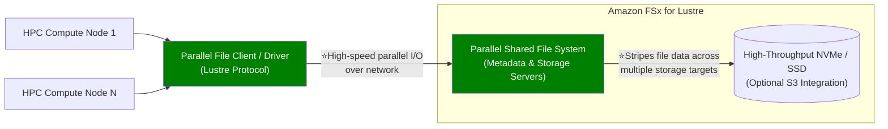
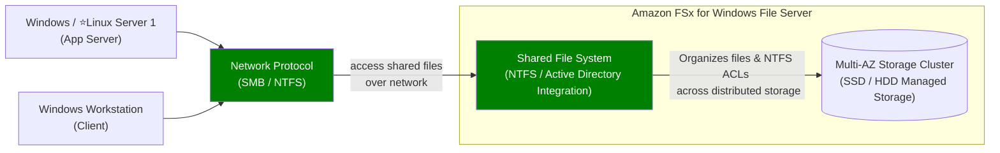
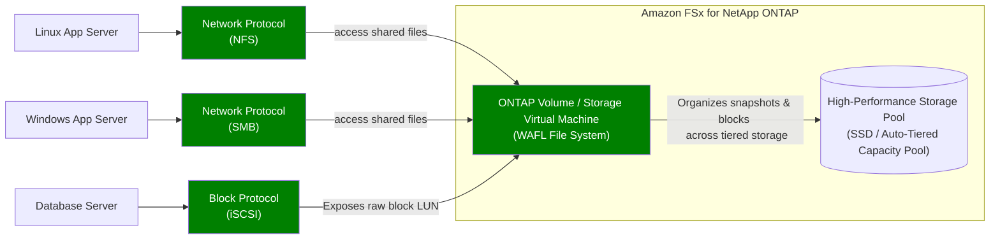
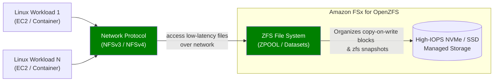

# Amazon FXs (serverless + fully managed)
## Overview
**high performance** FS over network, can be mounton :
- ec2-instance (multiple OS supported)
- on-prem VM ( for networking : `vpn` or `directConnect`)  👈
  
More:
- multi-AZ
- KMS encrypted.
- automated backup to S3

---    
## 1. FSx for `Luster FS`

- mount on :
    - ec2-i (Unix/Linux OS) 👈
- supported storage option : `SSD` , `HDD`
- supported protocol : `Lustre Protocol`, `POXIS-compliant`
- **size**: `100s PB` |  **iops** : `in millions`   | **throughput**  `100s of GB/s with large clister`

- **More**
    - integrate with **S3**  :dart: :dart:
        - transparently presents `S3 objects as files` and allows you to write changed data back to S3
        - ability to both process the
            - **hot data** in a parallel and distributed fashion.
            - **cold data** on Amazon S3
    - **use case**
        - HPC, ||, ML, Modeling
    - **deployment option**  👈
        - **scratch** : short term storage, 6x faster, `no data replication`
        - **persistent** : Long term storage: data replication in same AZ
        - 

---  
## 2. FSx for `Windows File System`
- support **Microsoft’s Distributed File System (DFS)** 👈
- **size**: `100s PB` 
- **iops** : `in millions`   
- **throughput**  `10 GB/s`
- integrate with:
  - ms AD - self or AWS managed ms AD.
  - ACLs
  - ms DFS : group multiple FS 

----
## 3. FSx for `NetApp ONTAP` 
- **compatible with lots of system**
- additional feature: compression, Point-in-time instantaneous cloning

----
## 4. FSx for `OpenZFS`
- **compatible with lots of system**
- additional feature: compression, Point-in-time instantaneous cloning

---
## Exam 🎯
https://aws.amazon.com/fsx/when-to-choose-fsx/

FSx :: ontap | ZFS | windows | Luster

