# Storage Gateway 
> - gateway is supposed to be installed on on-prem datacenter, 
> - Order **gateway Hardware appliance** from AWS
---
## Overview
- hybrid-cloud storage service that connects, On-premises applications ↔ AWS cloud storage.
- It allows existing applications to continue using familiar storage protocols such as:
NFS,
SMB,
iSCSI,
iSCSI-VTL

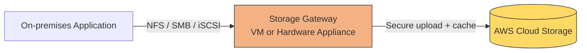
## Benefit
- hybrid solution
- provides **local cache** : improved throughput and latency 
- migration activity
- DR and backup

---
## Type (4)

| Gateway type               | Client protocol | AWS backend                  | Main use case                                    |
| -------------------------- | --------------- | ---------------------------- | ------------------------------------------------ |
| **S3 File Gateway**        | NFS, SMB        | Amazon S3                    | Store on-premises files as S3 objects            |
| **FSx File Gateway**       | SMB             | FSx for Windows File Server  | Low-latency access to Windows file shares in AWS |
| **Volume Gateway** | iSCSI           | S3-backed cloud volumes      | Primary data in AWS, hot data cached locally     |
| **Tape Gateway**           | iSCSI-VTL       | S3 and S3 archival classes   | Replace physical tape backup infrastructure      |

- 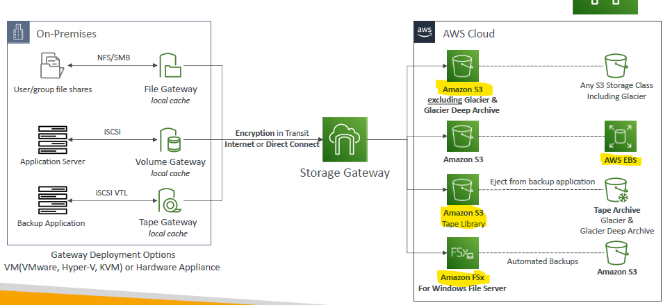

### 1. S3 File gateway 

```
Application writes file through NFS/SMB
                ↓
Storage Gateway converts file
                ↓
File becomes an object in Amazon S3
```

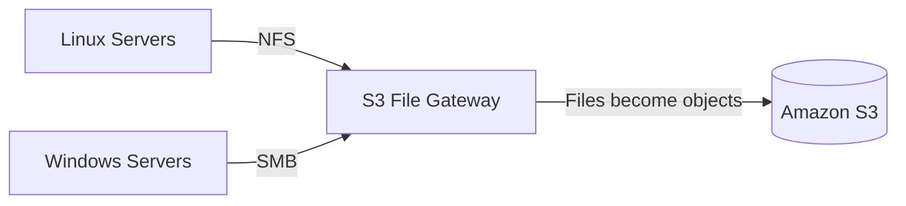
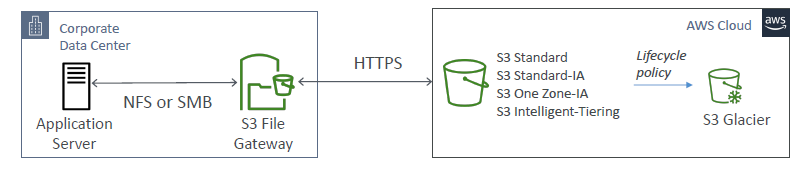

---
### 2. FSx window gateway

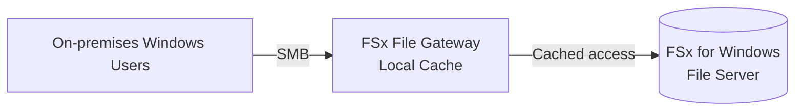

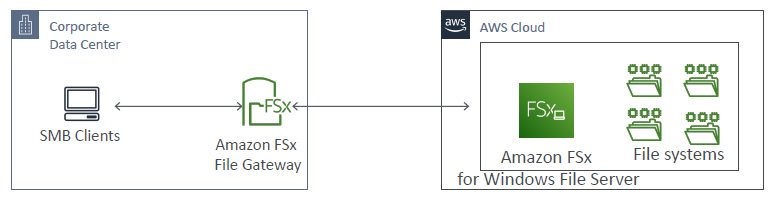

---
### 2. Volume gateway ⭐
```
Cached = cloud primary, local cache
Stored = local primary, cloud backup
```
**2.1 Gateway-Cached Volumes**:
- Primary copy = AWS
- Frequently used blocks = local cache
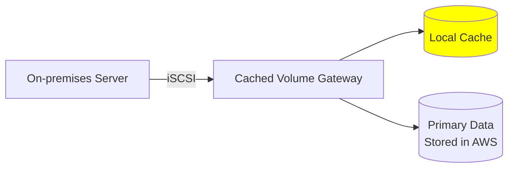
**2.2 Gateway-Stored Volumes**:
- Primary copy = On-premises
- Backup copy = AWS
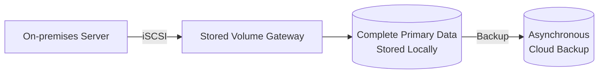
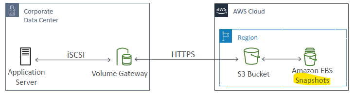

--- 
### 4. Tap gateway
- Primary copy = On-premises
- Backup copy = AWS

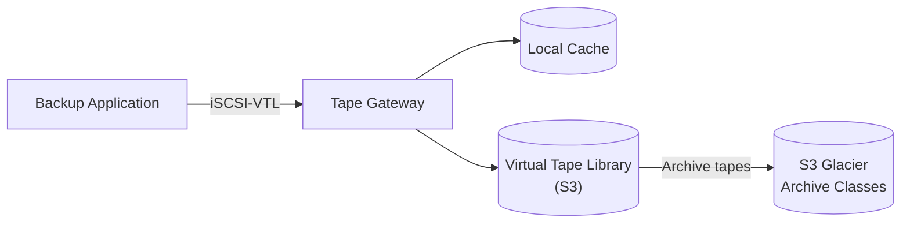
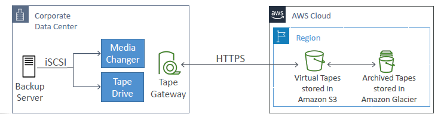

---
## Exam
### comparison
```
DMS:               Best for live database migrations with minimal downtime.
DataSync:          Used for file-based data transfers, not databases.
Storage Gateway:  For hybrid cloud storage, not database migrations.
```
### Decision table

| Requirement                                    | Select                                                         |
| ---------------------------------------------- | -------------------------------------------------------------- |
| On-premises NFS/SMB files stored as S3 objects | **S3 File Gateway**                                            |
| On-premises SMB access to FSx for Windows      | **FSx File Gateway**                                           |
| Block storage with primary data in AWS         | **Cached Volume Gateway**                                      |
| Block storage with primary data on-premises    | **Stored Volume Gateway**                                      |
| Replace physical tape backup                   | **Tape Gateway**                                               |
| One-time bulk migration                        | Consider **AWS DataSync**, Snowball or Transfer Family instead |
| Direct application access to S3 API            | Use S3 directly, not Storage Gateway                           |

### gateway vs Datasync

| Feature                | Storage Gateway                                      | AWS DataSync                                      |
| ---------------------- | ---------------------------------------------------- | ------------------------------------------------- |
| Purpose                | Continuous hybrid storage access                     | High-speed data transfer                          |
| Application interface  | NFS, SMB, iSCSI                                      | Transfer service                                  |
| Local cache            | Yes                                                  | No persistent application cache                   |
| Best use               | Applications continue working against hybrid storage | Migration, replication or scheduled transfer      |

### Traps
Trap 1: File Gateway does not make S3 a normal POSIX file system
Trap 2: Cached and stored volumes are opposite
Trap 3: Storage Gateway is for hybrid access

### Questions
```
Question 63

A company uses a legacy on-premises reporting application that operates on gigabytes of .json files 
and represents years of data. The legacy application cannot handle the growing size of .json files.
New .json files are added daily from various data sources to a central on-premises storage location.

The company wants to continue to support the legacy application. 
The company has hired you as a solutions architect to build a solution that 
can manage ongoing data updates from the on-premises application to Amazon S3.

Which of the following solutions would you suggest to address the given requirement?

💠 Option A

Set up AWS DataSync on-premises. Configure AWS DataSync to continuously replicate the .json files
between on-premises and Amazon Elastic File System (Amazon EFS). 
Enable replication from Amazon EFS to the company’s Amazon S3 bucket.

💠 Option B

Set up an on-premises Volume Gateway. Configure data sources to write the .json files to the Volume Gateway. 
Point the legacy analytics application to the Volume Gateway. The Volume Gateway should replicate data to Amazon S3.

💠 Option C — Correct Answer

Set up an on-premises File Gateway. Configure data sources to write the .json files to the File Gateway. 
Point the legacy analytics application to the File Gateway. The File Gateway should replicate the .json files to Amazon S3.

💠 Option D — Incorrect Answer Selected

Set up AWS DataSync on-premises. Configure AWS DataSync to continuously replicate the .json files
between the company’s on-premises storage and the company’s Amazon S3 bucket.
---

New files written through File Gateway are uploaded to S3.
Older files can remain in S3 and be downloaded back to the local cache when the application accesses them.
Only frequently accessed files stay cached on-premises (gateway hardware)
```


