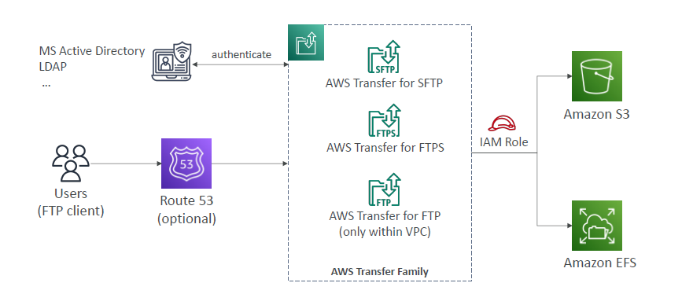

#  AWS Transfer
> backend: S3 and EFS
## Overview
Can expose s3/EFS over FTP protocol
- SFTP (outside AWS)
- FTPS (outside AWS)
- FTP (with in AWS/VPC)

---
## AWS Transfer for SFTP

---
## AWS Transfer for FTPS

---
## AWS Transfer for FTP
