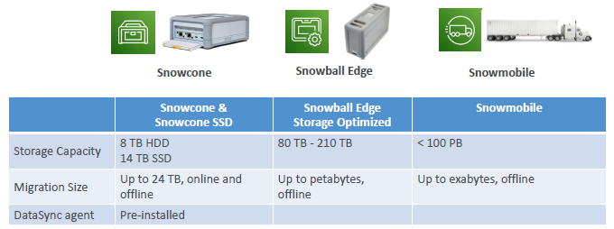
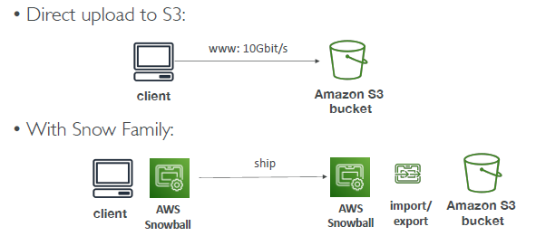
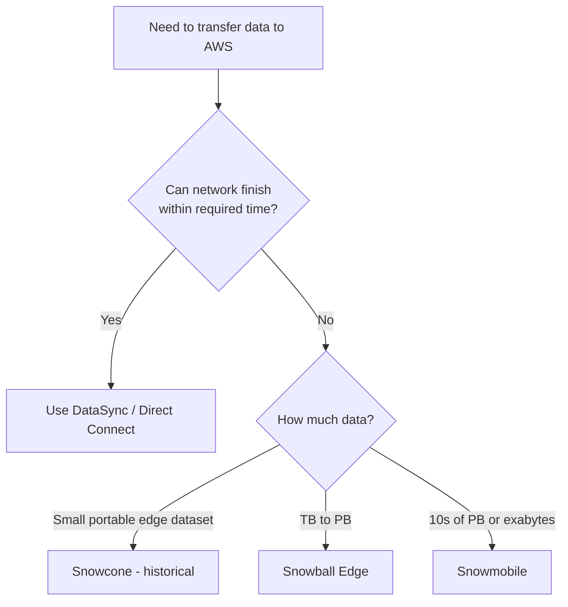

# AWS snow family ( Data Migration )
> ⚠️ DISCONTINUED
## Overview
- These are physical devices used when:
  - transferring data through the network would take too long 
  - or when the location has limited connectivity.



---
## AWS Snowball Edge (offline) ❌
> ⚠️ Snowball Edge became unavailable to new customers in November 2025.
> Discontinue commercial-region support after December 31, 2026.

Use cases
- large data cloud migrations, 
- DC decommission, 
- disaster recovery
    
Snowball devices (offline portable devices)

| Configuration         | Main strength        | Current specification                          |
| --------------------- | -------------------- | ---------------------------------------------- |
| **Storage Optimized** | Large data migration | Approximately 210 TB usable storage            |
| **Compute Optimized** | Edge processing      | Up to 104 vCPUs, 416 GB RAM and 28 TB NVMe SSD |

Can run **lambda@edge** , add optional GPU/s 👈

Send option:
- post device 
- send/upload to/from EBS + S3
  


---
## AWS Snowmobile (offline) ❌
> shut down in March 2024
- Snowmobile is an actual secure shipping container transported by truck.

```
1 Snowmobile ≈ 100 PB
10 Snowmobiles ≈ 1 EB
---
  - 1024 TB = 1 PB 
  - 1024 PB = 1 exabyte 
  - so it `1000,000 TB` or 1 Million TB
```
| Feature  | Snowmobile                                      |
| -------- | ----------------------------------------------- |
| Capacity | Up to approximately 100 PB per Snowmobile       |
| Scale    | Exabyte-scale migrations                        |
| Delivery | Secure truck-mounted container                  |
| Best for | Entire data-center migration                    |
| Ordering | Engagement through AWS, not normal self-service |

---
## AWS Snowcone (offline + online) ❌
> ⚠️ discontinued in November 2024
- The smallest and most portable Snow device.

| Feature         | Snowcone                                               |
| --------------- | ------------------------------------------------------ |
| Size            | Small, portable device                                 |
| Capacity        | Approximately 8 TB HDD or 14 TB SSD in older offerings |
| Transfer method | Ship device or transfer online with DataSync           |
| Compute         | Limited edge compute                                   |
| Best for        | Small migrations, IoT, vehicles, remote locations      |
| Status          | Discontinued                                           |

send option
- post device (offline), send/upload data to/from EBS + S3
- AWS DataSync agent, installed already, used to send/upload data to/from EBS

## Exam
### Decision rule:
