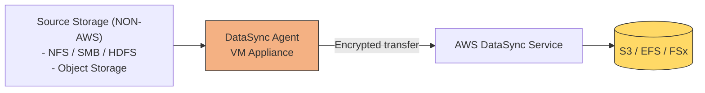
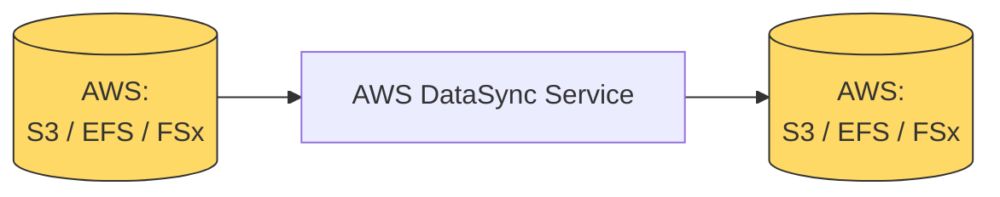

# AWS DataSync
> DataSync = fast, scheduled, online copying of files (EFS,FSx) and objects(S3). 
---
## Overview




AWS DataSync is a managed online **data-transfer service** used to copy `file` or `object` data:
- From on-premises storage to AWS
- From AWS to on-premises
- Between AWS storage services
  - perform cross-Region 
  - cross-account transfers
- Between other cloud storage and AWS
> Note: install DataSync agent on non-aws machine

It automates:
- Data transfer task
- Scheduling task
- configure: Encryption/TLS + Monitoring and retries
- Supports Incremental copying


---
## Details
Full transfer vs incremental transfer


```
Detect changed files or objects
Transfer only required data
Preserve supported metadata
Verify transferred data
Retry failures
Generate CloudWatch metrics and logs
```

## Common use cases
- on-prem Data migration
- Ongoing replication
- AWS storage migration
- Data lake ingestion (s3 data lake)
- Cloud-to-cloud transfer

---
## Supported source and protocols

| Location                        | Typical protocol/interface                 |
| ------------------------------- | ------------------------------------------ |
| On-premises Linux file server   | NFS                                        |
| On-premises Windows file server | SMB                                        |
| Hadoop cluster                  | HDFS                                       |
| Self-managed object storage     | S3-compatible API                          |
| Amazon S3                       | Object storage API                         |
| Amazon EFS                      | NFS                                        |
| Amazon FSx for Windows          | SMB                                        |
| Amazon FSx for Lustre           | Lustre-compatible storage                  |
| FSx for OpenZFS                 | NFS                                        |
| FSx for NetApp ONTAP            | NFS, SMB or object-related supported paths |
| Other cloud object storage      | Cloud object API                           |

---
## Exam
### More
- File permissions and metadata are `preserved`
- Cannot open **locked file**
- file is opened and **modified**, while sync
    - it will detect Data inconsistency during VERIFYING stage.
    - those files will be skipped/ missing then.
  
### Network perspective
- **Direct Connect** ✅ – Supported. DataSync can transfer data over AWS Direct Connect for faster, private transfers.
- **Site-to-Site VPN** ✅ – Supported. DataSync can run over a VPN tunnel for secure data transfers between on-prem and AWS.
- **Internet** ✅ – Supported. By default, DataSync uses the public internet with encryption for transfers between on-prem storage and AWS.

### DataSync vs Storage Gateway

|                            | AWS DataSync                    | Storage Gateway                       |
| --------------------------------- | ------------------------------- | ------------------------------------- |
| Main purpose                      | Transfer or replicate data      | Provide ongoing hybrid storage access |
